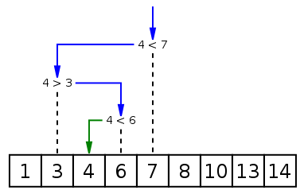

二分搜索是一种在有序数组中查找某一特定元素的搜索算法。搜索过程从数组的中间元素开始，如果中间元素正好是要查找的元素，则搜索过程结束；如果某一特定元素大于或者小于中间元素，则在数组大于或小于中间元素的那一半中查找，而且跟开始一样从中间元素开始比较。如果在某一步骤数组为空，则代表找不到。这种搜索算法每一次比较都使搜索范围缩小一半。



# 1、源码-递归

```python
def binarySearch (arr, l, r, x): 
    # 基本判断
    if r >= l: 
        mid = int(l + (r - l)/2)            
        # 元素整好的中间位置
        if arr[mid] == x: 
            return mid 
        # 元素小于中间位置的元素，只需要再比较左边的元素
        elif arr[mid] > x: 
            return binarySearch(arr, l, mid-1, x) 
        # 元素大于中间位置的元素，只需要再比较右边的元素
        else: 
            return binarySearch(arr, mid+1, r, x) 
    else: 
        # 不存在
        return -1
  
# 测试数组
arr = [ 2, 3, 4, 10, 40 ] 
x = 10
  
# 函数调用
result = binarySearch(arr, 0, len(arr)-1, x) 
  
if result != -1: 
    print ("元素在数组中的索引为 %d" % result )
else: 
    print ("元素不在数组中")
```

# 2、源码-循环

```python
def binarySearch(arr,start,end,target):
    while start<=end:                        #必须是start<=end,如果是start<end 会有死循环的风险，
        mid=(start+(end-start)//2)            #mid=(start+end)//2   ,这种写法，如果start或者end,数据过大，可能会造成溢出的风险，
        if arr[mid]==target:
            return mid
        elif arr[mid]<target:
            start=mid+1
        else:
            end=mid-1
    return -1

  
arr = [ 2, 3, 4, 10, 40 ]

res=binarySearch(arr,0,len(arr)-1,10)
print(res)
```

# 3、封装递归函数

## 3.1 示例： 查询某个数开根号的值

```python
#!/bin/python3

def binarySearch(arr,start,end,dic):      #dic 为一个字典，里面分装了需要使用的函数对象fun,以及fun 需要的各种参数。arr 就是被查找的对象。
    if start<=end:
        mid=(start+(end-start)//2)
        fun=dic.get("fun")
        res,mid=fun(arr,mid,dic)
        
        if res=="True":
            return mid
        elif res=="bigger":
            return binarySearch(arr,start,mid,dic)
        else:
            return binarySearch(arr,mid,end,dic)
    else:
        return -1   #不存在返回-1

   
def fun(arr,mid,dic=None):        
    target=dic.get("target")      #目标
    res=mid*mid
    num=target-res
    post=int(dic.get("post"))
    current=int(dic.get("current"))
    step=1/(10**current)
    mid=float(f"%.{post}f" % mid)

    if num==0:
        return "True",mid
    elif num>0:
        newmid=mid+step
        if newmid**2>target and current==post:    #current 
            return "True",mid
        elif newmid**2>target:
            current+=1
            dic["current"]=current
            step=1/(10**current)
        return  "smaller",mid+step

    else:
        return "bigger",mid-step


dic={
    "fun":fun,
      #函数对象，需要自己定义
    "target":99,    #要开根号的数字
    "post":5,       #定义最终的精度值，5表示的就是1/(10**5) ,也就是0.00001 保留5位小数          
    
    "current":0,    #定义当前的精度，同理0，就是，1/(10**0),,也就是1，一位小数都没有保留。
}


arr=[]
res=binarySearch(arr,1,dic.get("target"),dic)    #如果没有要被查询的列表，传入一个空列表即可。
print("res",res)
```

- 运行结果

```python
[hack@test2 ~]$ ./suan.py
res 9.94987
```