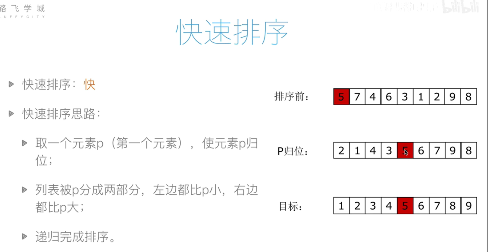

**快速排序使用分治法（Divide and conquer）策略来把一个序列（list）分为较小和较大的2个子序列，然后递归地排序两个子序列。**



**步骤为：**

*   **挑选基准值：从数列中挑出一个元素，称为"基准"（pivot）;**
*   **分割：重新排序数列，所有比基准值小的元素摆放在基准前面，所有比基准值大的元素摆在基准后面（与基准值相等的数可以到任何一边）。在这个分割结束之后，对基准值的排序就已经完成;**
*   **递归排序子序列：递归地将小于基准值元素的子序列和大于基准值元素的子序列排序。**

**递归到最底部的判断条件是数列的大小是零或一，此时该数列显然已经有序。**

**选取基准值有数种具体方法，此选取方法对排序的时间性能有决定性影响。**


```python
# _*_ coding : utf-8 _*_
# @Time : 2023/3/19 20:49
# @Author : HackWu
# @File : quickSort(快速排序)
# @Project : DS-Code


'''
    快速排序，就是从数组中随机获取一个数值作为key,
    然后让数组中所有的比key小的值，都在key的左边，所有比key大的值，都在key的右边。
    完成这个操作之后，key的索引index也发生了变化，key的索引从0变成了len(arr)-1 中的某个数。
    这里我们可以直接把index看成mid，也就是理想的情况下，这个index刚好在中间，也就是mid.

    然后再在mid的左边和右边的子数组，中进行重复的操作，最后实现升序排序。

    partition() 就是用来获取key的索引,也就是我么需要的mid。
    是从数组中的最左边或者最右边选一个值，作为key,
    这里我们选取最右边的值作为key,也就是left=0 ，key=arr[left]
    然后我们接下来的目标就是，让数组中所有比key小的值，都在key的右边，所有比key大的值，都在key的右边。
    此时最左边的数arr[left]被存在了key中，就不用担心这个值发生丢失。
    所以我么需要从最右边开始找比key小的值，一旦找到，就被这个值arr[right]赋给arr[left],也就是arr[left]=arr[right],
    这样就成功的把右边的值，移到了左边。
    那此时，arr[left]用于arr[right] 相等，所以我们需要舍去arr[right],需要将其更新为一个比key大的值。
    所以接下来要在左边找到一个比key大的值，然后再赋给arr[right]. 这样就完成了一次替换。

    在上面的操作中，left与right，是不断相互靠近的，直到left=right 时，结束执行。

'''

def partition(arr,left,right):           #用于获取key的索引，mid.
    key=arr[left]                        #选取最最左边的值作为key
    while left<right:                    #要保证left一定小于right，否则就不用找了
        while left<right and arr[right]>=key:   #从右边开始找一个比key小的数，但如果比key大，就啥也不做，right向左边移动一位，继续判断。
            right-=1
        arr[left]=arr[right]            #当到这一步时，right对应的值，一定小于key,所以将这个值移到左边。
        while left<right and arr[left]<=key:
            left+=1
        arr[right]=arr[left]        #当到这一步时，left对应的值，一定比key大，随意将它移动到右边。
    arr[left]=key                   #最后就是left=right,而这个值与上一次移动的那个值相等，并不是我们需要的。我么需要的是key，所以将key赋给他，也就是归还key的值，否则key将丢失
    return left                 #最后返回left或者right，作为mid,他们俩是相等的，随便哪一个都行。

def quickSort(arr,left,right):
    if left<right:
        mid=partition(arr,left,right)        #获取key的索引，mid,此时就把素组看成两个数组，以mid作为分隔。
        quickSort(arr,left,mid-1)
        quickSort(arr,mid+1,right)

arr = [10, 7, 8, 9, 1, 5]
quickSort(arr,0,len(arr)-1)
print(arr)
```

