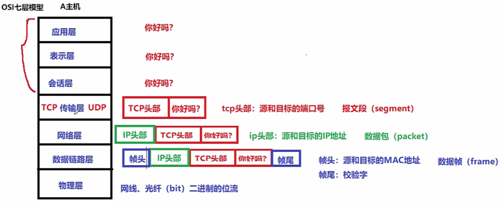
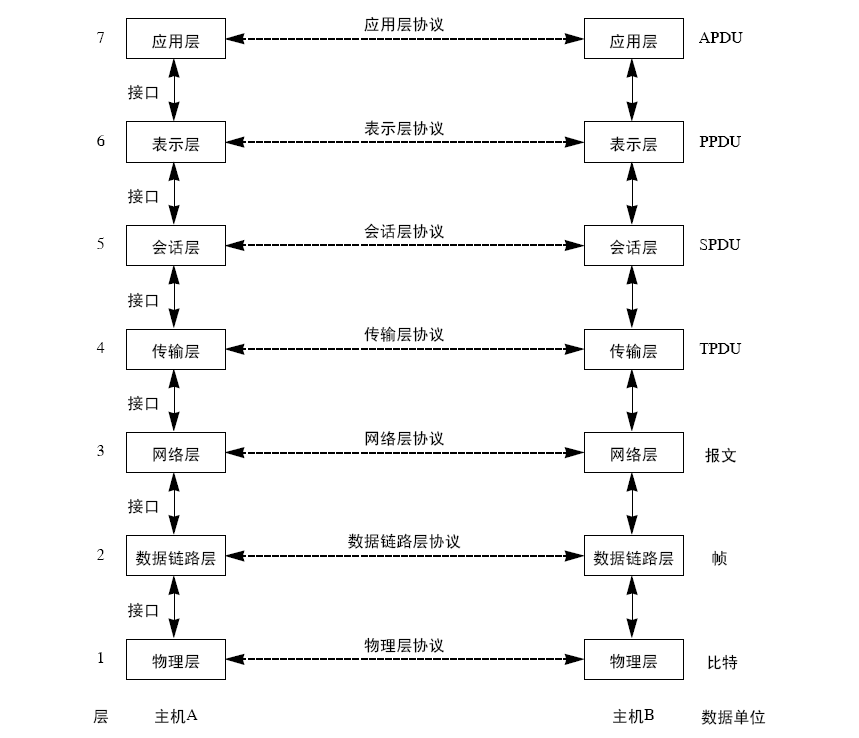
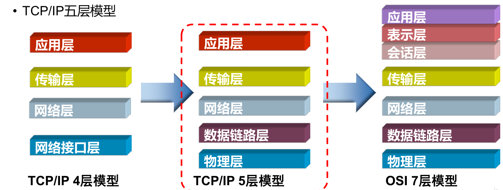
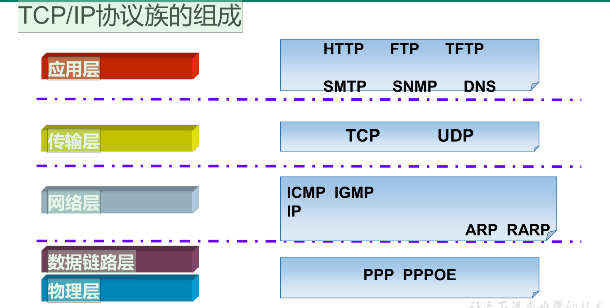

# 1、题目

**简述ISO/OSI七层模型的分层与作用**

- 数据封装过程

# 2、ISO/OSI的七层模型

- **国际标准化组织 (International Organization for Standardization)，ISO**

- **OSI（Open System Interconnect），即开放式系统互连**

## 第7层：应用层

• 为用户提供服务，给用户一个操作界面

## 第6层：表示层

• 数据提供表示

• 加密

• 压缩

## 第5层：会话层

• 确定数据是否需要进行网络传递

## 第4层：传输层

• 对报文进行分组（发送时）、组装（接收时）

• 提供传输协议的选择：

- TCP（传输控制协议）：可靠的，面向连接的传输协议（可靠，准确）（慢）

- UDP（用户数据报协议）：不可靠的，面向无连接的传输协议（快）（不可靠）

• 端口封装

• 差错校验

## 第3层：网络层

• IP地址编址

• 路由选择

静态路由

动态路由

## 第2层：数据链路层

• MAC地址编址

• MAC地址寻址

• 差错校验

## 第1层：物理层

• 数据实际传输

• 电气特性定义

# 3、类似面试题

• TCP/IP四层模型与作用？

• TCP协议与UDP协议工作在哪一层，作用是什么？

## OSI模型 vs TCP/IP模型

• OSI七层模型

• TCP/IP四层模型

- 四层协议就是把七层协议中的应用层，表示层，会话层，全部打包为应用层

- 然后数据链路层，和物理层打包为网络接口层

• TCP/IP五层模型

- 就是网络接口层，不打包了，还是数据链路层和物理层

## TCP/IP协议族的组成

