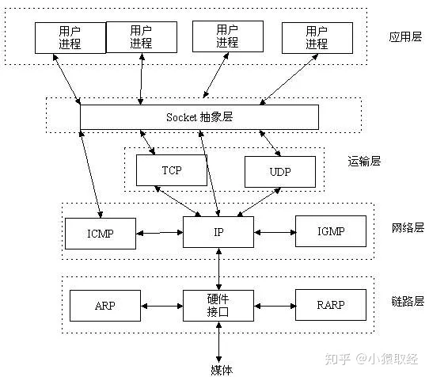
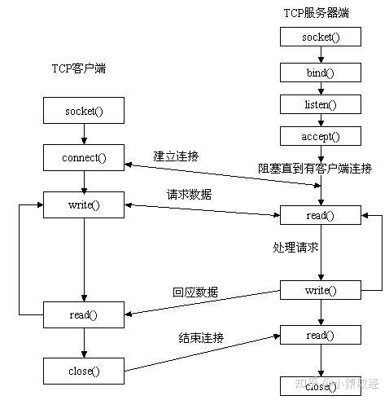
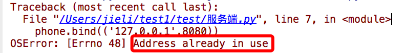
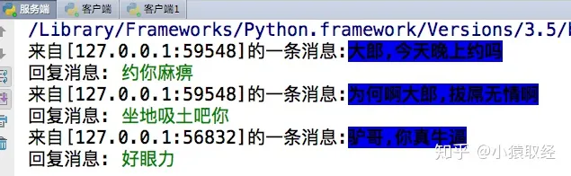
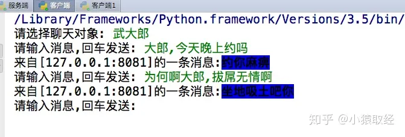
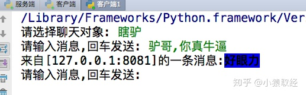

# 1、 socket层

在图1中，我们没有看到Socket的影子，那么它到底在哪里呢？还是用图来说话，一目了然。



# 2、 socket是什么

Socket是应用层与TCP/IP协议族通信的中间软件抽象层，它是一组接口。在设计模式中，Socket其实就是一个门面模式，它把复杂的TCP/IP协议族隐藏在Socket接口后面，对用户来说，一组简单的接口就是全部，让Socket去组织数据，以符合指定的协议。

所以，我们无需深入理解tcp/udp协议，socket已经为我们封装好了，我们只需要遵循socket的规定去编程，写出的程序自然就是遵循tcp/udp标准的。

> **也有人将socket说成ip+port，ip是用来标识互联网中的一台主机的位置，而port是用来标识这台机器上的一个应用程序，**
> **ip地址是配置到网卡上的，而port是应用程序开启的，ip与port的绑定就标识了互联网中独一无二的一个应用程序**
> **而程序的pid是同一台机器上不同进程或者线程的标识**


# 3、 套接字发展史及分类

套接字起源于 20 世纪 70 年代加利福尼亚大学伯克利分校版本的 Unix,即人们所说的 BSD Unix。 因此,有时人们也把套接字称为“伯克利套接字”或“BSD 套接字”。一开始,套接字被设计用在同 一台主机上多个应用程序之间的通讯。这也被称进程间通讯,或 IPC。套接字有两种（或者称为有两个种族）,分别是基于文件型的和基于网络型的。

## ***3.1 基于文件类型的套接字家族***

- **套接字家族的名字：**AF_UNIX

unix一切皆文件，基于文件的套接字调用的就是底层的文件系统来取数据，两个套接字进程运行在同一机器，可以通过访问同一个文件系统间接完成通信

## ***3.2 基于网络类型的套接字家族***

- **套接字家族的名字**：AF_INET

还有AF_INET6被用于ipv6，还有一些其他的地址家族，不过，他们要么是只用于某个平台，要么就是已经被废弃，或者是很少被使用，或者是根本没有实现，所有地址家族中，AF_INET是使用最广泛的一个，python支持很多种地址家族，但是由于我们只关心网络编程，所以大部分时候我么只使用AF_INET

# 4、 套接字工作流程

​ 一个生活中的场景。你要打电话给一个朋友，先拨号，朋友听到电话铃声后提起电话，这时你和你的朋友就建立起了连接，就可以讲话了。等交流结束，挂断电话结束此次交谈。 生活中的场景就解释了这工作原理。



​ 

先从服务器端说起。服务器端先初始化Socket，然后与端口绑定(bind)，对端口进行监听(listen)，调用accept阻塞，等待客户端连接。在这时如果有个客户端初始化一个Socket，然后连接服务器(connect)，如果连接成功，这时客户端与服务器端的连接就建立了。客户端发送数据请求，服务器端接收请求并处理请求，然后把回应数据发送给客户端，客户端读取数据，最后关闭连接，一次交互结束

## **4.1 socket()模块函数用法**

```python
import socket
socket.socket(socket_family,socket_type,protocal=0)
socket_family 可以是 AF_UNIX 或 AF_INET。socket_type 可以是 SOCK_STREAM 或 SOCK_DGRAM。protocol 一般不填,默认值为 0。
 #获取tcp/ip套接字
 tcpSock = socket.socket(socket.AF_INET, socket.SOCK_STREAM)
 #获取udp/ip套接字
 udpSock = socket.socket(socket.AF_INET, socket.SOCK_DGRAM)
#由于 socket 模块中有太多的属性。我们在这里破例使用了'from module import *'语句。使用 'from socket import *',
    #我们就把 socket 模块里的所有属性都带到我们的命名空间里了,这样能 大幅减短我们的代码。
#例如tcpSock = socket(AF_INET, SOCK_STREAM
```

## ***4.2 服务端套接字函数***

```
s.bind()       #绑定(主机,端口号)到套接字
s.listen()     #开始TCP监听
s.accept()     #被动接受TCP客户的连接,(阻塞式)等待连接的到来
```

## ***4.3 客户端套接字函数***

```
s.connect()     #主动初始化TCP服务器连接
s.connect_ex()  #connect()函数的扩展版本,出错时返回出错码,而不是抛出异常
```

## ***4.4 公共用途的套接字函数***

```
s.recv()          //接收TCP数据
s.send()          //发送TCP数据(send在待发送数据量大于己端缓存区剩余空间时,数据丢失,不会发完)
s.sendall()       //发送完整的TCP数据(本质就是循环调用send,sendall在待发送数据量大于己端缓存区剩余空间时,数据不丢失,循环调用send直到发完)
s.recvfrom()      //接收UDP数据
s.sendto()        //发送UDP数据
s.getpeername()   //连接到当前套接字的远端的地址
s.getsockname()   //当前套接字的地址
s.getsockopt()    //返回指定套接字的参数
s.setsockopt()    //设置指定套接字的参数
s.close()         //关闭套接字
```

## ***4.5 面向锁的套接字方法***

```
s.setblocking()     //设置套接字的阻塞与非阻塞模式
s.settimeout()     //设置阻塞套接字操作的超时时间
s.gettimeout()     //得到阻塞套接字操作的超时时间
```

## ***4.6 面向文件的套接字的函数***

```
s.fileno()     //套接字的文件描述符
s.makefile()   //创建一个与该套接字相关的文件
```

# 5、基于TCP的套接字

***tcp是基于链接的，必须先启动服务端，然后再启动客户端去链接服务端***

## ***5.1 tcp服务端***

```python
1 ss = socket() #创建服务器套接字
2 ss.bind()      #把地址绑定到套接字
3 ss.listen()      #监听链接
4 inf_loop:      #服务器无限循环
5     cs = ss.accept() #接受客户端链接
6     comm_loop:         #通讯循环
7         cs.recv()/cs.send() #对话(接收与发送)
8     cs.close()    #关闭客户端套接字
9 ss.close()        #关闭服务器套接字(可选)
```

## ***5.2 tcp客户端***

```python
1 cs = socket()    # 创建客户套接字
2 cs.connect()    # 尝试连接服务器
3 comm_loop:        # 通讯循环
4     cs.send()/cs.recv()    # 对话(发送/接收)
5 cs.close()            # 关闭客户套接字
```

socket通信流程与打电话流程类似，我们就以打电话为例来实现一个low版的套接字通信

服务端：

```python
#_*_coding:utf-8_*_
__author__ = 'Linhaifeng'
import socket
ip_port=('127.0.0.1',9000)  #电话卡
BUFSIZE=1024                #收发消息的尺寸
s=socket.socket(socket.AF_INET,socket.SOCK_STREAM) #买手机
s.bind(ip_port) #手机插卡
s.listen(5)     #手机待机
conn,addr=s.accept()            #手机接电话
# print(conn)
# print(addr)
print('接到来自%s的电话' %addr[0])
msg=conn.recv(BUFSIZE)             #听消息,听话
print(msg,type(msg))
conn.send(msg.upper())          #发消息,说话
conn.close()                    #挂电话
s.close()                       #手机关机
```

客户端：

```python
#_*_coding:utf-8_*_
__author__ = 'Linhaifeng'
import socket
ip_port=('127.0.0.1',9000)
BUFSIZE=1024
s=socket.socket(socket.AF_INET,socket.SOCK_STREAM)
s.connect_ex(ip_port)           #拨电话
s.send('linhaifeng nb'.encode('utf-8'))         #发消息,说话(只能发送字节类型)
feedback=s.recv(BUFSIZE)                           #收消息,听话
print(feedback.decode('utf-8'))
s.close()                                       #挂电话
```

加上链接循环与通信循环

服务端改进版:

```python
#_*_coding:utf-8_*_
__author__ = 'Linhaifeng'
import socket
ip_port=('127.0.0.1',8081)#电话卡
BUFSIZE=1024
s=socket.socket(socket.AF_INET,socket.SOCK_STREAM) #买手机
s.bind(ip_port) #手机插卡
s.listen(5)     #手机待机
while True:                         #新增接收链接循环,可以不停的接电话
    conn,addr=s.accept()            #手机接电话
    # print(conn)
    # print(addr)
    print('接到来自%s的电话' %addr[0])
    while True:                         #新增通信循环,可以不断的通信,收发消息
        msg=conn.recv(BUFSIZE)             #听消息,听话
        # if len(msg) == 0:break        #如果不加,那么正在链接的客户端突然断开,recv便不再阻塞,死循环发生
        print(msg,type(msg))
        conn.send(msg.upper())          #发消息,说话
    conn.close()                    #挂电话
s.close()                       #手机关机
```

客户端改进版

```python
#_*_coding:utf-8_*_
__author__ = 'Linhaifeng'
import socket
ip_port=('127.0.0.1',8081)
BUFSIZE=1024
s=socket.socket(socket.AF_INET,socket.SOCK_STREAM)
s.connect_ex(ip_port)           #拨电话
while True:                             #新增通信循环,客户端可以不断发收消息
    msg=input('>>: ').strip()
    if len(msg) == 0:continue
    s.send(msg.encode('utf-8'))         #发消息,说话(只能发送字节类型)
    feedback=s.recv(BUFSIZE)                           #收消息,听话
    print(feedback.decode('utf-8'))
s.close()                                       #挂电话
```

问题：

有的同学在重启服务端时可能会遇到



这个是由于你的服务端仍然存在四次挥手的time_wait状态在占用地址（如果不懂，请深入研究1.tcp三次握手，四次挥手 2.syn洪水攻击 3.服务器高并发情况下会有大量的time_wait状态的优化方法）

解决方法：

方法一

```python
#加入一条socket配置，重用ip和端口
phone=socket(AF_INET,SOCK_STREAM)
phone.setsockopt(SOL_SOCKET,SO_REUSEADDR,1) #就是它，在bind前加
phone.bind(('127.0.0.1',8080))
```

方法二

```python
发现系统存在大量TIME_WAIT状态的连接，通过调整linux内核参数解决，
vi /etc/sysctl.conf
编辑文件，加入以下内容：
net.ipv4.tcp_syncookies = 1
net.ipv4.tcp_tw_reuse = 1
net.ipv4.tcp_tw_recycle = 1
net.ipv4.tcp_fin_timeout = 30
然后执行 /sbin/sysctl -p 让参数生效。
net.ipv4.tcp_syncookies = 1 表示开启SYN Cookies。当出现SYN等待队列溢出时，启用cookies来处理，可防范少量SYN攻击，默认为0，表示关闭；
net.ipv4.tcp_tw_reuse = 1 表示开启重用。允许将TIME-WAIT sockets重新用于新的TCP连接，默认为0，表示关闭；
net.ipv4.tcp_tw_recycle = 1 表示开启TCP连接中TIME-WAIT sockets的快速回收，默认为0，表示关闭。
net.ipv4.tcp_fin_timeout 修改系統默认的 TIMEOUT 时间
```

# 6、基于UDP的套接字

***udp是无链接的，先启动哪一端都不会报错***

## 6.1 udp服务端

```python
1 ss = socket()   #创建一个服务器的套接字
2 ss.bind()       #绑定服务器套接字
3 inf_loop:       #服务器无限循环
4     cs = ss.recvfrom()/ss.sendto() # 对话(接收与发送)
5 ss.close()                         # 关闭服务器套接字
```

## 6.2 udp客户端

```python
cs = socket()   # 创建客户套接字
comm_loop:      # 通讯循环
    cs.sendto()/cs.recvfrom()   # 对话(发送/接收)
cs.close()                      # 关闭客户套接字
```

## ***6.3 udp套接字简单示例***

### 6.3.1 udp服务端

```python
#_*_coding:utf-8_*_
__author__ = 'Linhaifeng'
import socket
ip_port=('127.0.0.1',9000)
BUFSIZE=1024
udp_server_client=socket.socket(socket.AF_INET,socket.SOCK_DGRAM)
udp_server_client.bind(ip_port)
while True:
    msg,addr=udp_server_client.recvfrom(BUFSIZE)
    print(msg,addr)
    udp_server_client.sendto(msg.upper(),addr)
```

### 6.3.2 udp客户端

```python
#_*_coding:utf-8_*_
__author__ = 'Linhaifeng'
import socket
ip_port=('127.0.0.1',9000)
BUFSIZE=1024
udp_server_client=socket.socket(socket.AF_INET,socket.SOCK_DGRAM)
while True:
    msg=input('>>: ').strip()
    if not msg:continue
    udp_server_client.sendto(msg.encode('utf-8'),ip_port)
    back_msg,addr=udp_server_client.recvfrom(BUFSIZE)
    print(back_msg.decode('utf-8'),addr)
```

## **6.4 qq聊天(由于udp无连接，所以可以同时多个客户端去跟服务端通信)**

### 6.4.1 udp服务端

```python
#_*_coding:utf-8_*_
__author__ = 'Linhaifeng'
import socket
ip_port=('127.0.0.1',8081)
udp_server_sock=socket.socket(socket.AF_INET,socket.SOCK_DGRAM) #买手机
udp_server_sock.bind(ip_port)
while True:
    qq_msg,addr=udp_server_sock.recvfrom(1024)
    print('来自[%s:%s]的一条消息:\033[1;44m%s\033[0m' %(addr[0],addr[1],qq_msg.decode('utf-8')))
    back_msg=input('回复消息: ').strip()
    udp_server_sock.sendto(back_msg.encode('utf-8'),addr)
```

udp客户端1

```python
#_*_coding:utf-8_*_
__author__ = 'Linhaifeng'
import socket
BUFSIZE=1024
udp_client_socket=socket.socket(socket.AF_INET,socket.SOCK_DGRAM)
qq_name_dic={
    '狗哥alex':('127.0.0.1',8081),
    '瞎驴':('127.0.0.1',8081),
    '一棵树':('127.0.0.1',8081),
    '武大郎':('127.0.0.1',8081),
}
while True:
    qq_name=input('请选择聊天对象: ').strip()
    while True:
        msg=input('请输入消息,回车发送: ').strip()
        if msg == 'quit':break
        if not msg or not qq_name or qq_name not in qq_name_dic:continue
        udp_client_socket.sendto(msg.encode('utf-8'),qq_name_dic[qq_name])
        back_msg,addr=udp_client_socket.recvfrom(BUFSIZE)
        print('来自[%s:%s]的一条消息:\033[1;44m%s\033[0m' %(addr[0],addr[1],back_msg.decode('utf-8')))
udp_client_socket.close()
```

### 6.4.2 udp客户端2

```python
#_*_coding:utf-8_*_
__author__ = 'Linhaifeng'
import socket
BUFSIZE=1024
udp_client_socket=socket.socket(socket.AF_INET,socket.SOCK_DGRAM)
qq_name_dic={
    '狗哥alex':('127.0.0.1',8081),
    '瞎驴':('127.0.0.1',8081),
    '一棵树':('127.0.0.1',8081),
    '武大郎':('127.0.0.1',8081),
}
while True:
    qq_name=input('请选择聊天对象: ').strip()
    while True:
        msg=input('请输入消息,回车发送: ').strip()
        if msg == 'quit':break
        if not msg or not qq_name or qq_name not in qq_name_dic:continue
        udp_client_socket.sendto(msg.encode('utf-8'),qq_name_dic[qq_name])
        back_msg,addr=udp_client_socket.recvfrom(BUFSIZE)
        print('来自[%s:%s]的一条消息:\033[1;44m%s\033[0m' %(addr[0],addr[1],back_msg.decode('utf-8')))
udp_client_socket.close()
```

服务端运行结果



客户端1运行结果



客户端2运行结果



## ***6.5 时间服务器***

### 6.5.1 ntp服务端

```python
#_*_coding:utf-8_*_
__author__ = 'Linhaifeng'
from socket import *
from time import strftime
ip_port=('127.0.0.1',9000)
bufsize=1024
tcp_server=socket(AF_INET,SOCK_DGRAM)
tcp_server.bind(ip_port)
while True:
    msg,addr=tcp_server.recvfrom(bufsize)
    print('===>',msg)
    if not msg:
        time_fmt='%Y-%m-%d %X'
    else:
        time_fmt=msg.decode('utf-8')
    back_msg=strftime(time_fmt)
    tcp_server.sendto(back_msg.encode('utf-8'),addr)
tcp_server.close()
```

### 6.5.2 ntp客户端

```python
#_*_coding:utf-8_*_
__author__ = 'Linhaifeng'
from socket import *
ip_port=('127.0.0.1',9000)
bufsize=1024
tcp_client=socket(AF_INET,SOCK_DGRAM)
while True:
    msg=input('请输入时间格式(例%Y %m %d)>>: ').strip()
    tcp_client.sendto(msg.encode('utf-8'),ip_port)
    data=tcp_client.recv(bufsize)
    print(data.decode('utf-8'))
tcp_client.close()
```