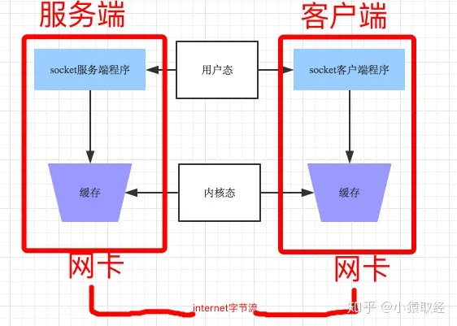
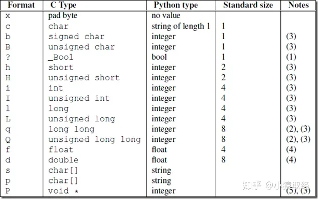

# 1、粘包现象

让我们基于tcp先制作一个远程执行命令的程序（1：执行错误命令 2：执行ls 3：执行ifconfig）

**注意注意注意：**

```
res=subprocess.Popen(cmd.decode('utf-8'), shell=True, stderr=subprocess.PIPE, stdout=subprocess.PIPE)
```

的结果的编码是以当前所在的系统为准的，如果是windows，那么

**且只能从管道里读一次结果**

注意：命令ls -l ; pwd 的结果是既有正确stdout结果，又有错误stderr结果

服务端

```python
#_*_coding:utf-8_*_
__author__ = 'Linhaifeng'
from socket import *
import subprocess
ip_port=('127.0.0.1',8080)
BUFSIZE=1024
tcp_socket_server=socket(AF_INET,SOCK_STREAM)
tcp_socket_server.bind(ip_port)
tcp_socket_server.listen(5)
while True:
    conn,addr=tcp_socket_server.accept()
    print('客户端',addr)
    while True:
        cmd=conn.recv(BUFSIZE)
        if len(cmd) == 0:break
        res=subprocess.Popen(cmd.decode('utf-8'),shell=True,
                         stdout=subprocess.PIPE,
                         stdin=subprocess.PIPE,
                         stderr=subprocess.PIPE)
        stderr=act_res.stderr.read()
        stdout=act_res.stdout.read()
        conn.send(stderr)
        conn.send(stdout)
```

客户端

```python
#_*_coding:utf-8_*_
__author__ = 'Linhaifeng'
import socket
BUFSIZE=1024
ip_port=('127.0.0.1',8080)
s=socket.socket(socket.AF_INET,socket.SOCK_STREAM)
res=s.connect_ex(ip_port)
while True:
    msg=input('>>: ').strip()
    if len(msg) == 0:continue
    if msg == 'quit':break
    s.send(msg.encode('utf-8'))
    act_res=s.recv(BUFSIZE)
    print(act_res.decode('utf-8'),end='')
```

上述程序是基于tcp的socket，在运行时会发生粘包

让我们再基于udp制作一个远程执行命令的程序

服务端

```python
#_*_coding:utf-8_*_
__author__ = 'Linhaifeng'
from socket import *
import subprocess
ip_port=('127.0.0.1',9003)
bufsize=1024
udp_server=socket(AF_INET,SOCK_DGRAM)
udp_server.bind(ip_port)
while True:
    #收消息
    cmd,addr=udp_server.recvfrom(bufsize)
    print('用户命令----->',cmd)
    #逻辑处理
    res=subprocess.Popen(cmd.decode('utf-8'),shell=True,stderr=subprocess.PIPE,stdin=subprocess.PIPE,stdout=subprocess.PIPE)
    stderr=res.stderr.read()
    stdout=res.stdout.read()
    #发消息
    udp_server.sendto(stderr,addr)
    udp_server.sendto(stdout,addr)
udp_server.close()
```

客户端

```python
from socket import *
ip_port=('127.0.0.1',9003)
bufsize=1024
udp_client=socket(AF_INET,SOCK_DGRAM)
while True:
    msg=input('>>: ').strip()
    udp_client.sendto(msg.encode('utf-8'),ip_port)
    data,addr=udp_client.recvfrom(bufsize)
    print(data.decode('utf-8'),end='')
```

上述程序是基于udp的socket，在运行时永远不会发生粘包

# 2、什么是粘包

须知：只有TCP有粘包现象，UDP永远不会粘包，为何，且听我娓娓道来

首先需要掌握一个socket收发消息的原理



发送端可以是1K1K地发送数据，而接收端的应用程序可以两K两K地提走数据，当然也有可能一次提走3K或6K数据，或者一次只提走几个字节的数据，也就是说，应用程序所看到的数据是一个整体，或说是一个流（stream），一条消息有多少字节对应用程序是不可见的，因此TCP协议是面向流的协议，这也是容易出现粘包问题的原因。而UDP是面向消息的协议，每个UDP段都是一条消息，应用程序必须以消息为单位提取数据，不能一次提取任意字节的数据，这一点和TCP是很不同的。怎样定义消息呢？可以认为对方一次性write/send的数据为一个消息，需要明白的是当对方send一条信息的时候，无论底层怎样分段分片，TCP协议层会把构成整条消息的数据段排序完成后才呈现在内核缓冲区。

例如基于tcp的套接字客户端往服务端上传文件，发送时文件内容是按照一段一段的字节流发送的，在接收方看了，根本不知道该文件的字节流从何处开始，在何处结束.

所谓粘包问题主要还是因为接收方不知道消息之间的界限，不知道一次性提取多少字节的数据所造成的。

此外，发送方引起的粘包是由TCP协议本身造成的，TCP为提高传输效率，发送方往往要收集到足够多的数据后才发送一个TCP段。若连续几次需要send的数据都很少，通常TCP会根据优化[算法](https://link.zhihu.com/?target=http%3A//lib.csdn.net/base/datastructure)把这些数据合成一个TCP段后一次发送出去，这样接收方就收到了粘包数据。

1. TCP（transport control protocol，传输控制协议）是面向连接的，面向流的，提供高可靠性服务。收发两端（客户端和服务器端）都要有一一成对的socket，因此，发送端为了将多个发往接收端的包，更有效的发到对方，使用了优化方法（Nagle算法），将多次间隔较小且数据量小的数据，合并成一个大的数据块，然后进行封包。这样，接收端，就难于分辨出来了，必须提供科学的拆包机制。 即面向流的通信是无消息保护边界的。

1. UDP（user datagram protocol，用户数据报协议）是无连接的，面向消息的，提供高效率服务。不会使用块的合并优化算法，, 由于UDP支持的是一对多的模式，所以接收端的skbuff(套接字缓冲区）采用了链式结构来记录每一个到达的UDP包，在每个UDP包中就有了消息头（消息来源地址，端口等信息），这样，对于接收端来说，就容易进行区分处理了。 **即面向消息的通信是有消息保护边界的。**

1. **tcp是基于数据流的，于是收发的消息不能为空，这就需要在客户端和服务端都添加空消息的处理机制，防止程序卡住，而udp是基于数据报的，即便是你输入的是空内容（直接回车），那也不是空消息，udp协议会帮你封装上消息头，实验略**

udp的recvfrom是阻塞的，一个recvfrom(x)必须对唯一一个sendinto(y),收完了x个字节的数据就算完成,若是y>x数据就丢失，这意味着udp根本不会粘包，但是会丢数据，不可靠

tcp的协议数据不会丢，没有收完包，下次接收，会继续上次继续接收，己端总是在收到ack时才会清除缓冲区内容。数据是可靠的，但是会粘包。

***两种情况下会发生粘包。***

发送端需要等缓冲区满才发送出去，造成粘包（发送数据时间间隔很短，数据了很小，会合到一起，产生粘包）

服务端

```python
#_*_coding:utf-8_*_
__author__ = 'Linhaifeng'
from socket import *
ip_port=('127.0.0.1',8080)
tcp_socket_server=socket(AF_INET,SOCK_STREAM)
tcp_socket_server.bind(ip_port)
tcp_socket_server.listen(5)
conn,addr=tcp_socket_server.accept()
data1=conn.recv(10)
data2=conn.recv(10)
print('----->',data1.decode('utf-8'))
print('----->',data2.decode('utf-8'))
conn.close()
```

客户端

```python
#_*_coding:utf-8_*_
__author__ = 'Linhaifeng'
import socket
BUFSIZE=1024
ip_port=('127.0.0.1',8080)
s=socket.socket(socket.AF_INET,socket.SOCK_STREAM)
res=s.connect_ex(ip_port)
s.send('hello'.encode('utf-8'))
s.send('feng'.encode('utf-8'))
```

接收方不及时接收缓冲区的包，造成多个包接收（客户端发送了一段数据，服务端只收了一小部分，服务端下次再收的时候还是从缓冲区拿上次遗留的数据，产生粘包）

服务端

```python
#_*_coding:utf-8_*_
__author__ = 'Linhaifeng'
from socket import *
ip_port=('127.0.0.1',8080)
tcp_socket_server=socket(AF_INET,SOCK_STREAM)
tcp_socket_server.bind(ip_port)
tcp_socket_server.listen(5)
conn,addr=tcp_socket_server.accept()
data1=conn.recv(2) #一次没有收完整
data2=conn.recv(10)#下次收的时候,会先取旧的数据,然后取新的
print('----->',data1.decode('utf-8'))
print('----->',data2.decode('utf-8'))
conn.close()
```

客户端

```python
#_*_coding:utf-8_*_
__author__ = 'Linhaifeng'
import socket
BUFSIZE=1024
ip_port=('127.0.0.1',8080)
s=socket.socket(socket.AF_INET,socket.SOCK_STREAM)
res=s.connect_ex(ip_port)
s.send('hello feng'.encode('utf-8'))
```

***拆包的发生情况***

当发送端缓冲区的长度大于网卡的MTU时，tcp会将这次发送的数据拆成几个数据包发送出去。

***补充问题一：为何tcp是可靠传输，udp是不可靠传输***

基于tcp的数据传输请参考我的另一篇文章[http://www.cnblogs.com/linhaifeng/articles/5937962.html](https://link.zhihu.com/?target=http%3A//www.cnblogs.com/linhaifeng/articles/5937962.html)，tcp在数据传输时，发送端先把数据发送到自己的缓存中，然后协议控制将缓存中的数据发往对端，对端返回一个ack=1，发送端则清理缓存中的数据，对端返回ack=0，则重新发送数据，所以tcp是可靠的,而udp发送数据，对端是不会返回确认信息的，因此不可靠

***补充问题二：send(字节流)和recv(1024)及sendall***

recv里指定的1024意思是从缓存里一次拿出1024个字节的数据

send的字节流是先放入己端缓存，然后由协议控制将缓存内容发往对端，如果待发送的字节流大小大于缓存剩余空间，那么数据丢失，用sendall就会循环调用send，数据不会丢失

# 3、解决粘包的low比处理方法

问题的根源在于，接收端不知道发送端将要传送的字节流的长度，所以解决粘包的方法就是围绕，如何让发送端在发送数据前，把自己将要发送的字节流总大小让接收端知晓，然后接收端来一个死循环接收完所有数据

low版本的解决方法

服务端

```python
#_*_coding:utf-8_*_
__author__ = 'Linhaifeng'
import socket,subprocess
ip_port=('127.0.0.1',8080)
s=socket.socket(socket.AF_INET,socket.SOCK_STREAM)
s.setsockopt(socket.SOL_SOCKET, socket.SO_REUSEADDR, 1)
s.bind(ip_port)
s.listen(5)
while True:
    conn,addr=s.accept()
    print('客户端',addr)
    while True:
        msg=conn.recv(1024)
        if not msg:break
        res=subprocess.Popen(msg.decode('utf-8'),shell=True,\
                            stdin=subprocess.PIPE,\
                         stderr=subprocess.PIPE,\
                         stdout=subprocess.PIPE)
        err=res.stderr.read()
        if err:
            ret=err
        else:
            ret=res.stdout.read()
        data_length=len(ret)
        conn.send(str(data_length).encode('utf-8'))
        data=conn.recv(1024).decode('utf-8')
        if data == 'recv_ready':
            conn.sendall(ret)
    conn.close()
```

客户端

```python
#_*_coding:utf-8_*_
__author__ = 'Linhaifeng'
import socket,time
s=socket.socket(socket.AF_INET,socket.SOCK_STREAM)
res=s.connect_ex(('127.0.0.1',8080))
while True:
    msg=input('>>: ').strip()
    if len(msg) == 0:continue
    if msg == 'quit':break
    s.send(msg.encode('utf-8'))
    length=int(s.recv(1024).decode('utf-8'))
    s.send('recv_ready'.encode('utf-8'))
    send_size=0
    recv_size=0
    data=b''
    while recv_size < length:
        data+=s.recv(1024)
        recv_size+=len(data)
    print(data.decode('utf-8'))
```

为何low：

程序的运行速度远快于网络传输速度，所以在发送一段字节前，先用send去发送该字节流长度，这种方式会放大网络延迟带来的性能损耗

# 4、决粘包的方法

为字节流加上自定义固定长度报头，报头中包含字节流长度，然后一次send到对端，对端在接收时，先从缓存中取出定长的报头，然后再取真实数据

**struct模块**

该模块可以把一个类型，如数字，转成固定长度的bytes

>>> struct.pack('i',1111111111111)

。。。。。。。。。

struct.error: 'i' format requires -2147483648 <= number <= 2147483647 #这个是范围



```python
import json,struct
#假设通过客户端上传1T:1073741824000的文件a.txt
#为避免粘包,必须自定制报头
header={'file_size':1073741824000,'file_name':'/a/b/c/d/e/a.txt','md5':'8f6fbf8347faa4924a76856701edb0f3'} #1T数据,文件路径和md5值
#为了该报头能传送,需要序列化并且转为bytes
head_bytes=bytes(json.dumps(header),encoding='utf-8') #序列化并转成bytes,用于传输
#为了让客户端知道报头的长度,用struck将报头长度这个数字转成固定长度:4个字节
head_len_bytes=struct.pack('i',len(head_bytes)) #这4个字节里只包含了一个数字,该数字是报头的长度
#客户端开始发送
conn.send(head_len_bytes) #先发报头的长度,4个bytes
conn.send(head_bytes) #再发报头的字节格式
conn.sendall(文件内容) #然后发真实内容的字节格式
#服务端开始接收
head_len_bytes=s.recv(4) #先收报头4个bytes,得到报头长度的字节格式
x=struct.unpack('i',head_len_bytes)[0] #提取报头的长度
head_bytes=s.recv(x) #按照报头长度x,收取报头的bytes格式
header=json.loads(json.dumps(header)) #提取报头
#最后根据报头的内容提取真实的数据,比如
real_data_len=s.recv(header['file_size'])
s.recv(real_data_len)
```

关于struct的详细用法

```python
#_*_coding:utf-8_*_
#
__author__ = 'Linhaifeng'
import struct
import binascii
import ctypes
values1 = (1, 'abc'.encode('utf-8'), 2.7)
values2 = ('defg'.encode('utf-8'),101)
s1 = struct.Struct('I3sf')
s2 = struct.Struct('4sI')
print(s1.size,s2.size)
prebuffer=ctypes.create_string_buffer(s1.size+s2.size)
print('Before : ',binascii.hexlify(prebuffer))
# t=binascii.hexlify('asdfaf'.encode('utf-8'))
# print(t)
s1.pack_into(prebuffer,0,*values1)
s2.pack_into(prebuffer,s1.size,*values2)
print('After pack',binascii.hexlify(prebuffer))
print(s1.unpack_from(prebuffer,0))
print(s2.unpack_from(prebuffer,s1.size))
s3=struct.Struct('ii')
s3.pack_into(prebuffer,0,123,123)
print('After pack',binascii.hexlify(prebuffer))
print(s3.unpack_from(prebuffer,0))
```

服务端（自定制报头）

```python
import socket,struct,json
import subprocess
phone=socket.socket(socket.AF_INET,socket.SOCK_STREAM)
phone.setsockopt(socket.SOL_SOCKET,socket.SO_REUSEADDR,1) #就是它，在bind前加
phone.bind(('127.0.0.1',8080))
phone.listen(5)
while True:
    conn,addr=phone.accept()
    while True:
        cmd=conn.recv(1024)
        if not cmd:break
        print('cmd: %s' %cmd)
        res=subprocess.Popen(cmd.decode('utf-8'),
                             shell=True,
                             stdout=subprocess.PIPE,
                             stderr=subprocess.PIPE)
        err=res.stderr.read()
        print(err)
        if err:
            back_msg=err
        else:
            back_msg=res.stdout.read()
        conn.send(struct.pack('i',len(back_msg))) #先发back_msg的长度
        conn.sendall(back_msg) #在发真实的内容
    conn.close()
```

客户端（自定制报头）

```python
#_*_coding:utf-8_*_
__author__ = 'Linhaifeng'
import socket,time,struct
s=socket.socket(socket.AF_INET,socket.SOCK_STREAM)
res=s.connect_ex(('127.0.0.1',8080))
while True:
    msg=input('>>: ').strip()
    if len(msg) == 0:continue
    if msg == 'quit':break
    s.send(msg.encode('utf-8'))
    l=s.recv(4)
    x=struct.unpack('i',l)[0]
    print(type(x),x)
    # print(struct.unpack('I',l))
    r_s=0
    data=b''
    while r_s < x:
        r_d=s.recv(1024)
        data+=r_d
        r_s+=len(r_d)
    # print(data.decode('utf-8'))
    print(data.decode('gbk')) #windows默认gbk编码
```

我们可以把报头做成字典，字典里包含将要发送的真实数据的详细信息，然后json序列化，然后用struck将序列化后的数据长度打包成4个字节（4个自己足够用了）

发送时：

先发报头长度

再编码报头内容然后发送

最后发真实内容

接收时：

先手报头长度，用struct取出来

根据取出的长度收取报头内容，然后解码，反序列化

从反序列化的结果中取出待取数据的详细信息，然后去取真实的数据内容

服务端：定制稍微复杂一点的报头

```python
import socket,struct,json
import subprocess
phone=socket.socket(socket.AF_INET,socket.SOCK_STREAM)
phone.setsockopt(socket.SOL_SOCKET,socket.SO_REUSEADDR,1) #就是它，在bind前加
phone.bind(('127.0.0.1',8080))
phone.listen(5)
while True:
    conn,addr=phone.accept()
    while True:
        cmd=conn.recv(1024)
        if not cmd:break
        print('cmd: %s' %cmd)
        res=subprocess.Popen(cmd.decode('utf-8'),
                             shell=True,
                             stdout=subprocess.PIPE,
                             stderr=subprocess.PIPE)
        err=res.stderr.read()
        print(err)
        if err:
            back_msg=err
        else:
            back_msg=res.stdout.read()
        headers={'data_size':len(back_msg)}
        head_json=json.dumps(headers)
        head_json_bytes=bytes(head_json,encoding='utf-8')
        conn.send(struct.pack('i',len(head_json_bytes))) #先发报头的长度
        conn.send(head_json_bytes) #再发报头
        conn.sendall(back_msg) #在发真实的内容
    conn.close()
```

客户端

```python
from socket import *
import struct,json
ip_port=('127.0.0.1',8080)
client=socket(AF_INET,SOCK_STREAM)
client.connect(ip_port)
while True:
    cmd=input('>>: ')
    if not cmd:continue
    client.send(bytes(cmd,encoding='utf-8'))
    head=client.recv(4)
    head_json_len=struct.unpack('i',head)[0]
    head_json=json.loads(client.recv(head_json_len).decode('utf-8'))
    data_len=head_json['data_size']
    recv_size=0
    recv_data=b''
    while recv_size < data_len:
        data=client.recv(1024)
        recv_size+=len(data)
        recv_data+=data
    print(recv_data.decode('utf-8'))
    #print(recv_data.decode('gbk')) #windows默认gbk编码
```

FTP作业：上传下载文件

服务端

```python
import socket
import struct
import json
import subprocess
import os
class MYTCPServer:
    address_family = socket.AF_INET
    socket_type = socket.SOCK_STREAM
    allow_reuse_address = False
    max_packet_size = 8192
    coding='utf-8'
    request_queue_size = 5
    server_dir='file_upload'
    def __init__(self, server_address, bind_and_activate=True):
        """Constructor.  May be extended, do not override."""
        self.server_address=server_address
        self.socket = socket.socket(self.address_family,
                                    self.socket_type)
        if bind_and_activate:
            try:
                self.server_bind()
                self.server_activate()
            except:
                self.server_close()
                raise
    def server_bind(self):
        """Called by constructor to bind the socket.
        """
        if self.allow_reuse_address:
            self.socket.setsockopt(socket.SOL_SOCKET, socket.SO_REUSEADDR, 1)
        self.socket.bind(self.server_address)
        self.server_address = self.socket.getsockname()
    def server_activate(self):
        """Called by constructor to activate the server.
        """
        self.socket.listen(self.request_queue_size)
    def server_close(self):
        """Called to clean-up the server.
        """
        self.socket.close()
    def get_request(self):
        """Get the request and client address from the socket.
        """
        return self.socket.accept()
    def close_request(self, request):
        """Called to clean up an individual request."""
        request.close()
    def run(self):
        while True:
            self.conn,self.client_addr=self.get_request()
            print('from client ',self.client_addr)
            while True:
                try:
                    head_struct = self.conn.recv(4)
                    if not head_struct:break
                    head_len = struct.unpack('i', head_struct)[0]
                    head_json = self.conn.recv(head_len).decode(self.coding)
                    head_dic = json.loads(head_json)
                    print(head_dic)
                    #head_dic={'cmd':'put','filename':'a.txt','filesize':123123}
                    cmd=head_dic['cmd']
                    if hasattr(self,cmd):
                        func=getattr(self,cmd)
                        func(head_dic)
                except Exception:
                    break
    def put(self,args):
        file_path=os.path.normpath(os.path.join(
            self.server_dir,
            args['filename']
        ))
        filesize=args['filesize']
        recv_size=0
        print('----->',file_path)
        with open(file_path,'wb') as f:
            while recv_size < filesize:
                recv_data=self.conn.recv(self.max_packet_size)
                f.write(recv_data)
                recv_size+=len(recv_data)
                print('recvsize:%s filesize:%s' %(recv_size,filesize))
tcpserver1=MYTCPServer(('127.0.0.1',8080))
tcpserver1.run()
```

客户端

```python
import socket
import struct
import json
import os
class MYTCPClient:
    address_family = socket.AF_INET
    socket_type = socket.SOCK_STREAM
    allow_reuse_address = False
    max_packet_size = 8192
    coding='utf-8'
    request_queue_size = 5
    def __init__(self, server_address, connect=True):
        self.server_address=server_address
        self.socket = socket.socket(self.address_family,
                                    self.socket_type)
        if connect:
            try:
                self.client_connect()
            except:
                self.client_close()
                raise
    def client_connect(self):
        self.socket.connect(self.server_address)
    def client_close(self):
        self.socket.close()
    def run(self):
        while True:
            inp=input(">>: ").strip()
            if not inp:continue
            l=inp.split()
            cmd=l[0]
            if hasattr(self,cmd):
                func=getattr(self,cmd)
                func(l)
    def put(self,args):
        cmd=args[0]
        filename=args[1]
        if not os.path.isfile(filename):
            print('file:%s is not exists' %filename)
            return
        else:
            filesize=os.path.getsize(filename)
        head_dic={'cmd':cmd,'filename':os.path.basename(filename),'filesize':filesize}
        print(head_dic)
        head_json=json.dumps(head_dic)
        head_json_bytes=bytes(head_json,encoding=self.coding)
        head_struct=struct.pack('i',len(head_json_bytes))
        self.socket.send(head_struct)
        self.socket.send(head_json_bytes)
        send_size=0
        with open(filename,'rb') as f:
            for line in f:
                self.socket.send(line)
                send_size+=len(line)
                print(send_size)
            else:
                print('upload successful')
client=MYTCPClient(('127.0.0.1',8080))
client.run()
```

# 4、认证客户端的链接合法性

如果你想在分布式系统中实现一个简单的客户端链接认证功能，又不像SSL那么复杂，那么利用hmac+加盐的方式来实现

服务端

```python
#_*_coding:utf-8_*_
__author__ = 'Linhaifeng'
from socket import *
import hmac,os
secret_key=b'linhaifeng bang bang bang'
def conn_auth(conn):
    '''
    认证客户端链接
    :param conn:
    :return:
    '''
    print('开始验证新链接的合法性')
    msg=os.urandom(32)
    conn.sendall(msg)
    h=hmac.new(secret_key,msg)
    digest=h.digest()
    respone=conn.recv(len(digest))
    return hmac.compare_digest(respone,digest)
def data_handler(conn,bufsize=1024):
    if not conn_auth(conn):
        print('该链接不合法,关闭')
        conn.close()
        return
    print('链接合法,开始通信')
    while True:
        data=conn.recv(bufsize)
        if not data:break
        conn.sendall(data.upper())
def server_handler(ip_port,bufsize,backlog=5):
    '''
    只处理链接
    :param ip_port:
    :return:
    '''
    tcp_socket_server=socket(AF_INET,SOCK_STREAM)
    tcp_socket_server.bind(ip_port)
    tcp_socket_server.listen(backlog)
    while True:
        conn,addr=tcp_socket_server.accept()
        print('新连接[%s:%s]' %(addr[0],addr[1]))
        data_handler(conn,bufsize)
if __name__ == '__main__':
    ip_port=('127.0.0.1',9999)
    bufsize=1024
    server_handler(ip_port,bufsize)
```

客户端(合法)

```python
#_*_coding:utf-8_*_
__author__ = 'Linhaifeng'
from socket import *
import hmac,os
secret_key=b'linhaifeng bang bang bang'
def conn_auth(conn):
    '''
    验证客户端到服务器的链接
    :param conn:
    :return:
    '''
    msg=conn.recv(32)
    h=hmac.new(secret_key,msg)
    digest=h.digest()
    conn.sendall(digest)
def client_handler(ip_port,bufsize=1024):
    tcp_socket_client=socket(AF_INET,SOCK_STREAM)
    tcp_socket_client.connect(ip_port)
    conn_auth(tcp_socket_client)
    while True:
        data=input('>>: ').strip()
        if not data:continue
        if data == 'quit':break
        tcp_socket_client.sendall(data.encode('utf-8'))
        respone=tcp_socket_client.recv(bufsize)
        print(respone.decode('utf-8'))
    tcp_socket_client.close()
if __name__ == '__main__':
    ip_port=('127.0.0.1',9999)
    bufsize=1024
    client_handler(ip_port,bufsize)
```

客户端(非法:不知道加密方式)

```python
#_*_coding:utf-8_*_
__author__ = 'Linhaifeng'
from socket import *
def client_handler(ip_port,bufsize=1024):
    tcp_socket_client=socket(AF_INET,SOCK_STREAM)
    tcp_socket_client.connect(ip_port)
    while True:
        data=input('>>: ').strip()
        if not data:continue
        if data == 'quit':break
        tcp_socket_client.sendall(data.encode('utf-8'))
        respone=tcp_socket_client.recv(bufsize)
        print(respone.decode('utf-8'))
    tcp_socket_client.close()
if __name__ == '__main__':
    ip_port=('127.0.0.1',9999)
    bufsize=1024
    client_handler(ip_port,bufsize)
```

客户端(非法:不知道secret_key)

```python
#_*_coding:utf-8_*_
__author__ = 'Linhaifeng'
from socket import *
import hmac,os
secret_key=b'linhaifeng bang bang bang1111'
def conn_auth(conn):
    '''
    验证客户端到服务器的链接
    :param conn:
    :return:
    '''
    msg=conn.recv(32)
    h=hmac.new(secret_key,msg)
    digest=h.digest()
    conn.sendall(digest)
def client_handler(ip_port,bufsize=1024):
    tcp_socket_client=socket(AF_INET,SOCK_STREAM)
    tcp_socket_client.connect(ip_port)
    conn_auth(tcp_socket_client)
    while True:
        data=input('>>: ').strip()
        if not data:continue
        if data == 'quit':break
        tcp_socket_client.sendall(data.encode('utf-8'))
        respone=tcp_socket_client.recv(bufsize)
        print(respone.decode('utf-8'))
    tcp_socket_client.close()
if __name__ == '__main__':
    ip_port=('127.0.0.1',9999)
    bufsize=1024
    client_handler(ip_port,bufsize)
```