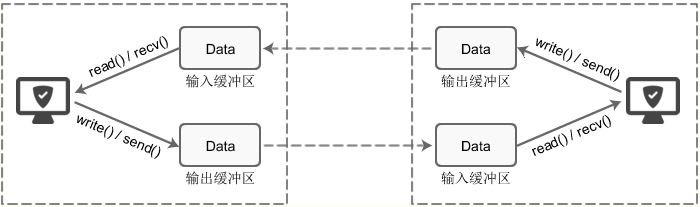
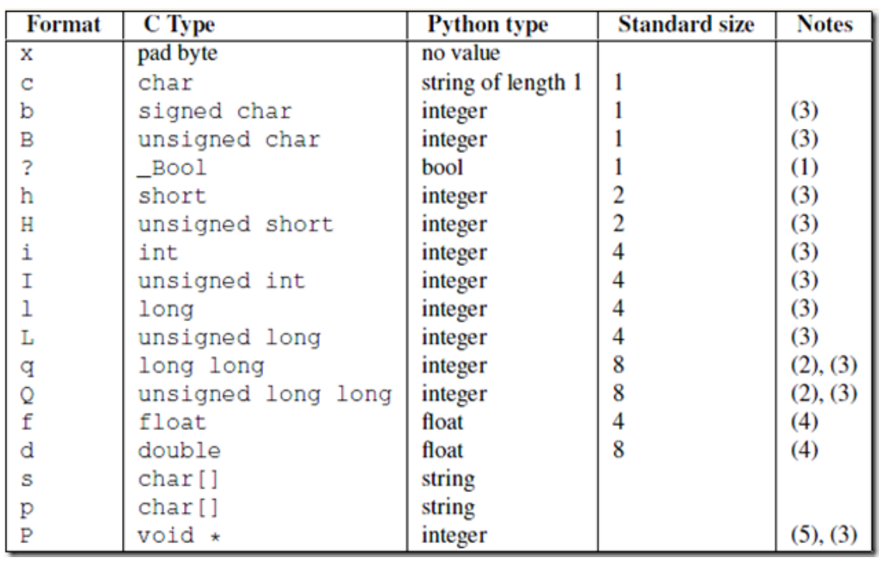

**粘包**



每个 socket 被创建后，都会分配两个缓冲区，输入缓冲区和输出缓冲区。

write()/send() 并不立即向网络中传输数据，而是先将数据写入缓冲区中，再由TCP协议将数据从缓冲区发送到目标机器。一旦将数据写入到缓冲区，函数就可以成功返回，不管它们有没有到达目标机器，也不管它们何时被发送到网络，这些都是TCP协议负责的事情。

TCP协议独立于 write()/send() 函数，数据有可能刚被写入缓冲区就发送到网络，也可能在缓冲区中不断积压，多次写入的数据被一次性发送到网络，这取决于当时的网络情况、当前线程是否空闲等诸多因素，不由程序员控制。read()/recv() 函数也是如此，也从输入缓冲区中读取数据，而不是直接从网络中读取。

这些I/O缓冲区特性可整理如下：

1. I/O缓冲区在每个TCP套接字中单独存在；

1. I/O缓冲区在创建套接字时自动生成；

1. 即使关闭套接字也会继续传送输出缓冲区中遗留的数据；

1. 关闭套接字将丢失输入缓冲区中的数据。

# 1、两种情况下会发生粘包

## 1）情况一：

- 接收方没有及时接收缓冲区的包，造成多个包接收（客户端发送了一段数据，服务端只收了一小部分，服务端下次再收的时候还是从缓冲区拿上次遗留的数据，产生粘包）

### 服务端

```
import socket
import subprocess
phone = socket.socket(socket.AF_INET, socket.SOCK_STREAM)
phone.bind(('127.0.0.1', 8080))
phone.listen(5)
while 1:  # 循环连接客户端
  conn, client_addr = phone.accept()
  print(client_addr)
  while 1:
    try:
      cmd = conn.recv(1024)
      ret = subprocess.Popen(cmd.decode('utf-8'), shell=True,
stdout=subprocess.PIPE, stderr=subprocess.PIPE)
      correct_msg = ret.stdout.read()
      error_msg = ret.stderr.read()
      conn.send(correct_msg + error_msg)
    except ConnectionResetError:
      break
conn.close()
phone.close()
```

### 客户端

```
import socket
phone = socket.socket(socket.AF_INET,socket.SOCK_STREAM)  # 买电话
phone.connect(('127.0.0.1',8080))  # 与客户端建立连接， 拨号
while 1:
  cmd = input('>>>')
  phone.send(cmd.encode('utf-8'))
  from_server_data = phone.recv(1024)
  print(from_server_data.decode('gbk'))
phone.close()
```

## 2）情况二

- 发送端需要等缓冲区满才发送出去，造成粘包（发送数据时间间隔很短，数据也很小，会合到一起，产生粘包）

### 服务端

```
import socket
phone = socket.socket(socket.AF_INET, socket.SOCK_STREAM)
phone.bind(('127.0.0.1', 8080))
phone.listen(5)
conn, client_addr = phone.accept()
frist_data = conn.recv(1024)
print('1:',frist_data.decode('utf-8'))  # 1: helloworld
second_data = conn.recv(1024)
print('2:',second_data.decode('utf-8'))
conn.close()
phone.close()
```

### 客户端

```
import socket
phone = socket.socket(socket.AF_INET, socket.SOCK_STREAM)
phone.connect(('127.0.0.1', 8080))
phone.send(b'hello')
phone.send(b'world')
phone.close()
```

# 2、粘包的解决方案

## 1）struct模块

该模块可以把一个类型，如数字，转成固定长度的bytes



```
import struct
# 将一个数字转化成等长度的bytes类型。
ret = struct.pack('i', 183346)
print(ret, type(ret), len(ret))

# 通过unpack反解回来
ret1 = struct.unpack('i',ret)[0]
print(ret1, type(ret1), len(ret1))
# 但是通过struct 处理不能处理太大
```

## 2）方案一:

```
import socket
import subprocess
import struct
phone = socket.socket(socket.AF_INET, socket.SOCK_STREAM)
phone.bind(('127.0.0.1', 8080))
phone.listen(5)
while 1:
  conn, client_addr = phone.accept()
  print(client_addr)
  while 1:
    try:
      cmd = conn.recv(1024)
      ret = subprocess.Popen(cmd.decode('utf-8'), shell=True,
stdout=subprocess.PIPE, stderr=subprocess.PIPE)
      correct_msg = ret.stdout.read()
      error_msg = ret.stderr.read()
      # 1 制作固定报头
      total_size = len(correct_msg) + len(error_msg)
      header = struct.pack('i', total_size)
      # 2 发送报头
      conn.send(header)
      # 发送真实数据：
      conn.send(correct_msg)
      conn.send(error_msg)
    except ConnectionResetError:
      break
conn.close()
phone.close()
# 但是low版本有问题：
# 1，报头不只有总数据大小，而是还应该有MD5数据，文件名等等一些数据。
# 2，通过struct模块直接数据处理，不能处理太大。
```

### 客户端

```
import socket
import struct
phone = socket.socket(socket.AF_INET, socket.SOCK_STREAM)
phone.connect(('127.0.0.1', 8080))
while 1:
  cmd = input('>>>').strip()
  if not cmd: continue
  phone.send(cmd.encode('utf-8'))
  # 1，接收固定报头
  header = phone.recv(4)    
  # 2，解析报头
  total_size = struct.unpack('i', header)[0]        #unpack()，返回值是一个元组
  # 3，根据报头信息，接收真实数据
  recv_size = 0
  res = b''
  while recv_size < total_size:
    recv_data = phone.recv(1024)
    res += recv_data
    recv_size += len(recv_data)
  print(res.decode('gbk'))
phone.close()
```

## 3）方案二：可自定制报头

### 服务端

```
import socket
import subprocess
import struct
import json
phone = socket.socket(socket.AF_INET, socket.SOCK_STREAM)
phone.bind(('127.0.0.1', 8080))
phone.listen(5)
while 1:
  conn, client_addr = phone.accept()
  print(client_addr)
  while 1:
    try:
      cmd = conn.recv(1024)
      ret = subprocess.Popen(cmd.decode('utf-8'), shell=True,
stdout=subprocess.PIPE, stderr=subprocess.PIPE)
      correct_msg = ret.stdout.read()
      error_msg = ret.stderr.read()
      # 1 制作固定报头
      total_size = len(correct_msg) + len(error_msg)
      header_dict = {
        'md5': 'fdsaf2143254f',
        'file_name': 'f1.txt',
        'total_size': total_size,
     }
      header_dict_json = json.dumps(header_dict)     # str
      bytes_headers = header_dict_json.encode('utf-8')
      header_size = len(bytes_headers)
      header = struct.pack('i', header_size)
      # 2 发送报头长度
      conn.send(header)
      # 3 发送报头
      conn.send(bytes_headers)
      # 4 发送真实数据：
      conn.send(correct_msg)
      conn.send(error_msg)
    except ConnectionResetError:
      break
conn.close()
phone.close()
```

### 客户端

```
import socket
import struct
import json
phone = socket.socket(socket.AF_INET, socket.SOCK_STREAM)
phone.connect(('127.0.0.1', 8080))
while 1:
  cmd = input('>>>').strip()
  if not cmd: continue
  phone.send(cmd.encode('utf-8'))
  # 1，接收固定报头
  header_size = struct.unpack('i', phone.recv(4))[0]
  # 2，解析报头长度
  header_bytes = phone.recv(header_size)
  header_dict = json.loads(header_bytes.decode('utf-8'))
  # 3,收取报头
  total_size = header_dict['total_size']
  # 3，根据报头信息，接收真实数据
  recv_size = 0
  res = b''
  while recv_size < total_size:
    recv_data = phone.recv(1024)
    res += recv_data
    recv_size += len(recv_data)
  print(res.decode('gbk'))
phone.close()
```

## 4）FTP上传下载文件的代码（简单版）

### 服务端

```
import socket
import struct
import json
sk = socket.socket()
# buffer = 4096 # 当双方的这个接收发送的大小比较大的时候，就像这个4096，就会丢数据，这
个等我查一下再告诉大家，改小了就ok的，在linux上也是ok的。
buffer = 1024 #每次接收数据的大小
sk.bind(('127.0.0.1',8090))
sk.listen()
conn,addr = sk.accept()
#接收
head_len = conn.recv(4)
head_len = struct.unpack('i',head_len)[0] #解包
json_head = conn.recv(head_len).decode('utf-8') #反序列化
head = json.loads(json_head)
filesize = head['filesize']
with open(head['filename'],'wb') as f:
  while filesize:
    if filesize >= buffer: #>=是因为如果刚好等于的情况出现也是可以的。
      content = conn.recv(buffer)
      f.write(content)
      filesize -= buffer
    else:
      content = conn.recv(buffer)
      f.write(content)
      break
conn.close()
sk.close()
```

### 客户端

```
import os
import json
import socket
import struct
sk = socket.socket()
sk.connect(('127.0.0.1',8090))
buffer = 1024 #读取文件的时候，每次读取的大小
head = {
      'filepath':r'C:\Users\Aaron\Desktop\新建文件夹', #需要下载的文件路
径，也就是文件所在的文件夹
      'filename':'config',  #改成上面filepath下的一个文件
      'filesize':None,
   }
file_path = os.path.join(head['filepath'],head['filename'])
filesize = os.path.getsize(file_path)
head['filesize'] = filesize
# json_head = json.dumps(head,ensure_ascii=False) #字典转换成字符串
json_head = json.dumps(head)  #字典转换成字符串
bytes_head = json_head.encode('utf-8') #字符串转换成bytes类型
print(json_head)
print(bytes_head)
#计算head的长度，因为接收端先接收我们自己定制的报头，对吧
head_len = len(bytes_head) #报头长度
pack_len = struct.pack('i',head_len)
print(head_len)
print(pack_len)
sk.send(pack_len)  #先发送报头长度
sk.send(bytes_head) #再发送bytes类型的报头
#即便是视频文件，也是可以按行来读取的，也可以readline，也可以for循环，但是读取出来的数据
大小就不固定了，影响效率，有可能读的比较小，也可能很大，像视频文件一般都是一行的二进制字节
流。
#所有我们可以用read，设定一个一次读取内容的大小，一边读一边发，一边收一边写
with open(file_path,'rb') as f:
  while filesize:
    if filesize >= buffer: #>=是因为如果刚好等于的情况出现也是可以的。
      content = f.read(buffer) #每次读取出来的内容
      sk.send(content)
      filesize -= buffer #每次减去读取的大小
    else: #那么说明剩余的不够一次读取的大小了，那么只要把剩下的读取出来发送过去就行
了
      content = f.read(filesize)
      sk.send(content)
      break
sk.close()
```