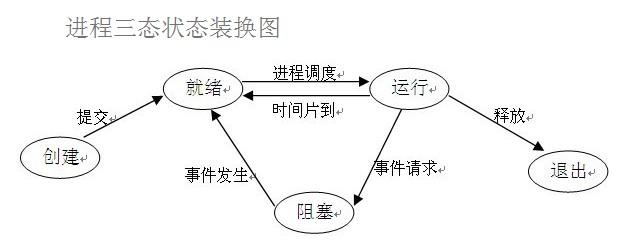
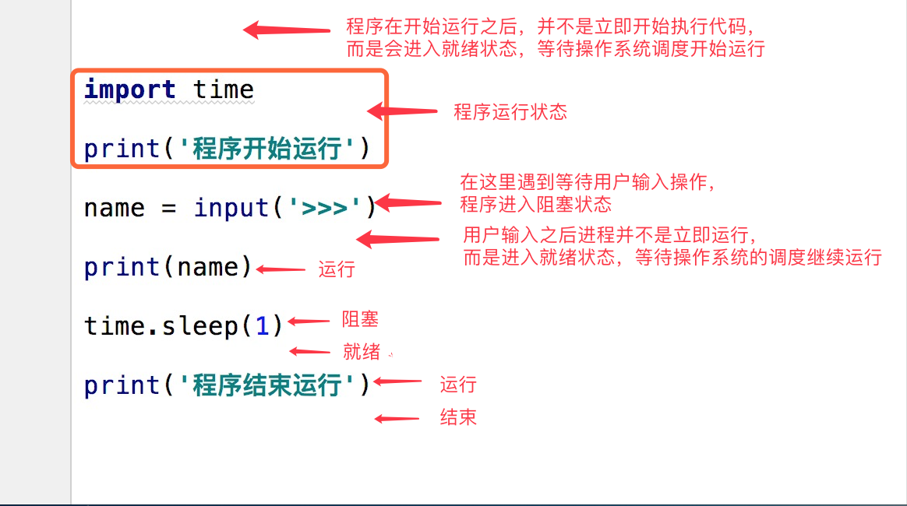

# 1、什么是进程

进程（Process）是计算机中的程序关于某数据集合上的一次运行活动，是系统进行资源分配和调度的基本单位，是[操作系统](https://baike.baidu.com/item/%E6%93%8D%E4%BD%9C%E7%B3%BB%E7%BB%9F)结构的基础。在早期面向进程设计的计算机结构中，进程是程序的基本执行实体；在当代面向线程设计的计算机结构中，进程是线程的容器。程序是指令、数据及其组织形式的描述，进程是程序的实体。

**狭义定义：**

**广义定义：**

第一，进程是一个实体。每一个进程都有它自己的地址空间，一般情况下，包括文本区域（text region）、数据区域（data region）和堆栈（stack region）。文本区域存储处理器执行的代码；数据区域存储变量和进程执行期间使用的动态分配的内存；堆栈区域存储着活动过程调用的指令和本地变量。

第二，进程是一个“执行中的程序”。程序是一个没有生命的实体，只有处理器赋予程序生命时（操作系统执行之），它才能成为一个活动的实体，我们称其为进程。

进程是操作系统中最基本、重要的概念。是多道程序系统出现后，为了刻画系统内部出现的动态情况，描述系统内部各道程序的活动规律引进的一个概念,所有多道程序设计操作系统都建立在进程的基础上。[](javascript:void(0);)

```
动态性：进程的实质是程序在多道程序系统中的一次执行过程，进程是动态产生，动态消亡的。
并发性：任何进程都可以同其他进程一起并发执行
独立性：进程是一个能独立运行的基本单位，同时也是系统分配资源和调度的独立单位；
异步性：由于进程间的相互制约，使进程具有执行的间断性，即进程按各自独立的、不可预知的速度向前推进
结构特征：进程由程序、数据和进程控制块三部分组成。
多个不同的进程可以包含相同的程序：一个程序在不同的数据集里就构成不同的进程，能得到不同的结果；但是执行过程中，程序不能发生改变。
```

```
程序是指令和数据的有序集合，其本身没有任何运行的含义，是一个静态的概念。
而进程是程序在处理机上的一次执行过程，它是一个动态的概念。
程序可以作为一种软件资料长期存在，而进程是有一定生命期的。
程序是永久的，进程是暂时的。
```

**注意：同一个程序执行两次，就会在操作系统中出现两个进程，所以我们可以同时运行一个软件，分别做不同的事情也不会混乱。**

# 2、进程调度

要想多个进程交替运行，操作系统必须对这些进程进行调度，这个调度也不是随即进行的，而是需要遵循一定的法则，由此就有了进程的调度算法。

- **先来先服务（FCFS）**

调度算法是一种最简单的调度算法，该算法既可用于作业调度，也可用于进程调度。FCFS算法比较有利于长作业（进程），而不利于短作业（进程）。由此可知，本算法适合于CPU繁忙型作业，而不利于I/O繁忙型的作业（进程）。

- **短作业（进程）优先调度算法**

是指对短作业或短进程优先调度的算法，该算法既可用于作业调度，也可用于进程调度。但其对长作业不利；不能保证紧迫性作业（进程）被及时处理；作业的长短只是被估算出来的

- 

基本思路是让每个进程在就绪队列中的等待时间与享受服务的时间成比例。在时间片轮转法中，需要将CPU的处理时间分成固定大小的时间片，例如，几十毫秒至几百毫秒。如果一个进程在被调度选中之后用完了系统规定的时间片，但又未完成要求的任务，则它自行释放自己所占有的CPU而排到就绪队列的末尾，等待下一次调度。同时，进程调度程序又去调度当前就绪队列中的第一个进程。

- **多级反馈队列调度**

多级反馈队列调度算法则不必事先知道各种进程所需的执行时间，而且还可以满足各种类型进程的需要，因而它是目前被公认的一种较好的进程调度算法。在采用多级反馈队列调度算法的系统中，调度算法的实施过程如下所述。

(1) 应设置多个就绪队列，并为各个队列赋予不同的优先级。第一个队列的优先级最高，第二个队列次之，其余各队列的优先权逐个降低。该算法赋予各个队列中进程执行时间片的大小也各不相同，在优先权愈高的队列中，为每个进程所规定的执行时间片就愈小。例如，第二个队列的时间片要比第一个队列的时间片长一倍，……，第i+1个队列的时间片要比第i个队列的时间片长一倍。

(2) 当一个新进程进入内存后，首先将它放入第一队列的末尾，按FCFS原则排队等待调度。当轮到该进程执行时，如它能在该时间片内完成，便可准备撤离系统；如果它在一个时间片结束时尚未完成，调度程序便将该进程转入第二队列的末尾，再同样地按FCFS原则等待调度执行；如果它在第二队列中运行一个时间片后仍未完成，再依次将它放入第三队列，……，如此下去，当一个长作业(进程)从第一队列依次降到第n队列后，在第n 队列便采取按时间片轮转的方式运行。

(3) 仅当第一队列空闲时，调度程序才调度第二队列中的进程运行；仅当第1～(i-1)队列均空时，才会调度第i队列中的进程运行。如果处理机正在第i队列中为某进程服务时，又有新进程进入优先权较高的队列(第1～(i-1)中的任何一个队列)，则此时新进程将抢占正在运行进程的处理机，即由调度程序把正在运行的进程放回到第i队列的末尾，把处理机分配给新到的高优先权进程。

[](javascript:void(0);)

# 3、进程的并行与并发

**并行**

**并发**

**区别:**

**并行**

**并发**

# 4、同步异步阻塞非阻塞

**状态介绍**



在了解其他概念之前，我们首先要了解进程的几个状态。在程序运行的过程中，由于被操作系统的调度算法控制，程序会进入几个状态：就绪，运行和阻塞。

（1）就绪(Ready)状态

　　当进程已分配到除CPU以外的所有必要的资源，只要获得处理机便可立即执行，这时的进程状态称为就绪状态。

（2）执行/运行（Running）状态当进程已获得处理机，其程序正在处理机上执行，此时的进程状态称为执行状态。

（3）阻塞(Blocked)状态正在执行的进程，由于等待某个事件发生而无法执行时，便放弃处理机而处于阻塞状态。引起进程阻塞的事件可有多种，例如，等待I/O完成、申请缓冲区不能满足、等待信件(信号)等。

