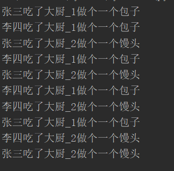

# 1、生产者消费者模型

- **生产者**:  生产/制造东西的

- **消费者:  消费/处理东西的**

- 该模型除了上述两个之外还需要一个媒介

- 生活中的例子做包子的将包子做好后放在蒸笼(媒介)里面，买包子的取蒸笼里面拿

- 厨师做菜做完之后用盘子装着给你消费者端过去

- 生产者和消费者之间不是直接做交互的，而是借助于媒介做交互

- 生产者(做包子的) + 消息队列(蒸笼) + 消费者(吃包子的)

> **核心思想：**
> **1、首先具备一个消息队列，用于进程通信**
> **2、一个或多个生产进程负责生成数据，并放入消息队列中**
> **3、一个或多个消费进程负责，负责从消息队里中获取数据**
> 
> **注意点：**
> **1、消费进程，在取用数据时，如果消息队里中已经没有数据，并且生成进程不再生产数据时，**
> **    那么该进程应该被杀死或者自动停止。  **
> **2、不能单一的认为，消息队列中没有数据了，就代表数据全部取出了，**
> **    有可能只是你取出数据的速度太快了，生产者还来不及将数据放到消息队里中，**
> **     所以当消息队里中没有了数据，还需要明确生产者是否还有待放入的数据，如果没有，才结束服务。**
> **   **


# 2、Queue队列实现（不推荐）

```python
# _*_ coding : utf-8 _*_
from multiprocessing import  Queue,Process
import  time,random
​
def producer(name,food,q):
    data=f"{name}做个一个{food}"
    for i in range(0,5):
        time.sleep(random.randint(1,3))
        # print(data)
        q.put(data)
​
​
def consumer(name,q):
    while True:
        time.sleep(random.randint(1,2))
        data=q.get()
        if data is None:
            break
        print(f"{name}吃了{data}")
​
​
if __name__ == '__main__':
    q=Queue()
    cook1=Process(target=producer,args=("大厨_1","包子",q))     #做早饭
    cook2=Process(target=producer,args=("大厨_2","馒头",q))
    cook1.start()
    cook2.start()
​
    zhansan=Process(target=consumer,args=("张三",q))      #池早饭
    lisi=Process(target=consumer,args=("李四",q))
    zhansan.start()
    lisi.start()
    cook1.join()    #等生产者全部生产完毕
    cook2.join()
    q.put(None)    #在消息队里中，添加上结束信息，因为要告诉每个消费者，所以有多少个消费者，就至少要有多少个结束信息。
    q.put(None)
```

> **代码解析：**
> **1、启用了两个生产者进程，和两个消费者进程并发执行**
> **2、为了告知消费者，已经消费完所有的数据，所以在主进程中设置：**
> **     -当生产者全部，全部生产完毕之后，在消息队列的末尾，加上结束信息“None”，**
> **     -当消费者，获取到“None”信息时，就代表已经没有数据了，无需等待，所以退出服务**
> **    -具体实现：**
> **        ****producer.join()****  #等待生产者全部生产完毕**
> **       **** Queue.put(None)****  #由于有多个消费者，所以需要加入多个None到消息队列中，**
> **       **** Queue.put(None)**
> **        ......**
> **缺点：**
> ** 1、使用这样的方法，需要明确有多少个消费者，才可以。**
> **      或者说，消费者的数量是固定的，不能轻易的改动，比较麻烦。**


# 3、JoinenableQueue 队列实现（推荐使用）

```python
# _*_ coding : utf-8 _*_
from multiprocessing import  Queue,Process,JoinableQueue
import  time,random
def producer(name,food,q):
    data=f"{name}做个一个{food}"
    for i in range(0,5):
        time.sleep(random.randint(1,3))
        # print(data)
        q.put(data)
def consumer(name,q):
    while True:
        time.sleep(random.randint(1,2))
        data=q.get()
        print(f"{name}吃了{data}")
        q.task_done()       #JoinenableQueue队列中的计数器-1
if __name__ == '__main__':
    # q=Queue()
    q=JoinableQueue()        #将队列换成JoinenableQueue队列
    cook1=Process(target=producer,args=("大厨_1","包子",q))     #做早饭
    cook2=Process(target=producer,args=("大厨_2","馒头",q))
    cook1.start()
    cook2.start()
    zhansan=Process(target=consumer,args=("张三",q))      #吃早饭
    lisi=Process(target=consumer,args=("李四",q))
    zhansan.daemon=True
    lisi.daemon=True
    zhansan.start()
    lisi.start()
    cook1.join()
    cook2.join()
    q.join()    #当JoinenableQueue队列中的计数器为0时才往后执行，也就是说当队列中没有数据了才往后执行
```

- **运行结果：**



> 
> **与Queue队列实现的区别：**
> **1、将通信队列由Queue换成JoinenableQueue队列**
> **2、JoinenableQueue队列与Queue队列使用方法基本一致：**
> **    -但是JoinenableQueue队里中可以对队列中的数据的个数，进行了计数，**
> **       队列中专门有一个变量用于统计数据的个数，每当添加一个数据和这个变量就会+1，就类似于引用计数一样**
> **    -****JoinenableQueue.task_done() #****执行这个方法，队列中的引用计数就会-1，一般需要配合get()方法一起使用。**
> **      	****JoinenableQueue.get()	****  #取走一个数据**
> **        ****JoinenableQueue.task_done()****  #-1**
> **    -****JoinenableQueue.join() ****  #此方法判断队列中的引用计数是否为0，如果为0就会往后执行，**
> **         如果不为0，就会阻塞当前进程，直到引用计数为0位置**
> **3、主进程在保证生产者进程已经全部执行完毕之后，**
> **    使用了****JoinenableQueue.join()****方法，也就是当引用计数为0时再往后执行，并且它的执行也就代表着生产者**
> **      已经生产完所有的数据，以及消费者也取走了所有的数据。**
> **    并且将消费者进程设置为了守护进程。那么当主进程执行结束后，消费者进程会被自动杀死。**
> **    而****JoinenableQueue.join()****方法后面没有任何代码，也就代表着此方法执行完成后，主进程结束。**
> **    由此实现了消费者进程自动结束，且不用考虑到底有多少个消费者进程在执行。**
> **     **
