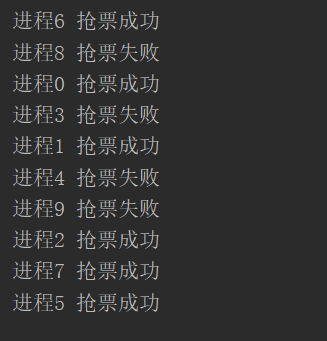
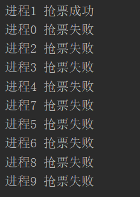
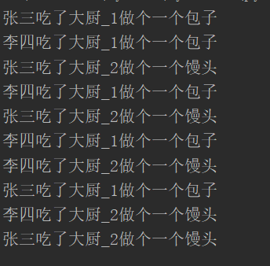

# 1、互斥锁

多个进程操作同一份数据的时候，会出现数据错乱的问题

## 1.1 情景模拟（抢票系统）

- data.json

```
{"ticket_num": 1}
```

- grab_ticket.py

```python
from  multiprocessing import Process,current_process
import random
import json,time
def search():
    res=None
    time.sleep(random.randint(1,2))
    with open("data.json","rt",encoding="utf-8") as f:
        dic=json.load(f)
        res=dic.get("ticket_num")
    return res
def buy():
    ticket_num=search()
    if ticket_num==0:
        print(f"{current_process().name} 抢票失败")
        return
    ticket_num-=1
    dic={
        "ticket_num":ticket_num
    }
    time.sleep(random.randint(1,2))
    with open("data.json","wt",encoding="utf-8") as f:
        json.dump(dic,f)
    print(f"{current_process().name} 抢票成功")
    return
def grab_ticket():
    res=search()
    if res>0:
        buy()
    else:
        print(f"{current_process().name} 已经没有票了")
if __name__ == '__main__':
    for i in range(0,10):
        p=Process(target=grab_ticket)
        p.name=f"进程{i}"
        p.start()
```

- 运行结果



> **运行结果： **
> **程序错误，因为只有一张票，却有好几个进程抢到了票，显然不合理。**
> 
> **原因分析：**
> **1、多个子进程并发执行抢票操作，抢票之前会先查询票的数量，如果大于0，就可以直接买到票了。**
> **2、买完票之后，才会修改原有的数据库中的票的数量。**
> **3、但是买票的过程是需要耗费时间的，而且只有买完票之后才会将新的数据更新到数据库，这样的话，**
> **    就在你买票的过程中，就已经有其他的进程在进行查票的操作了，诶，一看有票，好了他也去买票了。**
> **    而且这样的进程可能有多个。**
> **4、由于他们只要查到有票，就会进行买票操作。由此导致了一张票，却卖给了多个人的情况，**
> **    因为他们是在别人买票的过程中(修改数据的过程中)，进行的查票，相当与钻了空子买到的。**
> **5、而有的进程动作比较慢，是等别人已经买了票（修改完了数据），才进行的查票操作，所以没有买到票。**
> 
> **解决办法：**
> **1、进程修改数据的速度太慢了，所以导致，其他程序查询数据时，数据还没有修改完，由此到了数据错乱**
> **   所以，方法一，让修改数据的过程特别快，快到别人永远钻不了空子，但很显然不现实。**
> **    因为延迟是肯定有的，无法解决的。**
> **2、方法二：**
> **   就是当程序已经在修改数据的时候，其他进程无法获取到数据，必须要等到修改完数据，才能访问数据。**
> **   这样就保证了，每一次查询到的数据，都是英已经修改完成的，并且你查询的过程中，**
> **   没有其他的进程在修改这个数据。由此保证了数据的一致性。**


## 1.2 互斥锁，保证数据一致性 

针对上述问题，解决方式就是加锁处理:

```python
from  multiprocessing import Process,current_process,Lock
import random
import json,time
def search():
    res=None
    time.sleep(random.randint(1,2))
    with open("data.json","rt",encoding="utf-8") as f:
        dic=json.load(f)
        res=dic.get("ticket_num")
    return res
def buy():
    ticket_num=search()
    if ticket_num==0:
        print(f"{current_process().name} 抢票失败")
        return
    ticket_num-=1
    dic={
        "ticket_num":ticket_num
    }
    time.sleep(random.randint(1,2))
    with open("data.json","wt",encoding="utf-8") as f:
        json.dump(dic,f)
    print(f"{current_process().name} 抢票成功")
    return
def grab_ticket(mutex):
    res=search()
    if res>0:
        mutex.acquire()        #抢锁
        buy()
        mutex.release()        #释放锁
    else:
        print(f"{current_process().name} 已经没有票了")
if __name__ == '__main__':
    mutex=Lock()
    for i in range(0,10):
        p=Process(target=grab_ticket,args=(mutex,))
        p.name=f"进程{i}"
        p.start()
```

- 运行结果



> 
> **1、****mutex=Lock() ****封装了一把唯一的互斥锁lock,当需要对某个数据进行修改时，就需要先抢到这把锁，然后进行数据修改。**
> **   修改完成后，需要再把这把锁释放掉。因为只有一把，你不释放掉，别人就用不了了。**
> **2、如果抢到了，就可以执行后面的操作，如果没有抢到，程序就会被阻塞在那里，直到别人释放掉锁，然后你再去拿到那把锁，**
> **    才可以继续执行后面的操作。**
> **3、具体示例：**
> **    ****mutex.acquire()	****#抢锁，如果没有抢到会被阻塞**
> **    ****changdata()	****	#修改数据**
> **    ****mutex.release()****	#释放锁**
> **4、**** mutext=Lock() ****实例化，必须要放在主进程当中，然后再传给子进程使用。**
> **      因为只有这样，子进程相互之间，才会进行抢锁，因为只有一把。**
> **     如果你放在子进程中，实例化，那根本用不着抢了，因为他们自己就有一把，随时可以用，所以没有什么意义。 **
> **5、所以当我们给buy()函数上完锁之后，虽然查询时是并发查询的，都查询到有票，但是在同一个时间段，只能有一个进程**
> **   可以对数据进行修改，也就是抢到锁的那个进程。等他修改完数据后，那么只有第二个抢到锁的进程可以修改数据。**
> **   但由于第一个进程修改数据时，就已经把票抢完了，后面的即使可以修改数据了，可是票已经没了，所以修改失败。   **


# 2、进程间通信

## 2.1 队列Queue模块

```python
"""
管道:subprocess 
    stdin stdout stderr
队列:管道+锁
​
队列:先进先出
堆栈:先进后出
"""
from multiprocessing import Queue
​
# 创建一个队列
q = Queue(5)  # 括号内可以传数字 标示生成的队列最大可以同时存放的数据量
​
# 往队列中存数据
q.put(111)
q.put(222)
q.put(333)
# print(q.full())  # 判断当前队列是否满了
# print(q.empty())  # 判断当前队列是否空了
q.put(444)
q.put(555)
# print(q.full())  # 判断当前队列是否满了
​
# q.put(666)  # 当队列数据放满了之后 如果还有数据要放程序会阻塞 直到有位置让出来 不会报错
​
"""
存取数据 存是为了更好的取
千方百计的存、简单快捷的取
​
同在一个屋檐下
差距为何那么大
"""
​
# 去队列中取数据
v1 = q.get()
v2 = q.get()
v3 = q.get()
v4 = q.get()
v5 = q.get()
# print(q.empty())
# V6 = q.get_nowait()  # 没有数据直接报错queue.Empty
# v6 = q.get(timeout=3)  # 没有数据之后原地等待三秒之后再报错  queue.Empty
try:
    v6 = q.get(timeout=3)
    print(v6)
except Exception as e:
    print('一滴都没有了!')
​
# # v6 = q.get()  # 队列中如果已经没有数据的话 get方法会原地阻塞
# print(v1, v2, v3, v4, v5, v6)
​
"""
q.full()
q.empty()
q.get_nowait()
在多进程的情况下是不精确
"""
```

# 3、IPC机制，实现进程通信

```python
from multiprocessing import Queue, Process
​
"""
研究思路
    1.主进程跟子进程借助于队列通信
    2.子进程跟子进程借助于队列通信
"""
def producer(q):
    q.put('我是23号技师 很高兴为您服务')
​
​
def consumer(q):
    print(q.get())
​
​
if __name__ == '__main__':
    q = Queue()
    p = Process(target=producer,args=(q,))
    p1 = Process(target=consumer,args=(q,))
    p.start()
    p1.start()
```

# 4、生产者消费者模型

- **生产者**:  生产/制造东西的

- **消费者:  消费/处理东西的**

- 该模型除了上述两个之外还需要一个媒介

- 生活中的例子做包子的将包子做好后放在蒸笼(媒介)里面，买包子的取蒸笼里面拿

- 厨师做菜做完之后用盘子装着给你消费者端过去

- 生产者和消费者之间不是直接做交互的，而是借助于媒介做交互

- 生产者(做包子的) + 消息队列(蒸笼) + 消费者(吃包子的)

> **核心思想：**
> **1、首先具备一个消息队列，用于进程通信**
> **2、一个或多个生产进程负责生成数据，并放入消息队列中**
> **3、一个或多个消费进程负责，负责从消息队里中获取数据**
> 
> **注意点：**
> **1、消费进程，在取用数据时，如果消息队里中已经没有数据，并且生成进程不再生产数据时，**
> **    那么该进程应该被杀死或者自动停止。  **
> **2、不能单一的认为，消息队列中没有数据了，就代表数据全部取出了，**
> **    有可能只是你取出数据的速度太快了，生产者还来不及将数据放到消息队里中，**
> **     所以当消息队里中没有了数据，还需要明确生产者是否还有待放入的数据，如果没有，才结束服务。**
> **   **


## 4.2 Queue队列实现（不推荐）

```python
# _*_ coding : utf-8 _*_
from multiprocessing import  Queue,Process
import  time,random
​
def producer(name,food,q):
    data=f"{name}做个一个{food}"
    for i in range(0,5):
        time.sleep(random.randint(1,3))
        # print(data)
        q.put(data)
​
​
def consumer(name,q):
    while True:
        time.sleep(random.randint(1,2))
        data=q.get()
        if data is None:
            break
        print(f"{name}吃了{data}")
​
​
if __name__ == '__main__':
    q=Queue()
    cook1=Process(target=producer,args=("大厨_1","包子",q))     #做早饭
    cook2=Process(target=producer,args=("大厨_2","馒头",q))
    cook1.start()
    cook2.start()
​
    zhansan=Process(target=consumer,args=("张三",q))      #池早饭
    lisi=Process(target=consumer,args=("李四",q))
    zhansan.start()
    lisi.start()
    cook1.join()    #等生产者全部生产完毕
    cook2.join()
    q.put(None)    #在消息队里中，添加上结束信息，因为要告诉每个消费者，所以有多少个消费者，就至少要有多少个结束信息。
    q.put(None)
```

> **代码解析：**
> **1、启用了两个生产者进程，和两个消费者进程并发执行**
> **2、为了告知消费者，已经消费完所有的数据，所以在主进程中设置：**
> **     -当生产者全部，全部生产完毕之后，在消息队列的末尾，加上结束信息“None”，**
> **     -当消费者，获取到“None”信息时，就代表已经没有数据了，无需等待，所以退出服务**
> **    -具体实现：**
> **        producer.join()  #等待生产者全部生产完毕**
> **        Queue.put(None)  #由于有多个消费者，所以需要加入多个None到消息队列中，**
> **        Queue.put(None)**
> **        ......**
> **缺点：**
> ** 1、使用这样的方法，需要明确有多少个消费者，才可以。**
> **      或者说，消费者的数量是固定的，不能轻易的改动，比较麻烦。**


## 4.3 JoinenableQueue 队列实现（推荐使用）

```python
# _*_ coding : utf-8 _*_
from multiprocessing import  Queue,Process,JoinableQueue
import  time,random
def producer(name,food,q):
    data=f"{name}做个一个{food}"
    for i in range(0,5):
        time.sleep(random.randint(1,3))
        # print(data)
        q.put(data)
def  consumer(name,q):
    while True:
        time.sleep(random.randint(1,2))
        data=q.get()
        print(f"{name}吃了{data}")
        q.task_done()       #JoinenableQueue队列中的计数器-1
if __name__ == '__main__':
    # q=Queue()
    q=JoinableQueue()        #将队列换成JoinenableQueue队列
    cook1=Process(target=producer,args=("大厨_1","包子",q))     #做早饭
    cook2=Process(target=producer,args=("大厨_2","馒头",q))
    cook1.start()
    cook2.start()
    zhansan=Process(target=consumer,args=("张三",q))      #吃早饭
    lisi=Process(target=consumer,args=("李四",q))
    zhansan.daemon=True
    lisi.daemon=True
    zhansan.start()
    lisi.start()
    cook1.join()
    cook2.join()
    q.join()    #当JoinenableQueue队列中的计数器为0时才往后执行，也就是说当队列中没有数据了才往后执行
```

- **运行结果：**



> 
> **与Queue队列实现的区别：**
> **1、将通信队列由Queue换成JoinenableQueue队列**
> **2、JoinenableQueue队列与Queue队列使用方法基本一致：**
> **    -但是JoinenableQueue队里中可以对队列中的数据的个数，进行了计数，**
> **       队列中专门有一个变量用于统计数据的个数，每当添加一个数据和这个变量就会+1，就类似于引用计数一样**
> **    -****JoinenableQueue.task_done() #****执行这个方法，队列中的引用计数就会-1，一般需要配合get()方法一起使用。**
> **      	****JoinenableQueue.get()	****  #取走一个数据**
> **        ****JoinenableQueue.task_done()****  #-1**
> **    -****JoinenableQueue.join() ****  #此方法判断队列中的引用计数是否为0，如果为0就会往后执行，**
> **         如果不为0，就会阻塞当前进程，直到引用计数为0位置**
> **3、主进程在保证生产者进程已经全部执行完毕之后，**
> **    使用了JoinenableQueue.join()方法，也就是当引用计数为0时再往后执行，并且它的执行也就代表着生产者**
> **      已经生产完所有的数据，以及消费者也取走了所有的数据。**
> **    并且将消费者进程设置为了守护进程。那么当主进程执行结束后，消费者进程会被自动杀死。**
> **    而JoinenableQueue.join()方法后面没有任何代码，也就代表着此方法执行完成后，主进程结束。**
> **    由此实现了消费者进程自动结束，且不用考虑到底有多少个消费者进程在执行。**
> **     **
