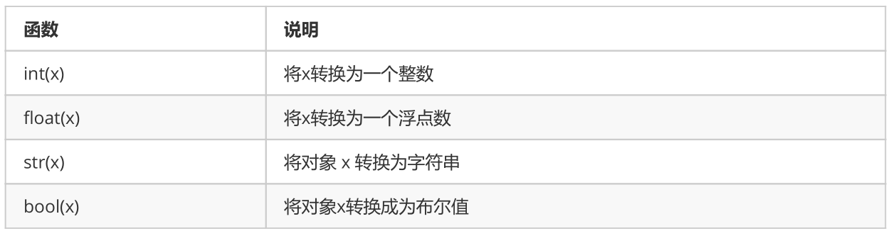

**类型转换**



- 转换成为整数

```
print(int("123"))  # 123 将字符串转换成为整数
print(int(123.78))  # 123 将浮点数转换成为整数
print(int(True))  # 1 布尔值True转换成为整数是 1
print(int(False)) # 0 布尔值False转换成为整数是 0
# 以下两种情况将会转换失败
'''
123.456 和 12ab 字符串，都包含非法字符，不能被转换成为整数，会报错
print(int("123.456"))
print(int("12ab"))
'''
```

- 转换成为浮点数

```
f1 = float("12.34")
print(f1)   # 12.34
print(type(f1)) # float 将字符串的 "12.34" 转换成为浮点数 12.34
f2 = float(23)
print(f2)  # 23.0
print(type(f2)) # float 将整数转换成为了浮点数
```

- 转换成为字符串

```
str1 = str(45)
str2 = str(34.56)
str3 = str(True)
print(type(str1),type(str2),type(str3))
```

- 转换成为布尔值

```
print(bool(''))
print(bool(""))
print(bool(0))
print(bool({}))
print(bool([])）
print(bool(())）
```