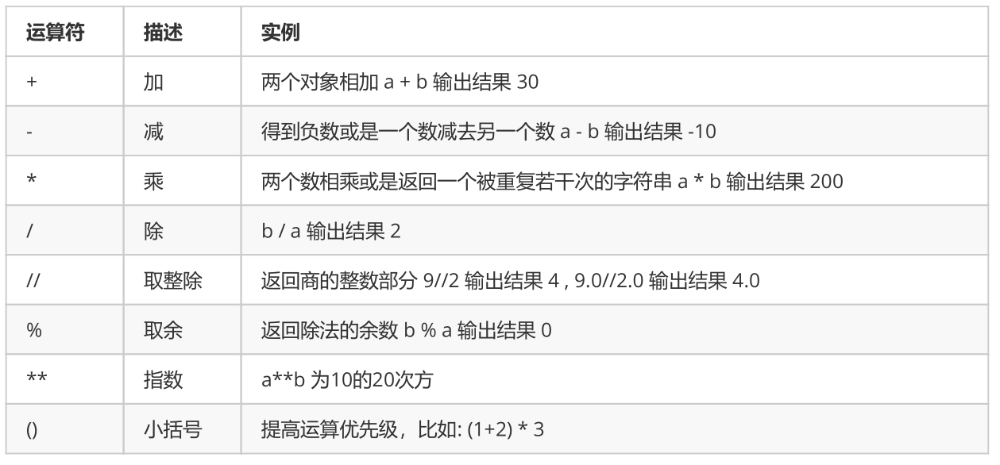
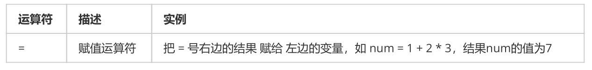
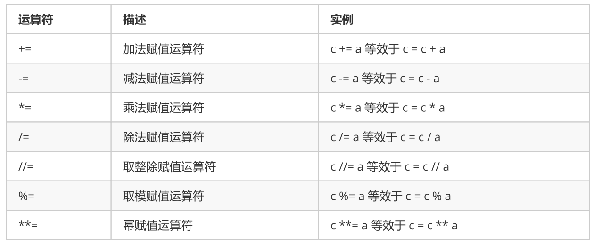
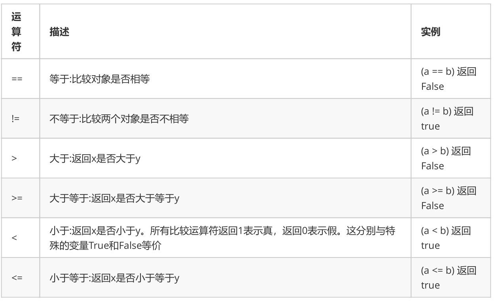
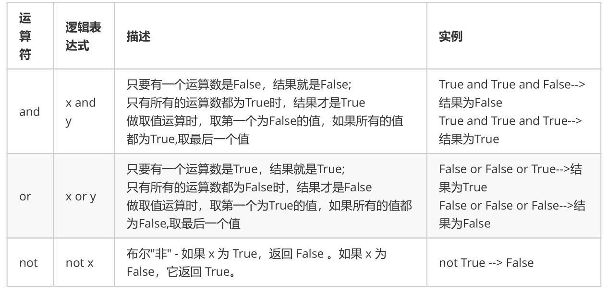

**运算符**

# 5.1 算数运算符

下面以a=10 ,b=20为例进行计算



```
>>> 10 + 5.5 * 2
21.0
>>> (10 + 5.5) * 2
31.0
```

## 1)算数运算符在字符串里的使用

```
In [1]: str1 ='hello'
In [2]: str2 = 'world'
In [3]: str1+str2
Out[3]: 'helloworld'
In [4]:
```

- 如果是两个字符串做加法运算，会直接把这两个字符串拼接成一个字符串。

```
In [1]: str1 ='hello'
In [2]: str2 = 'world'
In [3]: str1+str2
Out[3]: 'helloworld'
In [4]:
```

- 如果是数字和字符串做加法运算，会直接报错。

```
In [1]: str1 = 'hello'
In [2]: a = 2
In [3]: a+str1
‐‐‐‐‐‐‐‐‐‐‐‐‐‐‐‐‐‐‐‐‐‐‐‐‐‐‐‐‐‐‐‐‐‐‐‐‐‐‐‐‐‐‐‐‐‐‐‐‐‐‐‐‐‐‐‐‐‐‐‐‐‐‐‐‐‐‐‐‐‐‐‐‐‐‐
TypeError                                 Traceback (most recent call last)
<ipython‐input‐3‐993727a2aa69> in <module>
‐‐‐‐> 1 a+str1
TypeError: unsupported operand type(s) for +: 'int' and 'str'
```

- 如果是数字和字符串做乘法运算，会将这个**字符串重复多**次。

```
In [4]: str1 = 'hello'
In [5]: str1*10
Out[5]: 'hellohellohellohellohellohellohellohellohellohello'
```

# 5.2 赋值运算符



```
# 单个变量赋值
>>> num = 10
>>> num
10
# 同时为多个变量赋值(使用等号连接)
>>> a = b = 4
>>> a
4
>>> b
4
>>>
# 多个变量赋值(使用逗号分隔)
>>> num1, f1, str1 = 100, 3.14, "hello"
>>> num1
100
>>> f1
3.14
>>> str1
"hello"
```

# 5.3 复合赋值运算符



```
# 示例：+=
>>> a = 100
>>> a += 1  # 相当于执行 a = a + 1
>>> a
101
# 示例：*=
>>> a = 100
>>> a *= 2  # 相当于执行 a = a * 2
>>> a
200
# 示例：*=，运算时，符号右侧的表达式先计算出结果，再与左边变量的值运算
>>> a = 100
>>> a *= 1 + 2  # 相当于执行 a = a * (1+2)
>>> a
300
```

# 5.4 比较运算符

以下假设变量a为10，变量b为20：



# 5.5 逻辑运算符



性能提升

面试题：一下代码的输出结果是什么，为什么会有这样的输出。

```
a = 34
a > 10 and print('hello world')
a < 10 and print('hello world')
a >10 or print('你好世界')
a <10 or print('你好世界')
```

思考：

1. 逻辑运算的短路问题

1. 逻辑与运算和逻辑或运算取值时为什么是那种规则。