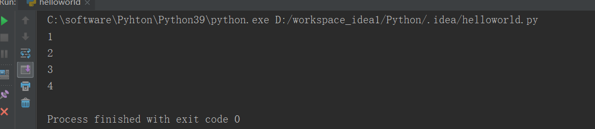
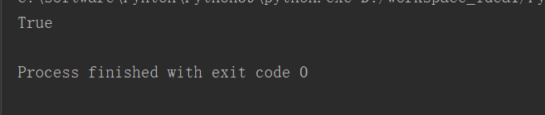
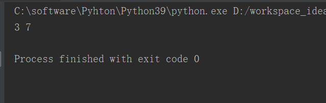

# 1、if语句


## 语法1

```javascript
if True :
    print("1")
    print("2")
    if True :
        print("3")
    print("4")
    if False :
        print("5")
```





---

## 语法2（Python）独有

```javascript
num=10
if 5<num<20:
    print("True")

```





---

# 语法3 if-elif-else

```javascript

a=7

if a==5:
    print("1",a)
elif a==6 :
    print("2",a)
elif a==7 :
    print("3",a)
else :
  print("False",a)
```




