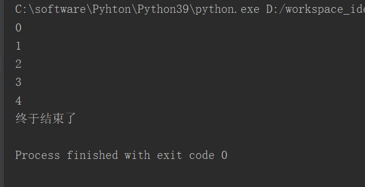
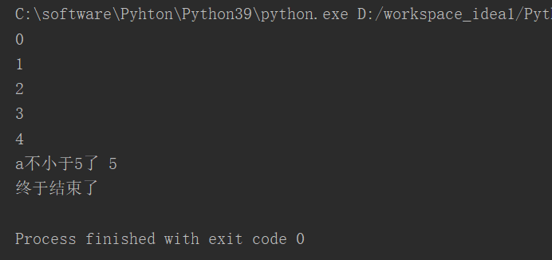
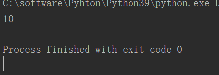
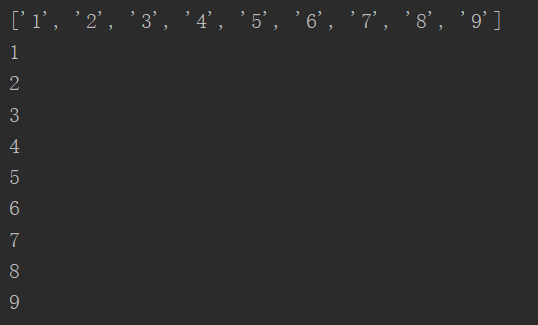
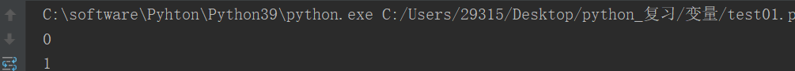

# 1、while


## 1)语法1

```javascript
a=0
while a<5 ：
    print(a)
    a+=1
print("终于结束了")
```





## 语法2（Python独有）

```javascript
a=0
while a<5 ：
    print(a)
    a+=1
else :
    print("a不小于5了",a)
print("终于结束了")
```





---

## 2、pass(用来站位没有意义）

```javascript
a=10
if a<20:
    pass
print(a)
```





---

# 3、for

```javascript
list=list("123456789")
print(list)
for s in list:
    print(s)
    

```





---

# 4、 for else

如果for 循环是正常结束，而不是被打断结束的，那么就会执行else中代码。

```javascript
num=0
for i in range(3):
    print(i)
    num+=1
    if num==2:
        break
else:
    print(num)
```




