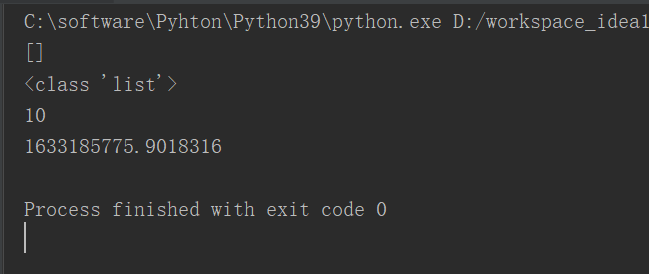
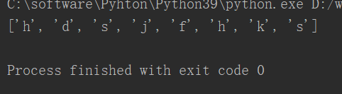
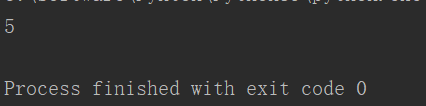
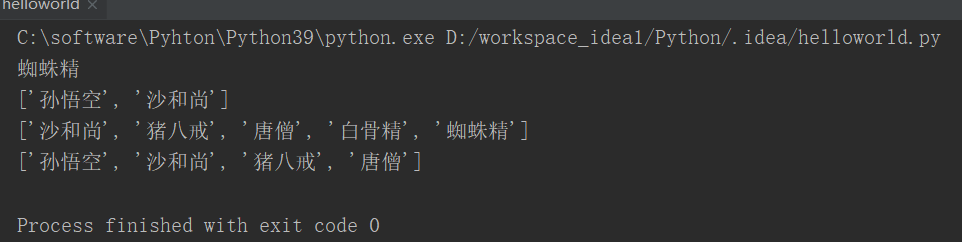
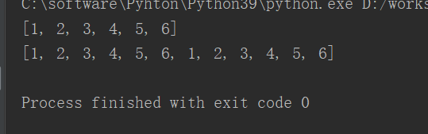
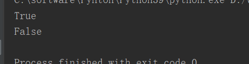
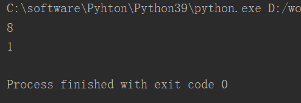
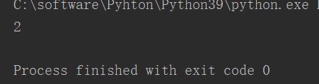
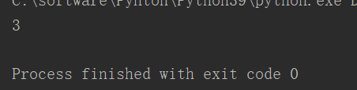

# **1、创建列表**

```javascript
#创建列表
from time import *
my_list=[]  #创建了一个空列表
print(my_list)
print(type(my_list))
my_list=[	
    10,20,30,40,
    time()
]
print(my_list[0])
print(my_list[4])
```



## **list(x)函数**

```javascript
#	参数：将参数x,转换为列表
list=list("hdsjfhks")
print(list)
```



# **2、len()函数**

**获取列表的长度（列表的元素个数）**

```javascript
from time import *
my_list=[
    10,20,30,40,
    time()
]
print(len(my_list))
```



# **3、切片**

- 切片指的是：从现有的列表中，获取一个子列表

- 创建一个列表，一般创建列表时，变量的名字会使用复数

```javascript
#创建列表
studs=["孙悟空","沙和尚","猪八戒","唐僧","白骨精","蜘蛛精"]
print(studs[-1])    #如果索引是负数，指的就是倒数第几个
#通过切片来获取指定的元素
#语法： 列表[start:end] ;注意，不包括end位置的元素
print(studs[0:2])
print(studs[1:])
print(studs[:4])
```



## **步长**

- **语法：列表[start:end:步长]**

- **步长不可以是0，但可以是负数，如果是负数，就倒着取元素**

```javascript
#语法：列表[起始：结束：步长]
#步长表示，每次获取元素的间隔，默认是1
studs=["孙悟空","沙和尚","猪八戒","唐僧","白骨精","蜘蛛精"]
print(studs[0:6:1])
print(studs[0:6:2])
print(studs[0:6:3])
```


**4、+ 和 ***

```javascript
**#	-+可以将两个列表拼接为一个列表**
**#	-*可以将一个列表复制，并拼接在一起**
**list=**[1,2,3]+[4,5,6]
print(list)
list=list*2
print(list)
```



# **5、in 和 not in**

```javascript
#	-in用来检查指定元素是否存在于列表中如果存在返回TRUE，否则返回FALSE
#	-not in用来检查指定元素是否不存在于列表中如果存在返回TRUE，否则返回FALSE
list=[1,2,3,4,5,6]
print(2 in list)
print(7 in list)
```



# **6、max()和min() 函数**

```javascript
#	-max(list),获取list列表中的最大值
#	-min(list),获取list列表中的最小值
list=[1,2,3,4,5,6,7,8]
print(max(list))
print(min(list))
```



**7、index()和count()方法**

## **index(）**

```javascript
**#	-index**(str,[start],[end])获取指定元素在列表中的位置
#	  -参数：start，开始查找的位置；end，查找结束位置
list=[1,2,3,4,5,6]
print(list.index(3))
```



## **count()**

```javascript
#	-count(str),统计指定元素在列表中出现的次数
list=[1,2,3,4,1,1,2,3,4]
print(list.count(1))
```

