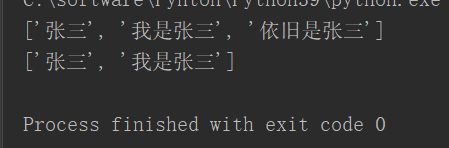
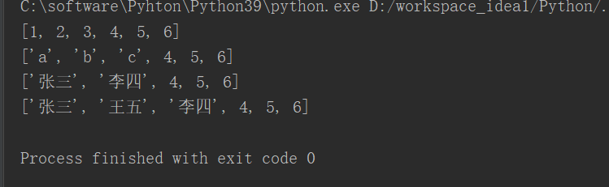
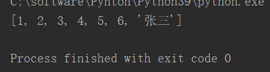
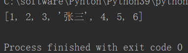
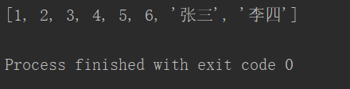
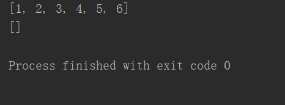
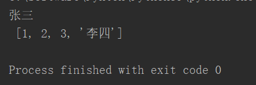
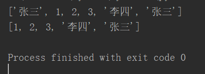
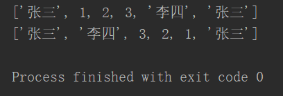

# **1、del**

```javascript
#通过del 删除元素
list=["张三","我是张三","依旧是张三"]
print(list)
del list[2]
print(list)
```



# **2、通过切片修改数据**

```javascript
list=[1,2,3,4,5,6]
print(list)
list[0:3]="abc"	#替换
print(list)
list[0:3]=["张三","李四"]	#替换
print(list)
list[1:1]=["王五"]	#插入
print(list)
```



## **利用切片将列表反转：**

```
list=[1,2,3,4,5,6]
print(list[::-1])   
```

# **3、append(x)和insert(index,x)和extend([ ])方法**

## **append()**

```javascript
#	-向列表的最后添加元素
list=[1,2,3,4,5,6]
list.append("张三")
print(list)
```



## **insert()**

```javascript
#	-insert(index,x),向指定位置添加元素
#	  参数：index，要插入的位置;x,要插入的元素；
list=[1,2,3,4,5,6]
list.insert(3,"张三")
print(list)
```



## **extend([ ])**

```javascript
#	-使用新的序列来扩展当前序列
#	-需要一个序列作为参数，它将会将该序列中的元素添加到当前序列中
list=[1,2,3,4,5,6]
list.extend(["张三","李四"])
print(list)
```



# **4、clear()方法**

```javascript
#	-clear(),清空序列
list=[1,2,3,4,5,6]
print(list)
list.clear()
print(list)
```



# **5、pop(index)和remove(x）**

## **pop(index)**

```javascript
#	-pop(),根据索引删除指定元素，并返回删除的元素
list=["张三",1,2,3,"李四"]
print(f"{list.pop(0)}\n",list)
```



## **remove(x)**

```javascript
#	-remove(x),删除指定值得元素，如果相同的元素有多个，就只删除第一个
list=["张三",1,2,3,"李四","张三"]
print(list)
list.remove("张三")
print(list)
```



# **7、reverse()**

```javascript
#	-用来反转列表
list=["张三",1,2,3,"李四","张三"]
print(list)
list.reverse()
print(list)
```



# **8、sort()**

```javascript
#	-用来对列表元素进行排序
list=list("jkejdejfcrkvnavqaq")
print(list)
list.sort()
print(list)
```

