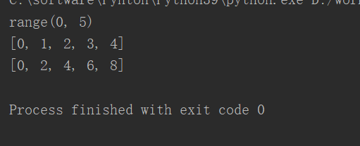
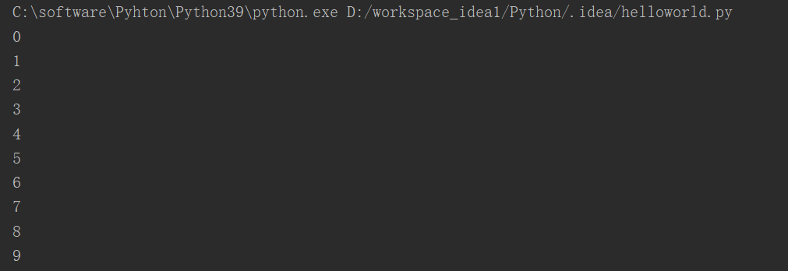
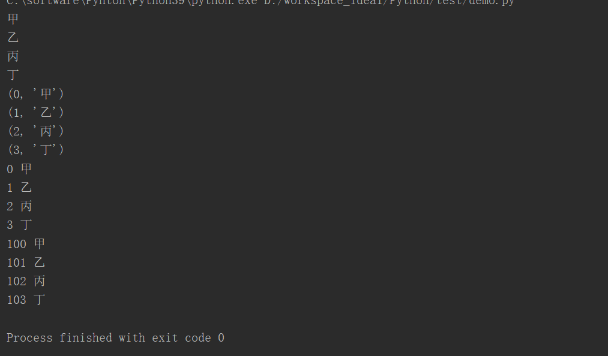

# **1、range([start],end,[step])**

```javascript
#	-range(),是一个函数，可以用来生成一个自然数的序列
r=range(5)
print(r)
print(list(r))
r=range(0,10,2)
print(list(r))
```



## **1)配合for循环使用**

```javascript
for i in range(10):
    print(i)
```



# **2、enumerate：枚举，**

对于一个可迭代的（iterable）/可遍历的对象（如列表、字符串），enumerate将

其组成一个索引序列，利用它可以同时获得索引和值。

```
li = ['甲','乙','丙','丁']
for i in li:
  print(i)
for i in enumerate(li):
  print(i)
for index,value in enumerate(li):
  print(index,value)
for index,value in enumerate(li,100): #从哪个数字开始索引
  print(index,value)
```

