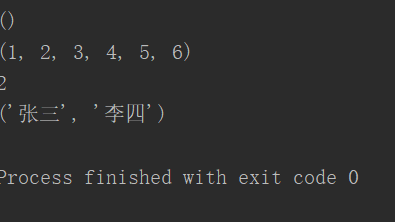
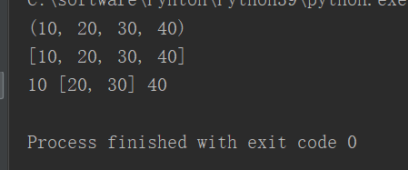
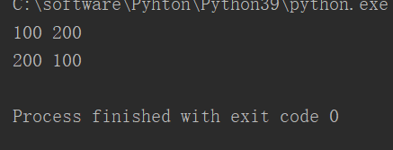

# **1、创建元组**

- **元组是一个不可变序列**

- **它的基本操作和列表基本一致**

- **元组不支持修改元素**

```javascript
tuple1=()		#创建空元组
print(tuple1)
tuple=(1,2,3,4,5,6)
print(tuple)
print(tuple[1])
tuple2="张三","李四"
print(tuple2)
```



# **2、解包（解构）**

```javascript
#	-解包，指的是将元组当中的每一个元素值都赋给一个变量
#	-解包时，变量的数量必须要和元组的数量一致
#	    或者在最后一个变量前加一个*号，这样元组剩余的元素将全部赋给那个变量
tuple=10,20,30,40
a,b,c,d=tuple
print(tuple)
*f,=tuple
print(f)
a,*b,c=tuple
print(a,b,c)
```



## **利用解包，交换变量值**

```javascript
a=100
b=200
print(a,b)
b,a=a,b
print(a,b)
```

