# **1、创建字典**

```javascript
d={ } #创建了一个空字典
print(d,type(d))
#字典的值可以是任意对象
#字典的键可以是任意的不可变对象（str,bool,int,tuple)
#字典的键不能重复
d={
    "name":"zhangsan",
    "age":18,
    "gender":"男"
}
print(d)
```

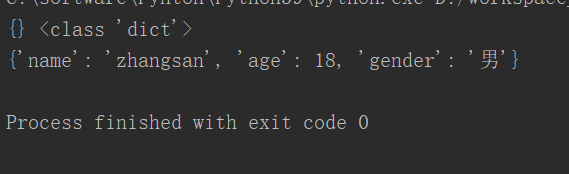

# **2、获取键值**

```javascript
d={
    "name":"zhangsan",
    "age":18,
    "gender":"男"
}
print(d["name"])
```

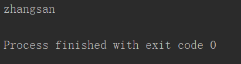

# **3、使用dict()函数创建字典**

```javascript
#dict()创建的字典，key均是字符串
d=dict(name="张三",gender="男")
print(d)
```

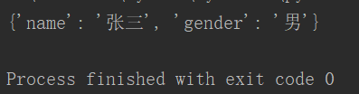

```javascript
#也可以将一个包含双值子序列的序列转换为字典
#双值序列，序列中只有两个值，[1,2] ("a",3) "ab"
#子序列，如果序列中的元素也是序列，那么我们称这个元素为子序列
#[(1,2),(3,5)]
d=dict([("name","zhangsan"),("age","19")])
print(d)
```

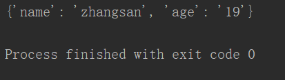

# **4、len()函数获取键值对的个数**

```javascript
d=dict(name="张三",gender="男")
print(len(d))
```

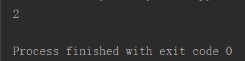

# **5、in 和not in**

```javascript
#in和 not in 检查字典中是否包含指定的键
d=dict(name="张三",gender="男")
print("name" in d)
```

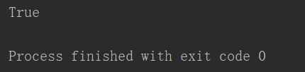

# **6、get("key"，"default")方法，获取键值**

```javascript
d=dict(name="张三",gender="男")
print(d.get("name"))	#如果key不存在，返回None
print(d.get("hdjshd","default"))	#如果key错误，返回"default"
```

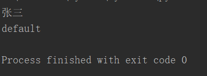

# **7、修改字典**

## **d["key"]**

```javascript
#修改字典
d=dict(name="张三",gender="男")
print(d)
d["name"]="李四"	#修改键值
d["age"]="29"	#增加键值对
print(d)
```

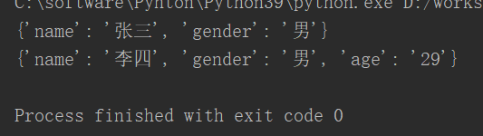

## **setdefault("key"，"value")方法**

```javascript
d=dict(name="张三",gender="男")
print(d)
d.setdefault("name","lisi") #如果key存在，此语句无效
d.setdefault("age","19") #如果key不存在，此语句生效
print(d)
```

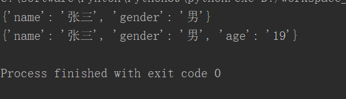

## **update(dict(x))方法更新字典**

```javascript
#update(),将其他字典中的key-value添加到当前字典
#如果有重复的key，后边的会替换掉当前的
d=dict(name="张三",gender="男")
d2=dict(age="18",city="苏州")
d.update(d2)
print(d)
```

# **8、删除字典**

## **del()函数**

```javascript
d=dict(name="张三",gender="男")
print(d)
del(d["name"])
print(d)
```

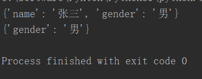

## **popitem()方法**

```javascript
#popitem(),随机删除字典中的一个键值对，一般都对删除最后一个键值对,并返回删除的键值对
d=dict(name="张三",gender="男")
print(d)
print(d.popitem())
print(d)
```

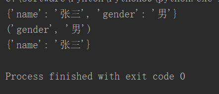

## **pop("key"，"default")方法**

```javascript
#pop("key"),根据"key"删除对应的键值对,并返回value
d=dict(name="张三",gender="男")
print(d)
d.pop("name")	#如果删除的key不存在会报错
print(d)
print(d.pop("name","default"))  #如果可key不存在，返回default
```

## **clear()方法**

```javascript
#clear(),清空字典
d=dict(name="张三",gender="男")
d.clear()
print(d)
```

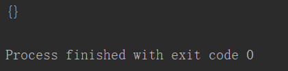

# **9、复制**

## **copy()方法**

```javascript
#copy(),用于对字典浅复制
#复制以后的对象和原对象是相互独立的
#浅复制，只能简单地复制对象里的值，
#如果值是一个可变对象，这个对象不会被复制，只会被引用
d=dict(name="张三",gender="男")
print(d)
d2=d.copy()
print(d2)
```

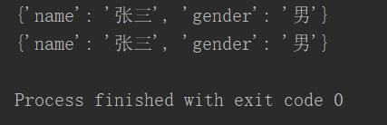

# **10、遍历字典**

## **keys()方法**

```javascript
#keys(),返回字典所有的key
#	该方法会返回一个序列，该序列保存有字典所有的键
d=dict(name="张三",gender="男",age="18")
print(d)
for k in d.keys():
    print(k,d[k])
```

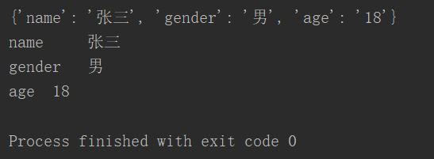

## **values()方法**

```javascript
#values,返回字典中所有的value
d=dict(name="张三",gender="男",age="18")
for k in d.values():
    print(k)
```

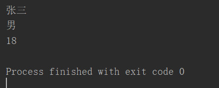

## **items()**

```javascript
#items(),该方法会返回字典总所有的项
#它会返回一个序列，序列中包含有双值子序列
#双值分别是，字典中的key和value
d=dict(name="张三",gender="男",age="18")
print(d.items())
for k,v in d.items():
    print(k,"=",v)
```

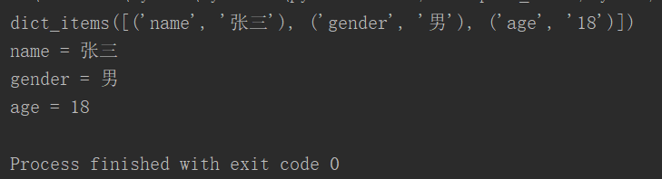