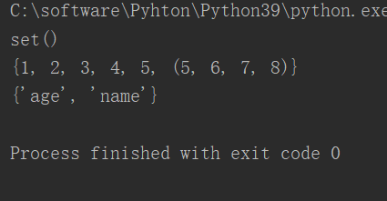
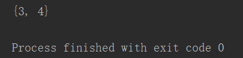
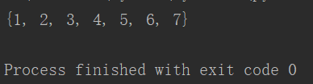
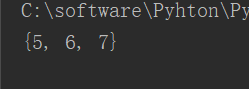
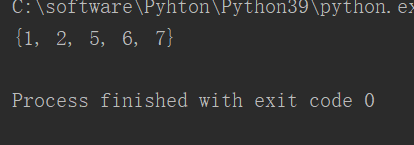
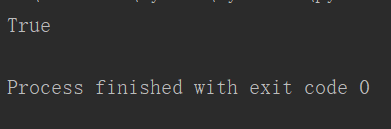
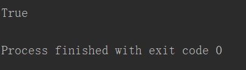

**集合**

- **集合和列表非常相似**

- **不同点**

- **集合中只能存储不可变对象**

- **集合中存储的元素是无序的（不是按照插入顺序排序的）**

- **集合中不能出现重复的元素**

# **1、创建集合**

```javascript
#使用{ }创建集合
s={1,2,3,4}
print(s,type(s))
#set()函数，可以通过set()来将数据和字典转换为集合
d=set()	#创建了一个空集合
print(d)
d=set([1,2,3,4,5,(5,6,7,8)])
print(d)
d=set({"name":"zhangsan","age":"18"})
print(d)
```



# **2、常用方法/函数**

- **in 和 not in**

- **len()函数，统计长度**

- **add(x)方法 ,添加元素**

- **update(set(x)/dict(x)/序列)方法,将一个集合/字典/序列中的元素添加到当前集合**

- **pop()方法,随机删除集合中的一个元素，并返回删除的元素**

- **remove(x)方法,删除指定的元素，元素不存在会报错**

- **discard()    删除某个元素，存在就删除，不存在就拉倒**

- **clear()方法，清空集合**

- **copy()方法，浅复制集合**

# **3、集合的运算**

## **&交集运算**

```javascript
s={1,2,3,4,}
s2={3,4,5,6,7}
print(s&s2)
```



## **|并集运算**

```javascript
s={1,2,3,4,}
s2={3,4,5,6,7}
print(s|s2)
```



## **-差集运算**

```javascript
s2={3,4,5,6,7}
s={1,2,3,4,}
print(s2-s)
```



## **^异或集合运算**

```javascript
#异或集合，只获取在对方集合里没有的元素
s2={3,4,5,6,7}
s={1,2,3,4,}
print(s2^s)
```



## **<=检查一个集合是否是另一个集合的子集**

```javascript
s={1,2,3,4,5,6,7,8}
s2={1,2,3,4}
print(s2<=s)
```



## **<检查一个集合是否是另一个集合的真子集**

```javascript
s={1,2,3,4,5,6,7,8}
s2={1,2,3,4}
print(s2<s)
```



## **>=检查一个集合是否另一个集合的超集**

## **>检查一个集合是否是另一个集合的真超集**