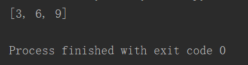
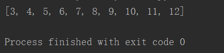

# **1、filter()**

- filter(),可以从序列中，过滤出符合条件的元素，保存到一个新的序列中

- 参数：

- 1，函数，根据函数的来过滤序列（可迭代的结构）

- 2、需要过滤的序列（可迭代的结构)

- 返回值：

- 过滤后的新序列（可迭代的结构）

```javascript
def fn4(i):
    if i%3==0:
        return True
    return False
li=[1,2,3,4,5,6,7,8,9,10]
result=list(filter(fn4,li))
print(result)
```



# **2、lambda函数表达式**

- lambda函数表达式专门构建一些简单的函数，它是函数创建的另一种方式

- 语法：lambda 参数列表：返回值

```javascript
li=[1,2,3,4,5,6,7,8,9,10]
result=filter(lambda i:i%3==0,li)
print(list(result))
```

# **3、map()**

- map()函数可以对指定对象中的元素，做指定的操作，然后将其添加到一个新的对象中返回

```javascript
li=[1,2,3,4,5,6,7,8,9,10] 
result=map(lambda i :i+2,li)
print(list(result))
```

