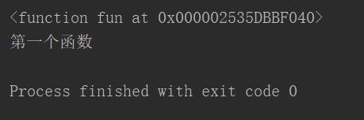
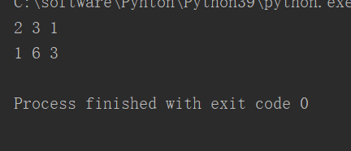
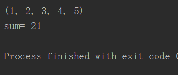
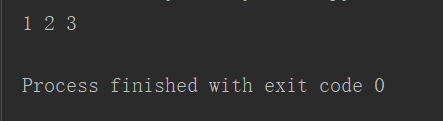
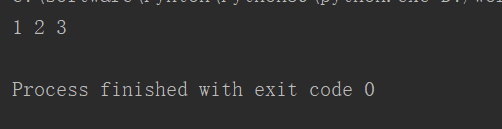

# **1、def function()定义函数**

```javascript
def fun():
    print("第一个函数")    
print(fun)
```



# **2、关键字参数**

```javascript
def fun(a=1,b=2,c=3):
    print(a,b,c)
fun(c=1,a=2,c=3)
#混合使用位置参数和关键字参数时
#位置参数必须要在关键字参数前面
fun(1,b=6)
```



# **3、不定长参数**

```javascript
#def fun(*a),*a追接收所有的参数，并且将这些参数保存在一个元组中
#不定长参数，不是必须写在最后，但是注意，不定长参数后面的所有参数，必须使用关键字参数，进行传值
def fun(*a):
    print(a)
fun(1,2,3,4,5)
def sum(*a)
    result=0
    for n in a:
        result+=n
    print("sum=",result)
sum(1,2,3,4,5,6)
```



# **4、参数解包**

## **元组解包 ***

```javascript
#	-使用*号对元组解包（序列）
def fun(a,b,c):
    print(a,b,c)
t=(1,2,3)
fun(*t)
```



## **字典解包 ****

```javascript
#	-使用**对字典解包
def fun(a,b,c):
    print(a,b,c)
d={
    "a":1,
    "b":2,
    "c":3
}
fun(**d)
```

