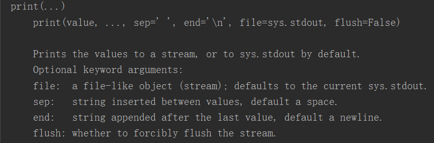

# 1、help()内置函数

```javascript
#help(),是Python中的内置函数
#通过help()函数可以查询pyhton中函数的用法
#语法：help(函数对象)
#help(print),获取print()函数的使用说明
help(print)
```





---

# 2、文档字符串

```javascript
#文档字符串(doc str)
#在定义函数时，可以在函数内部编写文档字符串，文档字符串就是函数的说明文档
#	但我们编写了文档字符串时，就可以通过help()函数来查看函数的说明
#	文档字符串非常简单，其实直接在函数的第一行写一个字符串就是文档字符串，一般使用三引号''' '''

def fun(a:int,b:bool,c:str)->int:
    '''
   这是一个文档字符串示例
   这是第二行了

    '''
    print(a,b,c)
    return a

help(fun)
fun(1,2,3)
```


