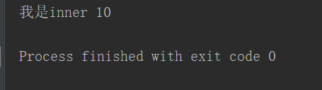

# **1、闭包**

```javascript
#将函数作为返回值返回，也是一种高阶函数
#这种高阶函数我们也称之为闭包，
#通过闭包可以创建一些只有当前函数才能访问的变量
#	可以将一些私有的数据藏在闭包中
def fn():
    a=10
    def inner():
        print("我是inner",a)
    return inner
r=fn()
r()
```



# **2、形成闭包的要件**

```javascript
#形成闭包的要件
#	1、函数嵌套
#	2、将内部函数作为返回值返回
#	3、内部函数必须要使用到外部函数的变量
#举例，创建一个函数，用来求平均值
def make_averages():
    nums=[]
    def averages(n):
        nums.append(n)
        return sum(nums)/len(nums)
    return averages
averages=make_averages()
print(averages(10))
print(averages(10))
print(averages(30))
print(averages(50))
```