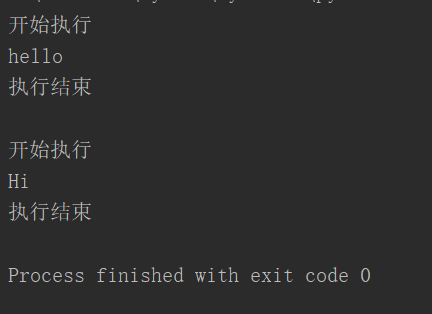

```javascript
def begin_end(old):			#定义一个装饰器
    def new_function(*args,**kargs):
        print("开始执行")
        result=old(*args,**kargs)
        print("执行结束")
        return result
    return new_function
def sayHello():
    print("hello")
fn=begin_end(sayHello)
fn()
print()
@begin_end		#典型用法
def sayHi():
    print("Hi")
sayHi()
```



# 1、什么是装饰器

让其他函数在不需要做任何代码变动的前提下，增加额外的功能，装饰器的返回值也是一个函数对象。

装饰器的应用场景：比如插入日志，性能测试，事务处理，缓存等等场景。

## 1）装饰器的形成过程

如果我想测试某个函数的执行时间

```
import time
def func1():
  print('in func1')
def timer(func):
  def inner():
    start = time.time()
    func()
    print(time.time() - start)
  return inner
func1 = timer(func1)
func1()
```

但是如果有多个函数，我都想让你测试他们的执行时间，你每次是不是都得func1 = timer(func1)?这样

还是有点麻烦，因为这些函数的函数名可能是不相同，有func1，func2,graph,等等，所以更简单的方

法，python给你提供了，那就是语法糖。

```
import time
def timer(func):
  def inner():
    start = time.time()
    func()
    print(time.time() - start)
  return inner
@timer
def func1():
  time.sleep(1)
  print('in func1')
func1()
```

## 2）装饰一个带参数的函数

```python
import time
def timer(func):
  def inner(a):
    start = time.time()
    func(a)
    print(time.time() - start)
  return inner
@timer
def func1(a):
  time.sleep(1)
  print(a)
func1('hello world')
```

## 3）装饰一个带各种参数的函数

```python
import time
def timer(func):
  def inner(*args,**kwargs):
    start = time.time()
    func(args,kwargs)
    print(time.time() - start)
  return inner
@timer
def func1(*args,**kwargs):
  print(args,kwargs)
func1('hello world','abc',123,432)
```

## 4）wraps装饰器

查看函数的相关信息，在加上装饰器后就失效了

```python
def index():
  '''这是一条注释信息'''
  print('from index')
print(index.__doc__)   # 查看函数注释
print(index.__name__)  # 查看函数名称
```

导入wraps装饰器

```
from functools import wraps
def deco(func):
  @wraps(func)
  def wrapper(*args,**kwargs):
    return func(*args,**kwargs)
  return wrapper
@deco
def index():
  '''这是一条注释信息'''
  print('from index')
print(index.__doc__)   # 查看函数注释
print(index.__name__)  # 查看函数名称
```

## 5）带参数的装饰器

加上一个outer函数，可以携带一个flag的值，然后控制装饰器是否生效

```python
def outer(flag):
  def timer(func):
    def inner(*args,**kwargs):
      if flag:
        print('函数开始执行')
      re = func(*args,**kwargs)
      if flag:
        print('函数执行完毕')
      return re
    return inner
  return timer
@outer(True)
def func():
  print('test')
func()
```

## 6）多个装饰器装饰一个函数

```python
def wrapper1(func):
  def inner():
    print('第一个装饰器，在程序运行之前')
    func()
    print('第一个装饰器，在程序运行之后')
  return inner
def wrapper2(func):
  def inner():
    print('第二个装饰器，在程序运行之前')
    func()
    print('第二个装饰器，在程序运行之后')
  return inner
@wrapper1
@wrapper2
def f():
  print('Hello')
f()
```

# 2、开放封闭原则

一句话，软件实体应该是可扩展但是不可修改的。

- 对于扩展是开放的

- 对于修改是封闭的

## 1）装饰器完美的遵循了这个开放封闭原则

```python
def outer(func):
  def inner(*args,**kwargs):
    '''执行函数之前要做的'''
    re = func(*args,**kwargs)
    '''执行函数之后要做的'''
    return re
  return inner
# 下面是加上wraps的固定结构
from functools import wraps
def outer(func):
  @wraps(func)
  def inner(*args,**kwargs)
 '''执行函数之前要做的'''
    re = func(*args,**kwargs)
    '''执行函数之后要做的'''
    return re
  return inner
```