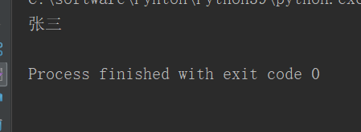
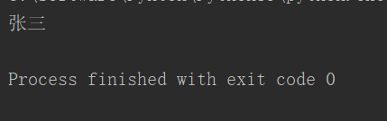
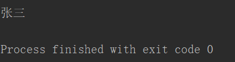
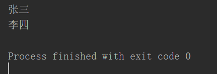

# **1、定义一个类**

- 使用class关键字来定义类，语法和函数很像！

```javascript
#class 类名([父类]):
#	代码块
#在方法中不能直接访问类的属性，必须要通过一个参数（self)去访问
class Person():
    name="zhangsan"                #定义类的属性，对象只能访问，不能修改。所有的对象共享。访问方式为People.name        
    def sayHello(self):
        print("hello",self.name)
p1=Person()
p1.name="zhangsan"
p1.sayHello()
```

# **2、isinstance(object，class),函数:检查一个对象是否是一个类的的实例**

# **3、__init__(self)特殊方法（魔术方法）**

```javascript
#相当于java中的构造方法
class Person():
    name=""
    def __init__(self,name):
        self.name=name
    def sayName(self):
        print(self.name)
person=Person("张三")
```



# **4、类的封装**

- 隐藏属性：self.hidden_属性名="..."

- getter：def getter_name（ ）

- setter：def setter_name( ）

```javascript
#1、隐藏了属性名。使调用者，无法随意修改对象中的属性
#2、增加了getter和setter方法，很好的控制属性是否是只读的
#		如果希望属性是只读的，则可以直接去掉setter方法
#		如果希望属性不能被外部访问，则可以直接去掉getter方法
```

## **self.__属性名（****双****下划线，隐藏属性）（无法通过对象直接访问）**

```javascript
#其实隐藏属性只不过是Python自动为属性改了一个名字
#	实际上将名字改为了，_类名__属性名
#        但是对内还是可以直接使用self.__属性名进行访问。
#        对方法，也可以使用__方法名() 的方式进行隐藏方法名。
class Person():
    def __init__(self,name):
        self.__name=name        #在名称空间中变成了_Person_name ,也就是_类名_属性名
    
person=Person("张三")
print(person._Person__name)
```



## **self._name (****单****下划线，私有属性）**

# **5、@property 装饰器  ****（property：属性）**

```javascript
#@property装饰器，用来给get方法，转换方法为对象的属性
#	添加为property装饰器以后，我们就可以调用属性一样使用
#	使用property装饰器的方法，必须和属性名一样
class Person():
    def __init__(self,name):
        self._name=name
    @property
    def name(self):
        return self._name
person=Person("张三")
print(person.name)
```



# **6、@属性名.setter装饰器(deleter)**

```javascript
class Person():
    def __init__(self,name):
        self._name=name
    @property
    def name(self):
        return self._name
    @name.setter        #obj.name=xxxx
    def name(self,name):
        self._name=name
        
     @name.deleter        #del obj.name
    def name(self,name):
        print("不能删除")
person=Person("张三")
print(person.name)
person.name="李四"
print(person.name)
```

