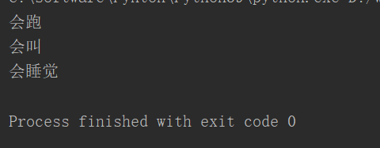
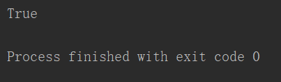
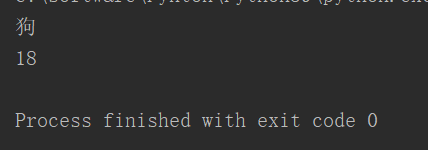
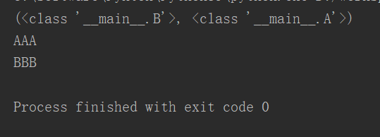

# **1、继承**

```javascript
class Animal:
    def __init__(self,name):
        self._name=name
    def run(self):
        print("%s会跑"%self._name)
    def speak(self):
        print("%s会叫"%self._name)
        
class Dog(Animal):		#继承Animal
    def sleep(self):
        print("我是狗，要睡觉")
                	         
dog=Dog("狗")
dog.run()
dog.speak()
dog.sleep()
```



# **2、issubclass(obj1,obj2) ,判断obj1是否是obj2的衍生子类**

```javascript
class Animal:
    def run(self):
        print("会跑")
    def speak(self):
        print("会叫")
class Dog(Animal):
    def sleep(self):
        print("会睡觉")
        
print(issubclass(Dog,Animal))
```



# **3、super(),调用父类的对象**

```javascript
class Animal:
    def __init__(self,name):
        self._name=name
    @property
    def name(self):
        return self._name
        
class Dog(Animal):		#继承Animal
    def __init__(self,name,age):
        super().__init__(name)	 
        self._age=age
    def sleep(self):
        print("我是狗，要睡觉")
    @property
    def age(self):
        return self._age
                	         
dog=Dog("狗",18)
print(dog.name)
print(dog.age)
```



# **4、多继承**

## **类名.__bases__,查看一个类的所有父类**

```javascript
class A:
    def testA(self):
        print("AAA")
class B():
    def testB(self):
        print("BBB")
class C(B,A):
    def testC(self):
      print("CCC")
print(C.__bases__)
c=C()
c.testA()
c.testB()
```

