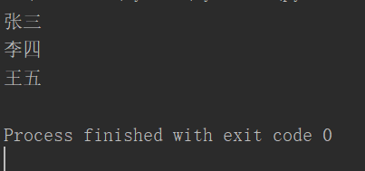

# **1、多态**

- **同一个函数，作用于多个不同的对象，却表现出相同或者类似的功能，这就是多态**

- 原理：

- 多个不同的对象中，对于某一个共同所需要的功能，都有一个名称相同的特殊方法。

- 然后定义一个函数，当需要使用那个功能时，只需要用这个函数检查那个对象中，是否有对应的方法，有就调用

```javascript
#例如实现一个输出对象名字的多态
class A:
    def __init__(self,name):
    	self._name=name
     def _getName(self):
         return self._name
class B:
    def __init__(self,name):
    	self._name=name
     def _getName(self):
         return self._name
class C:
    def __init__(self,name):
    	self._name=name
     def _getName(self):
         return self._name
def name(obj):
    return obj._getName()
a=A("张三")
b=B("李四")
c=C("王五")
print(name(a))
print(name(b))
print(name(c))
```

