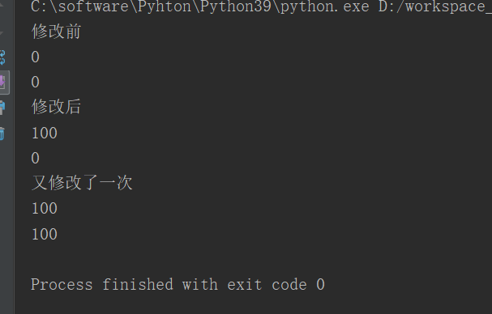
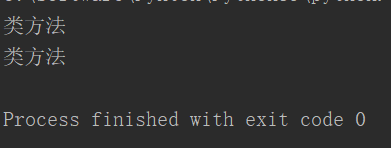
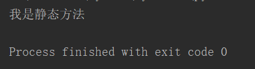
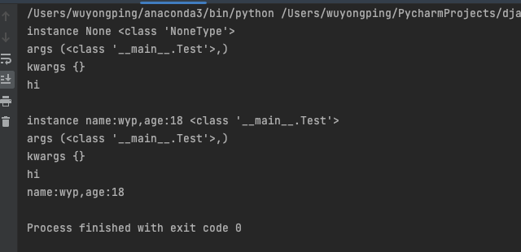

# 示例：

classmethod 和 staticmethod 是 Python 中两个常用的装饰器，它们都可以用来定义类方法。但是，它们之间有一些区别：

1. classmethod 方法的第一个参数是类本身（通常命名为 cls），而 staticmethod 方法没有这个参数。

1. classmethod 方法可以访问类的属性和方法，而 staticmethod 方法不能。

1. classmethod 方法通常用于需要访问类属性或调用类方法的情况，例如工厂方法或实现类似于备用构造函数的方法。而 staticmethod 方法常用于不需要访问类属性的情况，例如与类相关的实用程序函数。

下面是一个例子来说明这两种方法的区别：

```python
class MyClass:
    class_var = 10
    @classmethod
    def class_method(cls):
        print(f"Class variable value: {cls.class_var}")
        cls.class_var = 20
    @staticmethod
    def static_method():
        print("This is a static method")
# 调用 class_method
MyClass.class_method()     # 输出 Class variable value: 10
# 调用 static_method
MyClass.static_method()    # 输出 This is a static method
# 查看 class_var 的值
print(MyClass.class_var)   # 输出 20
```

从上面的代码中可以看出，classmethod 方法可以访问并修改类的属性，而 staticmethod 方法不能。

# **1、类属性**

- 类属性，直接在类中定义的属性是类属性

- 类属性可以通过**实例对象访问，**

- 但是类属性只能通过类对象来修改，无法通过实例对象修改

```javascript
class A:
    count=0
a=A()
print("修改前")
print(a.count)
print(A.count)
a.count=100
print("修改后")
print(a.count)
print(A.count)
print("又修改了一次")
A.count=100
print(a.count)
print(A.count)
```



# **2、实例属性**

- 实例属性，通过实例对象添加的属性属于实例属性

- 实例属性只能通过实例对象来访问和修改，类对象无法访问修改

# **3、实例方法**

- 实例方法，以self作为第一个参数的方法，都是实例方法

- 实例方法在调用时，Python会将调用的对象作为self传入

- 实例方法可以通过实例和类去调用

- 当通过实例调用时，会自动将当前调用的对象作为self传入

- 当通过类调用时，不会自动传递self,此时我们必须手动传递self

# **4、类方法**

- 在内部使用@classmethod来修饰的方法属于类方法

- 类方法的第一个参数是cls,也会被自动传递，cls就是当前的类

- 类方法可以通过类去调用，也可以通过实例去调用。

```javascript
class A :
    @classmethod
    def fun(cls):
        print("类方法")
a=A()
A.fun()
a.fun()
```



# **5、静态方法**

- 在类中使用@staticmethod来修饰的方法属于静态方法

- 静态方法不需要指定任何的默认参数，静态方法可以通过类和实例去调用

- 静态方法，基本上是一个和当前类的无关的方法，它只是一个保存到当前类中的函数

- 静态方法一般都是一些工具方法，和当前类无关

```javascript
class A:
    @staticmethod
    def fun():
    	print("我是静态方法")
a=A()
a.fun()
```



# 6、classmethod中的__get__()方法

当某个类或者此类的实例对象，调用被classmethod()装饰的方法时，会调用__get__()方法。

-  __get__(self,instance,*args,**kwargs) 的第一个参数，如果是类调用的，则instance==None,否则instance is not None. 

```python
class classmethod(object):
    def __get__(self, *args, **kwargs): # real signature unknown
        """ Return an attribute of instance, which is of type owner. """
        pass
```

- 示例：

```python
class myclassmethod(classmethod):
    def __get__(self, instance, *args, **kwargs):
        print("instance", instance, type(instance))
        print("args", args)
        print("kwargs", kwargs)
        return super().__get__(*args, **kwargs)
class Test(object):
    def __init__(self):
        self.name = "wyp"
        self.age = 18
    @myclassmethod
    def hi(cls):
        print("hi")
test = Test()
Test.hi()
print()
test.hi()
print(test)
```



**补充，如果我们要限制某个类方法只能由类对象调用，可以如下实现**

```python
class classonlymethod(classmethod):
    def __get__(self, instance, cls=None):
        if instance is not None:
            raise AttributeError("This method is available only on the class, not on instances.")
        return super().__get__(instance, cls)
```

> 同理，在staticmethod类中，也有一个__get__() 方法。
