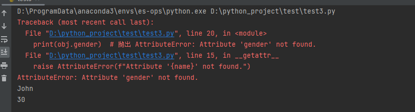

# **1、对象转字符串(__str__、__repr__)**

- __str__()

- __repr__()	

- 以上两个方法都可以用来返回当print() 对象时，返回的字符串形式。

- 当__str__和__repr__都定义时，会默认优先调用__repr__方法

- 但是两个方法的表现重点不一样。

- __str__方法，侧重于直接显示对象的信息。但是不包括对象的类型。

- __repr__方法，侧重于显示对象的类型，包括其信息。

```python
class Person:
    def __init__(self, name, age):
        self.name = name
        self.age = age
    def __repr__(self):
        return f"Person(name='{self.name}', age={self.age})"
    def __str__(self):
        return f"Person: {self.name} ({self.age} years old)"
if __name__ == '__main__':
    person = Person("zhangsa", 10)
    print(str(person))
    print(repr(person))    
>>
Person: zhangsa (10 years old)
Person(name='zhangsa', age=10)
```

# **2、对象比较**

- **__gt__(self,other)**

- 会在对象做大于比较时调用，该方法的返回值将会作为比较的结果

- 它需要两个参数，一个self表示当前对象,other表示和当前对象比较的对象

- **__lt__(self,other)**

- **__le__(self,other)**

- **__eq__(self,other)**

- **__ne__(self,other)**

- **__ge__(self,other)**

# **3、调用属性时，固定会调用的方法（__getattrbute__）**

- **__getattrbute__(self,item)**

- **这个方法需要传入一个参数item.**

- **item 就是你将调用的属性的名称，是一个str类型。**

- **这个方法必须有return，系统会自动调用你return的类型。**

- **如果没有return，就是None，那么调用时肯定报错。**

- **如果return str ,不出意外也会报错，因为str没法调用。**

- **所以最后需要return属性地址。**

- **此时你可能想到使用****getattr(self,item)  #错误**

- **虽然使用反射返回确实是属性地址，但是这个方法中会再次调用属性，**

- **然后调用属性又会调用__getaatrbute__() 这不就是死循环了么。**

- **所以需要return 的为：**

- **super().__getattrbute__(item)	****	#调用父类的__getattrbute__()**

- **这个方法，父类为我们处理，不会造成死循环。**

```python
class Person:
    def __init__(self, name, age):
        self.name = name
        self.age = age
    #item 就是被调用的属性名称,是一个str 类型
    def __getattribute__(self, item):
        print("属性名：",item)
        return  super().__getattribute__(item)
    def say(self):
        print("hello")
if __name__ == '__main__':
    person = Person("zhangsa", 10)
    person.say()
####
>>
属性名： say
hello
```

# 4、**调用不存在属性时，固定会调用的方法（__getattr__）**

- **__getattr__(self,name)**

- **当调用某个不存在的属性时，会执行这个方法。**

- **name**** 参数就是被调用的不存在的属性的名称。**

- **这个方法如果有return ，那么会将return的结果返回给一开始调用的程序。**

```python
class DynamicAttributes:
    def __init__(self):
        self.attributes = {'name': 'John', 'age': 30}
    def __getattr__(self, name):        #name被调用的属性名称
        if name in self.attributes:
            return self.attributes[name]
        else:
            raise AttributeError(f"Attribute '{name}' not found.")
obj = DynamicAttributes()
print(obj.name)  # 输出：John
print(obj.age)   # 输出：30
print(obj.gender)  # 抛出 AttributeError: Attribute 'gender' not found.
```



# 5、设置属性值的时候，会调用的方法（__setattr__）

- **_setattr__(self,name,value)**

- **name 就是属性的名称，value就是属性值。**

- **在其内部，不要直接对属性直接进行赋值操作，否则会造成死循环。**

- **因为直接对属性赋值，又会调用这个方法__setattr__**

- **所以可以通过其他方法赋值：**

- **super().__setattr__(name,value)**

- **或**

- **self.__dict__[name]=value**

```python
class A:
    def __init__(self, value):
        self.value = value
    def __setattr__(self, name, value):
        print(name,value)
        super().__setattr__( name, value)
if __name__ == '__main__':
    a=A(10)
    print(a.value)
###
value 10
10
```

# 6、删除属性时会调用的方法（__delattr__）

- **__delattr__(self,name)**

- **name**** 就是要删除的属性的名称**

- **为了避免死循环，此方法内部不要直接对属性进行删除。**

- **可以通过一下方法：**

- **super().__delattr__(name)**

```python
class A:
    def __init__(self, value):
        self.value = value
    def __delattr__(self, item):
        super().__delattr__( item)
    def __getattr__(self, item):
        return "when can not find attribute into __getattr__"
if __name__ == '__main__':
    a = A(10)
    print(a.value)
    del a.value
    print (a.value)
###
>>
10
when can not find attribute into __getattr__
```

# 6、迭代和序列相关的特殊方法：

- __iter__(self)

- __next__(self)

- __len__(self) 

- __getitem__(self, key)

# 7、上下文管理相关的特殊方法：

- __enter__(self) 

# 8、像字典那样获取和增加数据

- __getitem__(self,item)	**#通过[] 获取数据**

- __setitem__(self,key,value)	**#通过[]增加或修改数据**

- __delitem__(self,key)	#**可以通过del data[]	删除数据	**

```python
# coding=utf-8
# @Author:wyp
# @FileName:test1.py
# @DateTime:2023/9/25 16:13
data = {
    "name": "张三",
    "age": 20
}
class ProxyDict(dict):
    def __init__(self, data):
        self.data = data
        super().__init__()
    def get(self, key):
        print("通过get获取数据")
        return self.data.get(key)
    def __getitem__(self, item):
        print("通过[]获取数据")
        return self.data[item]
    def __setitem__(self, key, value):
        print("添加或修改了某个属性")
        self.data[key] = value
    def __delitem__(self, key):
        print(f'删除了key: {key}')
        del self.data[key]
data = ProxyDict(data)
print(data.get("name"))
print(data["age"])
data["address"]="beijing"
del data["age"]
#
>>
通过get获取数据
张三
通过[]获取数据
20
添加或修改了某个属性
删除了key: age
```

# 9、执行bool() 会调用的方法

- Python在执行bool()方法将某个对象转换为bool值时，

- 会首先调用对象的__bool__()方法，将其的执行结果作为返回值

- 但如果对象中没有定义__bool__方法，那么就会去调用__len__()的方法的执行结果作为返回值。

- 如果是0 就返回False，否则返回True,所以就算是-1返回的也是True

```python
class Test:
    def __init__(self, val):
        self.val = val
    def __len__(self):
        print("len")
        return self.val
    def __bool__(self):
        print("bool")
        return False
if __name__ == '__main__':
    test = Test(1)
    print(bool(test))
```