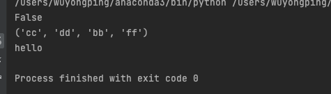

# 1、常见内置属性变量

在Python类中，有一些内置的属性变量，它们提供了对类和实例的一些元信息和特性访问。下面是一些常见的内置属性变量：

1. __dict__：

- 一个字典，包含实例的命名空间。

- 使用obj.__dict__

1. __doc__：

- 类或函数的文档字符串（docstring）。

- 使用obj.__doc__

1. __name__：

- 类或函数的名称。

- 在类定义中，可以通过ClassName.__name__

- 在函数定义中，可以通过function_name.__name__

1. __module__：

- 定义类或函数的模块名称。

- 在类定义中，通过ClassName.__module__

- 在函数定义中，通过function_name.__module__

1. __class__：

- 实例所属的类。

- 使用obj.__class__

- 这个属性变量常用于检查对象的类型或进行动态的类判断。

这些内置属性变量提供了方便的方式来访问和获取类和实例的信息。通过使用这些属性变量，可以在编写代码时获取有关类和实例的元数据。

# 2、__slots__

- 一般情况下，如果需要查看一个实例对象中的实例属性，可以一下方法

- test=Test()

- test.__dict__	#返回实例的命名空间

- 并且我们也可以自由的向实例对象中动态的添加属性

- test.aa="hello"

- 这时，如果想限制我们不能随意的添加属性，可以使用__slot__变量进行限制

```python
class Test:    
    #规定，实例对象中只能添加的属性,所以在初始化时，也只能对slots中指定的变量名进行赋值。
    __slots__ = ("cc", "dd", "bb", "ff","aa")    
    def __init__(self):
        self.bb = "world"
test = Test()
test.ff = "jsa"
print(hasattr(test, "__dict__"))
print(test.__slots__)
print(test.aa)
```



- 如上，当使用了__slots__之后，实例对象中将不再有__dict__

- 并且能添加的属性，也被限制在了slots中指定的那几个变量。