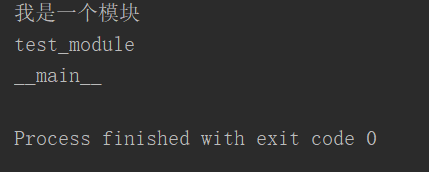
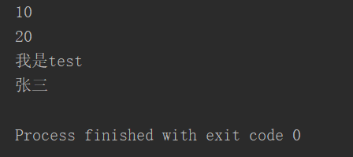
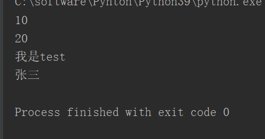

# 1、创建模块

- 创建模块实质就是创建一个Python文件

- 文件名规范：xxx_module.py

- 在模块中，添加了下划线（_)变量，只能在模块内部访问

- 编写测试代码

- 这部分代码，只有在当前模块为主模块时，才能被执行

- 而当模块被其他模块引入时不能被执行，此时就需要检测当前模块是否是主模块

```javascript
if __name__=="__main__":
    fun1()
    fun2()
```


---

# 2、引入模块

- 1、import 模块名（模块名，就是Python的名字，不需要py)

- 2、import 模块名 as 模块别名

- import可以在程序的任意位置调用，一般情况下同一写在开头

- 每一个模块内部都有一个__name__属性，通过这个属性可以获得模块的名字

- __name__属性值为__main__的模块的主模块，一个程序只有一个主模块

- 主模块就是我们直接通过Python执行的模块

- 只引入模块的中的部分内容：

- 语法 from 模块名 import 变量1，变量2，。。。。。

- from m import Person

- from m import Person，test

- from m import *

- from m import test as new_test


test_modul.py

```javascript
print("我是一个模块")
```


```javascript
import test_module as test

print(test.__name__)
print(__name__)
```





---

# 3、模块访问


## 1、方法一：

test_module.py

```javascript
a=10
b=20
def test():
    print("我是test")
class Person:
    def __init__(self,name):
        self._name=name
```


```javascript
import test_module as test
print(test.a)
print(test.b)
test.test()
person=test.Person("张三")
print(person._name)
```




## 2、方法二：

test_module.py

```javascript
a=10
b=20
def test():
    print("我是test")
class Person:
    def __init__(self,name):
        self._name=name
```


```javascript
from test_module import a,b,test,Person
print(a)
print(b)
test()
person=Person("张三")
print(person._name)
```




