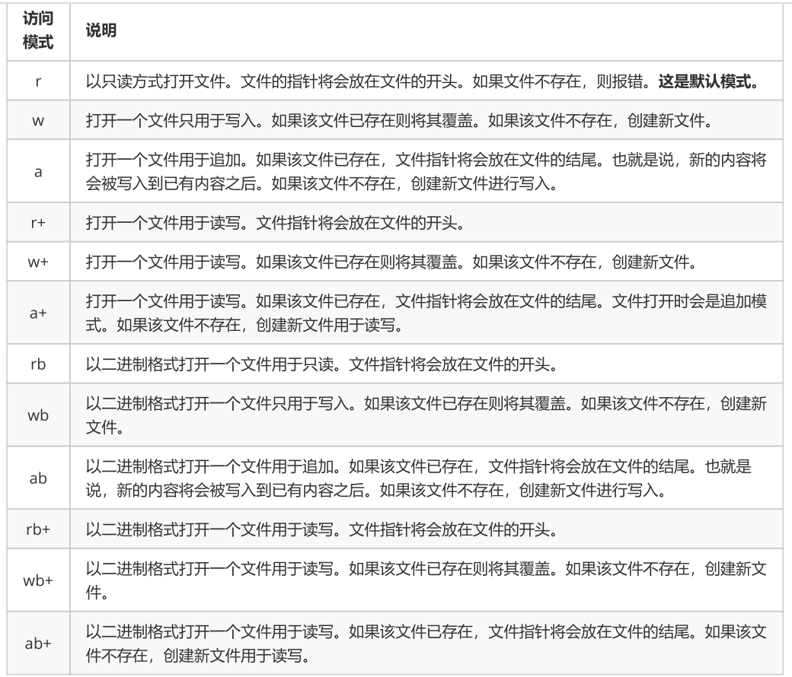
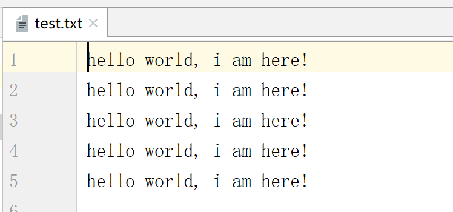

**文件总结**

# 10.1 文件的打开与关闭

## 1）打开文件/创建文件

在python，使用open函数，可以打开一个已经存在的文件，或者创建一个新文件open(文件路径，访问模式)

示例如下：

```
f = open('test.txt', 'w')
```

说明:

## 2）文件路径

- 绝对路径：指的是绝对位置，完整地描述了目标的所在地，所有目录层级关系是一目了然的。

- 例如： E:\python ，从电脑的盘符开始，表示的就是一个绝对路径。

- 相对路径：是从当前文件所在的文件夹开始的路径。

- test.txt ，是在当前文件夹查找 test.txt 文件

- ./test.txt ，也是在当前文件夹里查找 test.txt 文件， ./ 表示的是当前文件夹。

- ../test.txt ，从当前文件夹的上一级文件夹里查找 test.txt 文件。 ../ 表示的是上一级文件夹

- demo/test.txt ，在当前文件夹里查找 demo 这个文件夹，并在这个文件夹里查找 test.txt 文件。

## 3）访问模式：



## 4）关闭文件

示例如下

```
# 新建一个文件，文件名为:test.txt
f = open('test.txt', 'w')
# 关闭这个文件
f.close()
```

# 10.2 文件的读写

## 1）写数据(write)

使用write()可以完成向文件写入数据

demo: 新建一个文件 file_write_test.py ,向其中写入如下代码:

> **wirtelines(li)	#li是一个迭代对象**


```
f = open('test.txt', 'w')
f.write('hello world, i am here!\n' * 5)
f.close()
```

运行之后会在 file_write_test.py 文件所在的路径中创建一个文件 test.txt ,并写入内容，运行效果显示如下:



注意：

- 如果文件不存在，那么创建；如果存在那么就先清空，然后写入数据

## 2）读数据(read)

使用read(num)可以从文件中读取数据，num表示要从文件中读取的数据的长度（单位是字节），如果没有传入

num，那么就表示读取文件中所有的数据

- demo: 新建一个文件 file_read_test.py ，向其中写入如下代码:

```
f = open('test.txt', 'r')
content = f.read(5)  # 最多读取5个数据
print(content)
print("‐"*30)  # 分割线，用来测试
content = f.read()  # 从上次读取的位置继续读取剩下的所有的数据
print(content)
f.close()  # 关闭文件，这个可是个好习惯哦
```

- 运行现象：

```
hello
‐‐‐‐‐‐‐‐‐‐‐‐‐‐‐‐‐‐‐‐‐‐‐‐‐‐‐‐‐‐
 world, i am here!
```

注意：

- 如果用open打开文件时，如果使用的"r"，那么可以省略 open('test.txt')

## 3）读数据（readline）

readline只用来读取一行数据。

```
f = open('test.txt', 'r')
content = f.readline()
print("1:%s" % content)
content = f.readline()
print("2:%s" % content)
f.close()
```

## 3）读数据（readlines）

readlines可以按照行的方式把整个文件中的内容进行一次性读取，并且返回的是一个列表，其中每一行为列表的

一个元素。

```
f = open('test.txt', 'r')
content = f.readlines()
print(type(content))
for temp in content:
    print(temp)
f.close()
```

# 10.3 序列化和反序列化

通过文件操作，我们可以将字符串写入到一个本地文件。但是，如果是一个对象(例如列表、字典、元组等)，就无

法直接写入到一个文件里，需要对这个对象进行序列化，然后才能写入到文件里。

设计一套协议，按照某种规则，把内存中的数据转换为字节序列，保存到文件，这就是序列化，反之，从文件的字

节序列恢复到内存中，就是反序列化。

对象---》字节序列 === 序列化

字节序列--》对象 ===反序列化

Python中提供了JSON这个模块用来实现数据的序列化和反序列化。

## 2)JSON模块

JSON(JavaScriptObjectNotation, JS对象简谱)是一种轻量级的数据交换标准。JSON的本质是字符串。

## 2)使用JSON实现序列化

JSON提供了dump和dumps方法，将一个对象进行序列化。

dumps方法的作用是把对象转换成为字符串，它本身不具备将数据写入到文件的功能。

```
import json
file = open('names.txt', 'w')
names = ['zhangsan', 'lisi', 'wangwu', 'jerry', 'henry', 'merry', 'chris']
# file.write(names)  出错，不能直接将列表写入到文件里
# 可以调用 json的dumps方法，传入一个对象参数
result = json.dumps(names)
# dumps 方法得到的结果是一个字符串
print(type(result))  # <class 'str'>
# 可以将字符串写入到文件里
file.write(result)
file.close()
```

dump方法可以在将对象转换成为字符串的同时，指定一个文件对象，把转换后的字符串写入到这个文件里。

```
import json
file = open('names.txt', 'w')
names = ['zhangsan', 'lisi', 'wangwu', 'jerry', 'henry', 'merry', 'chris']
# dump方法可以接收一个文件参数，在将对象转换成为字符串的同时写入到文件里
json.dump(names, file)
file.close()
```

使用JSON实现反序列化

使用loads和load方法，可以将一个JSON字符串反序列化成为一个Python对象。

loads方法需要一个字符串参数，用来将一个字符串加载成为Python对象。

```
mport json
# 调用loads方法，传入一个字符串，可以将这个字符串加载成为Python对象
result = json.loads('["zhangsan", "lisi", "wangwu", "jerry", "henry", "merry", "chris"]')
print(type(result))  # <class 'list'>
```

load方法可以传入一个文件对象，用来将一个文件对象里的数据加载成为Python对象。

```
import json
# 以可读方式打开一个文件
file = open('names.txt', 'r')
# 调用load方法，将文件里的内容加载成为一个Python对象
result = json.load(file)
print(result)
file.close()
```