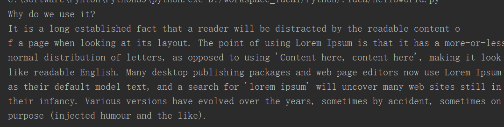

```
#1、打开文件
#windows路径分隔符问题
open('C:\a\nb\c\d.txt')
#解决方案一：推荐
open(r'C:\a\nb\c\d.txt')
#解决方案二：
open('C:/a/nb/c/d.txt')
t文本（默认的模式）
1、读写都以str  (unicode)为单位的
2、文本文件
3、必须指定encoding:='utf-8'
#没有指定encoding参数操作系统会使用自己默认的编码
linux系统默认utf-8
windows:系统默认gbk
```

# **1、open()代开文件**

- 使用open函数来打开一个文件

- 参数：

- file：要打开的文件的名称

- 返回值：返回一个对象，就代表打开了当前的文件

**demo.txt**

```javascript
Why do we use it?
It is a long established fact that a reader will be distracted by the readable content o
f a page when looking at its layout. The point of using Lorem Ipsum is that it has a more-or-less
normal distribution of letters, as opposed to using 'Content here, content here', making it look
like readable English. Many desktop publishing packages and web page editors now use Lorem Ipsum
as their default model text, and a search for 'lorem ipsum' will uncover many web sites still in
their infancy. Various versions have evolved over the years, sometimes by accident, sometimes on
purpose (injected humour and the like).
```

```javascript
file_name="demo.txt"
file_obj=open(file_name)
```

# **2、read()方法，读取文件**

```javascript
file_name="demo.txt"
file_obj=open(file_name)
content=file_obj.read()
print(content)
```



# **3、close()方法，关闭文件**

```javascript
file_obj.close()
```

# **4、with....as....语句,自动关闭文件**

```javascript
with open(file_name) as file_obj
    print(file_obj.read())
```