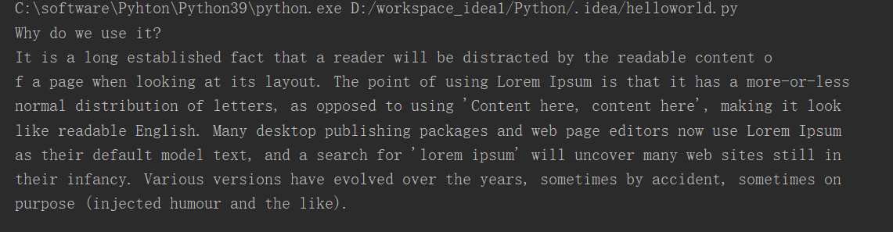
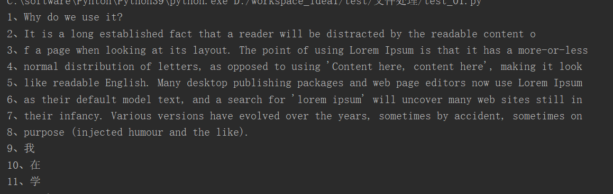

# **1、读取大文件**

- 如果直接调用read(),它会将文本文件的所有内容一次性全部都读出来，

- 如果文件过大，很占内容，所有文件较大，不要直接调用read()

- read()可以接收一个size作为参数（表示字符数），该参数用来指定要读取的字符数量，默认值为-1，表示将会读取全部内容

- 每一次读取，都是从上次读取到的位置开始读取

**demo.txt**

```javascript
1、Why do we use it?
2、It is a long established fact that a reader will be distracted by the readable content o
3、f a page when looking at its layout. The point of using Lorem Ipsum is that it has a more-or-less
4、normal distribution of letters, as opposed to using 'Content here, content here', making it look
5、like readable English. Many desktop publishing packages and web page editors now use Lorem Ipsum
6、as their default model text, and a search for 'lorem ipsum' will uncover many web sites still in
7、their infancy. Various versions have evolved over the years, sometimes by accident, sometimes on
8、purpose (injected humour and the like).
9、我
10、在
11、学
12、Python
```

# 2、每100个字符读取一次

```javascript
file_name="demo.txt"
try:
    with open(file_name,encoding="utf-8")as file_obj:
         chunk=100	#指定每一次读取的数量
         #创建一个循环来读取文件的内容
         while True:
             content=file_obj.read(chunk)
             if not content :
                 break
             print(content)
except FileNotFoundError:
    print(f"{file_name}文件没找到！")
```



# 3、每一行读取一次

```
with open("aa.txt",mode="rt",encoding="utf-8") as f:
    for line in f:
        print(line,end="")
```

