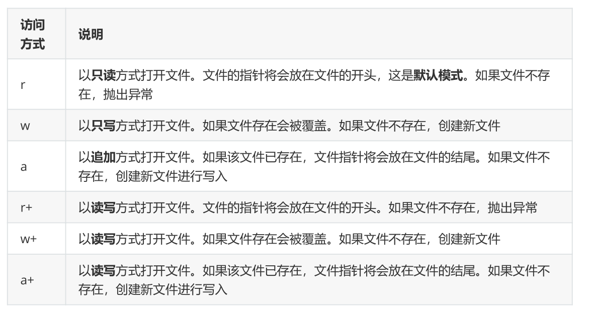
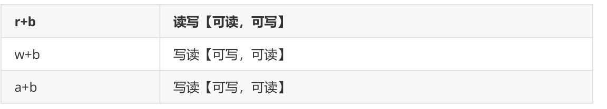
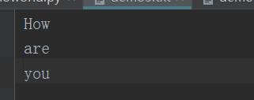

# **1、write()方法，写入文件**

- write()来向文件写书内容

- 使用open()打开文件时必须要指定打开文件所要做的操作，（读，写，追加）

- 如果不指定操作的类型，则默认是读取文件，而读取文件时，不可以写入

- 参数mode：



以bytes类型操作的读写，写读，写读模式



对于非文本文件，我们只能使用b模式，"b"表示以字节的方式操作（而所有文件也都是以字节的形式存

储的，使用这种模式无需考虑文本文件的字符编码、图片文件的jgp格式、视频文件的avi格式）

rb

wb

ab

注：以b方式打开时，读取到的内容是字节类型，写入时也需要提供字节类型，不能指定编码

频繁的移动文件指针，会影响文件的读写效率，开发中更多的时候会以 只读、只写 的方式来操作
文件.

```javascript
file_name="demo2.txt"
with open(file_name,encoding="utf-8",mode="w") as file_obj:
    file_obj.write("How\n")
    file_obj.write("are\n")
    file_obj.write("you")
```

