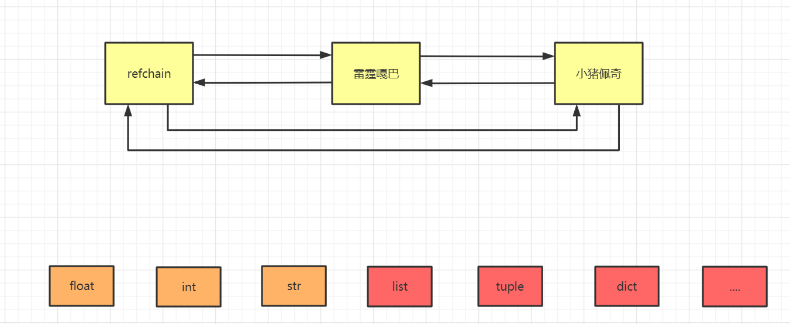
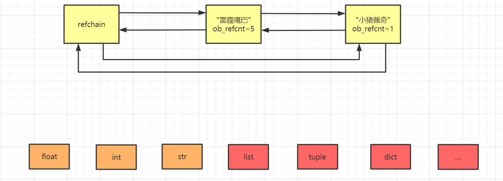
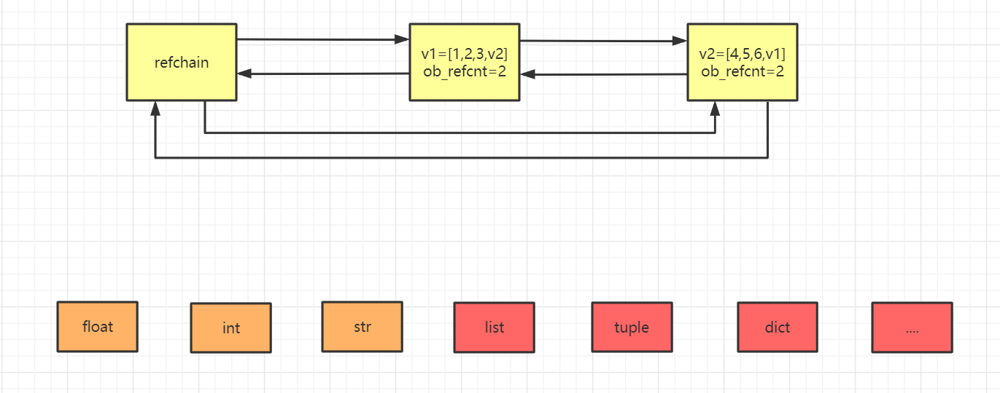

**引用计数器**

# 1.1环状的双向链表(Refchain)

在python程序中，创建的任何对象都会放在refchain的双向链表中

例如：



在python程序中，创建的任何对象都会放在refchain的双向链表中

例如

```
name = "小猪佩奇"  # 字符串对象
age = 18  # 整形对象
hobby = ["吸烟","喝酒","烫头"]  # 列表对象
```

这些对象都会放到这些双向链表当中，也就是帮忙维护了python中所有的对象。

也就是说如果你得到了refchain,也就得到了python程序中的所有对象。

# 1.2不同类型对象的存放形式

刚刚提到了所有的对象都存放在环状的双向链表中，而不同类型的对象存放在双向链表中既有一些共性

特征也有一些不同特征。

```
# name = "小猪佩奇" 
# 创建这个对象时，内部会创建一些数据，并且打包在一起
# 哪些数据：【指向上一个对象的指针、指向下一个对象的指针、类型(这里为字符串)、引用的个数】
"""
引用的个数:
 比如 name = '小猪佩奇' ,会给“小猪佩奇”开辟一个内存空间用来存放到双向链表中。
 这时候如果有 new = name，不会创建两个“小猪佩奇”，而是将new指向之前的那个小猪佩奇，
 而引用的个数变为2，也就是"小猪佩奇"这个对象被引用了两次。
"""
```

## 1）相同点：刚刚讲到的四个种数据每个对象都包含有。

```
# 内部会创建一些数据，【指向上一个对象的指针、指向下一个对象的指针、类型、引用的个数】
age = 18  # 整形对象
# 内部会创建一些数据，【指向上一个对象的指针、指向下一个对象的指针、类型、引用的个数】
hobby = ["吸烟","喝酒","烫头"]  # 列表对象
```

## 2）不同点：不同的数据类型还会创建不同的值：

```
# 内部会创建一些数据，【指向上一个对象的指针、指向下一个对象的指针、类型、引用的个数、
val=18】
age = 18  # 整形对象
# 内部会创建一些数据，【指向上一个对象的指针、指向下一个对象的指针、类型、引用的个数、
items=元素、元素的个数】
hobby = ["抽烟","喝酒","烫头"]  # 列表对象
```

所以在python中创建的对象会加到环形双向链表中，但是每一种类型的数据对象在存到链表中时，所存

放的数据个数可能是不同的（有相同点有不同点）。

### 两个重要的结构体

Python解释器由c语言开发完成，py中所有的操作最终都由底层的c语言来实现并完成，所以想要了解底

层内存管理需要结合python源码来进行解释。

```
#define PyObject_HEAD    PyObject ob_base ;
#define PyObject_VAR_HEAD    PyVarObject ob_base;
//宏定义，包含上一个、下一个，用于构造双向链表用。(放到refchain链表中时，要用到)
#define _PyObject_HEAD_EXTRA      \
 struct _object *_ob_next;      \
 struct _object *_ob_prev;
typedef struct _object {
 _PyObject_HEAD_EXTRA      //用于构造双向链表
 Py_ssize_t ob_refcnt;      //引用计数器
 struct _typeobject *ob_type;  //数据类型
} PyObject;
typedef struct {
 PyObject ob_base;    // PyObject对象
 Py_ssize_t ob_size; /* Number of items in variable part, 即:元素个数*/
} PyVarObject;
```

在C源码中如何体现每个对象中都有的相同的值：PyObject结构体（4个值：ob_next、ob_prev、

ob_refcnt、*ob_type）

9-13行 定义了一个结构体，第10行实际上就是6，7两行，用来存放前一个对象，和后一个对象的位置。

这个结构体可以存贮四个值（这四个值是对象都具有的）。

在C源码中如何体现由多个元素组成的对象：PyObject + ob_size(元素个数)

15-18行又定义了一个结构体，第16行相当于代指了9-13行中的四个数据。

而17行又多了一个数据字段，叫做元素个数，这个结构体。

以上源码是Python内存管理中的基石，其中包含了：

- 2个结构体

- PyObject，此结构体中包含3个元素。

- PyObject_HEAD_EXTRA，用于构造双向链表。

- ob_refcnt，引用计数器。

- *ob_type，数据类型。

- PyVarObject，次结构体中包含4个元素（ob_base中包含3个元素）

- ob_base，PyObject结构体对象，即：包含PyObject结构体中的三个元素。

- ob_size，内部元素个数。

### 类型封装的结构体

在我们了解了这两个结构体，现在我们来看看每一个数据类型都封装了哪些值：

- flaot类型

float结构体：

```
typedef struct {
 PyObject_HEAD # 这里相当于代表基础的4个值
 double ob_fval;
} PyFloatObject;
```

例：

```
data = 3.14
内部会创建：
 _ob_next = refchain中的上一个对象
 _ob_prev = refchain中的后一个对象
 ob_refcnt = 1   引用个数
 ob_type= float  数据类型
 ob_fval = 3.14  
```

- int类型

int结构体：

```
struct _longobject {
 PyObject_VAR_HEAD
 digit ob_digit[1];
};
// longobject.h
/* Long (arbitrary precision) integer object interface */
typedef struct _longobject PyLongObject; /* Revealed in longintrepr.h */
```

道理都是相同的，第2行代指第二个重要的结构体，第三行是int形特有的值，总结下来就是这个结构体

中有几个值，那么创建这个类型对象的时候内部就会创建几个值。

- list类型

list结构体：

```
typedef struct {
 PyObject_VAR_HEAD
 /* Vector of pointers to list elements. list[0] is ob_item[0], etc. */
 PyObject **ob_item;
 /* ob_item contains space for 'allocated' elements. The number
  * currently in use is ob_size.
  * Invariants:
  *   0 <= ob_size <= allocated
  *   len(list) == ob_size
  *   ob_item == NULL implies ob_size == allocated == 0
  * list.sort() temporarily sets allocated to -1 to detect mutations.
  *
  * Items must normally not be NULL, except during construction when
  * the list is not yet visible outside the function that builds it.
  */
 Py_ssize_t allocated;
} PyListObject;
```

- tuple类型

tuple结构体:

```
typedef struct {
 PyObject_VAR_HEAD
 PyObject *ob_item[1];
 /* ob_item contains space for 'ob_size' elements.
  * Items must normally not be NULL, except during construction when
  * the tuple is not yet visible outside the function that builds it.
  */
} PyTupleObject;
```

- dict类型

dict结构体:

```
typedef struct {
 PyObject_HEAD
 Py_ssize_t ma_used;
 PyDictKeysObject *ma_keys;
 PyObject **ma_values;
} PyDictObject;
```

到这里我们就学到了什么是环状双向链表，以及双向链表中存放的每一种数据类型的对象都是怎样的。

# 1.3引用计数器

```
v1 = 3.14
v2 = 999
v3 = (1,2,3)
```

当python程序运行时，会根据数据类型的不同，找到其对应的结构体，根据结构体中的字段，来进行创

建相关的数据，然后将对象添加到refchain双向链表中。

为了体现我们看过源码的牛逼之处，我们还可以进一步理解。

在C源码中有两个关键的结构体：PyObject、PyvarObject

- PyObject（存储是上一个对象，下一个对象，类型，引用的个数，是每一个对象都具有的）。

- PyvarObject（存储的是由多个元素组成的类型数据具有的值，例如字符串，int）。

- \1. python3中没有long类型，只有int类型，但py3内部的int是基于long实现。

- \2. python3中对int长度没有限制，其内部使用由多个元素组成的类似于“字符串”的机制来存储的。

每个对象中都有ob_refcnt ，它就是引用计数器，创建时默认是1，当有其他变量重新引用的

时候，引用计数器就会发生变化。

## 1）计数器增加

当发生以下四种情况的时候，该对象的引用计数器+1：**

```
a=14 # 对象被创建
b=a  # 对象被引用
func(a)  # 对象被作为参数,传到函数中
List=[a,"a","b",2]  # 对象作为一个元素，存储在容器中
b = 9999 # 引用计数器的值为1
c = b # 引用计数器的值为2
```

## 2）计数器减小

当发生以下四种情况时，该对象的引用计数器-1

```
当该对象的别名被显式销毁时    del a
当该对象的引别名被赋予新的对象， a=26
一个对象离开它的作用域，例如 func函数执行完毕时，函数里面的局部变量的引用计数器就会减一
（但是全局变量不会）
将该元素从容器中删除时，或者容器被销毁时。
a = 999
b = a # 当前计数器为2
del b # 删除变量b：b对应的对象的引用计数器-1  （此时计数器为1）
del a # 删除变量a：a对应的对象的引用计数器-1  (此时引用计数器为0)
当引用计数器为0 时，意味着没有人再使用这个对象，这个对象就变成垃圾，垃圾回收。
回收：1.对象从refchain的链表移除。
   2.将对象进行销毁，内存归还给操作系统，可用内存就增加。
```

**当引用计数器为0 时，意味着没有人再使用这个对象，这个对象就变成垃圾，垃圾回收。**

**回收：1.对象从refchain的链表移除。**

**2.将对象进行销毁，内存归还给操作系统，可用内存就增加。**

以上就是引用计数器大体上的机制，但是后面的缓存机制学习完之后我们才会进一步理解，这里不是简

单的说计数器等于0就销毁，内部还有一定的缓冲，目前就简单理解成计数器为0，我们就进行垃圾回

收。

- 例子

```
a = "雷霆嘎巴" # 创建对象并初始话引用计数器为1
b = a  # 计数器发生变化
c = a
d = a
e = a
f = "小猪佩奇" # 创建对象并初始话引用计数器为1
```



当我们将"雷霆嘎巴"的对象的引用计数器减小至0时，就将其移除，并且相邻两边直接连接。

# 1.4循环引用问题

一种编程语言利用引用计数器实现垃圾管理和回收，已经是比较完美的了，只要计数器为0就回收，不为

0就不回收，即简单明了，又能实现垃圾管理。

但是如果真正这样想就太单纯了，因为，仅仅利用引用计数器实现垃圾管理和回收，就会存在一个

BUG，就是循环引用问题。

比如：

```
v1 = [1,2,3]    # refchain中创建一个列表对象，由于v1=对象，所以列表引对象用计数器
为1.
v2 = [4,5,6]    # refchain中再创建一个列表对象，因v2=对象，所以列表对象引用计数器
为1.
v1.append(v2)    # 把v2追加到v1中，则v2对应的[4,5,6]对象的引用计数器加1，最终为2.
v2.append(v1)    # 把v1追加到v1中，则v1对应的[1,2,3]对象的引用计数器加1，最终为2.
del v1  # 引用计数器-1
del v2  # 引用计数器-1
最终v1,v2引用计数器都是1
```



两个引用计数器现在都是1，那么它们都不是垃圾所以都不会被回收，但如果是这样的话，我们的代码就

会出现问题。

我们删除了v1和v2，那么就没有任何变量指向这两个列表，那么这两个列表之后程序运行的时候都无法

再使用，但是这两个列表的引用计数器都不为0，所以不会被当成垃圾进行回收，所以这两个列表就会一

直存在在我们的内存中，永远不会销毁，当这种代码越来越多时，我们的程序一直运行，内存就会一点

一点被消耗，然后内存变满，满了之后就爆栈了。这时候如果重新启动程序或者电脑，这时候程序又会

正常运行，其实这就是因为循环引用导致数据没有被及时的销毁导致了内存泄漏。

# 1.5总结

- 优点

- 简单

- 实时性：一旦没有引用，内存就直接释放了。 不用像其他机制等到特定时机。实时性还带来一个好

处：处理回收内存的时间分摊到了平时

- 缺点

- 维护引用计数消耗资源

- 循环引用

对于如今的强大硬件，缺点1尚可接受，但是循环引用导致内存泄露，注定python还将引入新的回

收机制（标记清除和分代收集）。