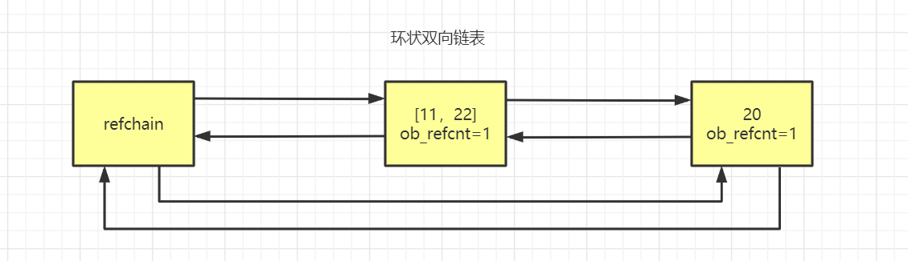
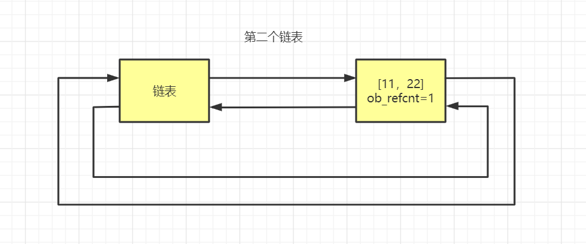
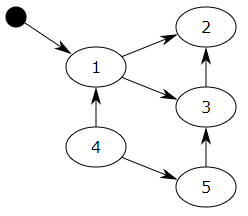

**标记清除**

# 2.1引入目的

为了解决循环引用的不足，python的底层不会单单只用引用计数器，引入了一个机制叫做标记清楚。

# 2.2实现原理

在python的底层中，再去维护一个链表，这个链表中专门放那些可能存在循环引用的对象。

那么哪些情况可能导致循环引用的情况发生？

就是那些元素里面可以存放其他元素的元素。（list/dict/tuple/set，甚至class）

例如：

第二个链表 只存储 可能是循环引用的对象。

维护两个链表的作用是，在python内部某种情况下，会去扫描 可能存在循环引用的链表 中的每个元素，

在循环一个列表的元素时，由于内部还有子元素 ，如果存在循环引用(v1 = [1,2,3,v2]和v2 = [4,5,6,v1])，

比如从v1的子元素中找到了v2，又从v2的子元素中找到了v1，那么就检查到循环引用，如果有循环引

用，就让双方的引用计数器各自-1，如果是0则垃圾回收。

# 2.3标记清除算法

【标记清除（Mark—Sweep）】算法是一种基于追踪回收（tracing GC）技术实现的垃圾回收算法。它

分为两个阶段：第一阶段是标记阶段，GC会把所有的『活动对象』打上标记，第二阶段是把那些没有标

记的对象『非活动对象』进行回收。那么GC又是如何判断哪些是活动对象哪些是非活动对象的呢？

对象之间通过引用（指针）连在一起，构成一个有向图，对象构成这个有向图的节点，而引用关系构成

这个有向图的边。从根对象（root object）出发，沿着有向边遍历对象，可达的（reachable）对象标

记为活动对象，不可达的对象就是要被清除的非活动对象。根对象就是全局变量、调用栈、寄存器。

在上图中，我们把小黑点视为全局变量，也就是把它作为root object，从小黑点出发，对象1可直达，

那么它将被标记，对象2、3可间接到达也会被标记，而4和5不可达，那么1、2、3就是活动对象，4和5

是非活动对象会被GC回收。

1. 寻找跟对象（root object）的集合作为垃圾检测动作的起点，跟对象也就是一些全局引用和函数栈

中的引用，这些引用所指向的对象是不可被删除的。

1. 从root object集合出发，沿着root object集合中的每一个引用，如果能够到达某个对象，则说明这

个对象是可达的，那么就不会被删除，这个过程就是垃圾检测阶段。

1. 当检测阶段结束以后，所有的对象就分成可达和不可达两部分，所有的可达对象都进行保留，其它

的不可达对象所占用的内存将会被回收，这就是垃圾回收阶段。（底层采用的是链表将这些集合的

对象连接在一起）。