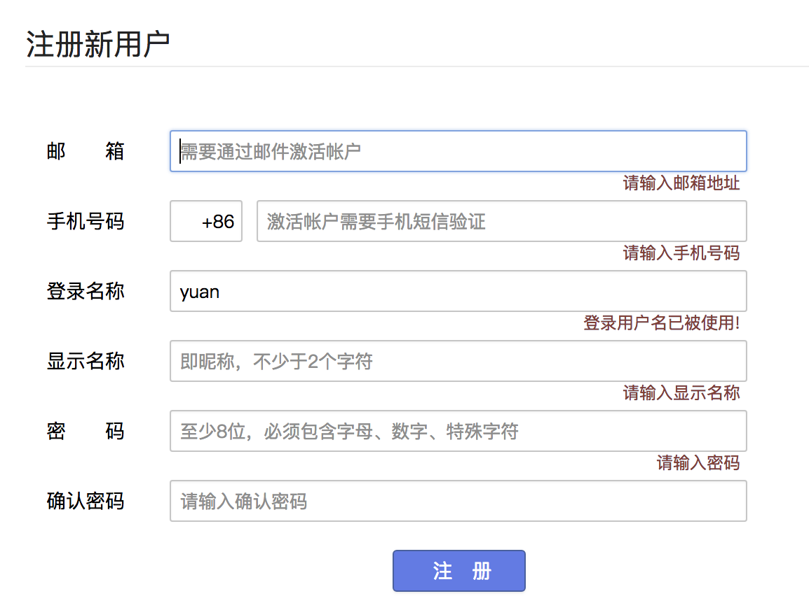
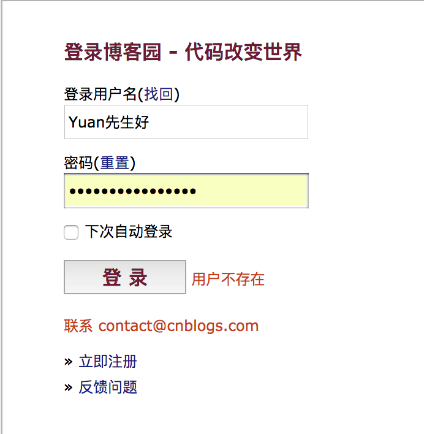

**Django与Ajax**

# 1、Ajax简介 

AJAX（Asynchronous Javascript And XML）翻译成中文就是“异步Javascript和XML”。即使用Javascript语言与服务器进行异步交互，传输的数据为XML（当然，传输的数据不只是XML,现在更多使用json数据）。

- 同步交互：客户端发出一个请求后，需要等待服务器响应结束后，才能发出第二个请求；

- 异步交互：客户端发出一个请求后，无需等待服务器响应结束，就可以发出第二个请求。

AJAX除了异步的特点外，还有一个就是：浏览器页面局部刷新；（这一特点给用户的感受是在不知不觉中完成请求和响应过程）

场景：



**优点：**

- AJAX使用Javascript技术向服务器发送异步请求

- AJAX无须刷新整个页面

# 2、基于jquery的Ajax实现

```
<button class="send_Ajax">send_Ajax</button>
<script>
   $(".send_Ajax").click(function(){
       $.ajax({
           url:"/handle_Ajax/",
           type:"POST",
           data:{username:"Yuan",password:123},
           success:function(data){
               console.log(data)
           },
     　　　　　　
           error: function (jqXHR, textStatus, err) {
                    console.log(arguments);
                },
           complete: function (jqXHR, textStatus) {
                    console.log(textStatus);
            },
           statusCode: {
                '403': function (jqXHR, textStatus, err) {
                      console.log(arguments);
                 },
                '400': function (jqXHR, textStatus, err) {
                    console.log(arguments);
                }
            }
       })
   })
</script>
```

# 3、案例

## 1）用户名是否已被注册

在注册表单中，当用户填写了用户名后，把光标移开后，会自动向服务器发送异步请求。服务器返回true或false，返回true表示这个用户名已经被注册过，返回false表示没有注册过。客户端得到服务器返回的结果后，确定是否在用户名文本框后显示“用户名已被注册”的错误信息！

## 2）基于Ajax进行登录验证

用户在表单输入用户名与密码，通过Ajax提交给服务器，服务器验证后返回响应信息，客户端通过响应信息确定是否登录成功，成功，则跳转到首页，否则，在页面上显示相应的错误信息。



# 3、文件上传

## 1）请求头ContentType

ContentType指的是请求体的编码类型，常见的类型共有3种：

### 1 application/x-www-form-urlencoded

这应该是最常见的 POST 提交数据的方式了。浏览器的原生 <form> 表单，如果不设置 enctype 属性，那么最终就会以 application/x-www-form-urlencoded 方式提交数据。请求类似于下面这样（无关的请求头在本文中都省略掉了）：

```
POST 
Content-Type: application/x-www-form-urlencoded;charset=utf-8
user=yuan&age=22
```

### 2 multipart/form-data

这又是一个常见的 POST 数据提交的方式。我们使用表单上传文件时，必须让 <form> 表单的 enctype 等于 multipart/form-data。直接来看一个请求示例：

```
POST 
Content-Type:multipart/form-data; boundary=----WebKitFormBoundaryrGKCBY7qhFd3TrwA
------WebKitFormBoundaryrGKCBY7qhFd3TrwA
Content-Disposition: form-data; name="user"
yuan
------WebKitFormBoundaryrGKCBY7qhFd3TrwA
Content-Disposition: form-data; name="file"; filename="chrome.png"
Content-Type: image/png
PNG ... content of chrome.png ...
------WebKitFormBoundaryrGKCBY7qhFd3TrwA--
```

这个例子稍微复杂点。首先生成了一个 boundary 用于分割不同的字段，为了避免与正文内容重复，boundary 很长很复杂。然后 Content-Type 里指明了数据是以 multipart/form-data 来编码，本次请求的 boundary 是什么内容。消息主体里按照字段个数又分为多个结构类似的部分，每部分都是以 --boundary 开始，紧接着是内容描述信息，然后是回车，最后是字段具体内容（文本或二进制）。如果传输的是文件，还要包含文件名和文件类型信息。消息主体最后以 --boundary-- 标示结束。关于 multipart/form-data 的详细定义，请前往 rfc1867 查看。

这种方式一般用来上传文件，各大服务端语言对它也有着良好的支持。

上面提到的这两种 POST 数据的方式，都是浏览器原生支持的，而且现阶段标准中原生 <form> 表单也只支持这两种方式（通过 <form> 元素的 enctype 属性指定，默认为 application/x-www-form-urlencoded。其实 enctype 还支持 text/plain，不过用得非常少）。

随着越来越多的 Web 站点，尤其是 WebApp，全部使用 Ajax 进行数据交互之后，我们完全可以定义新的数据提交方式，给开发带来更多便利。

### 3 application/json

application/json 这个 Content-Type 作为响应头大家肯定不陌生。实际上，现在越来越多的人把它作为请求头，用来告诉服务端消息主体是序列化后的 JSON 字符串。由于 JSON 规范的流行，除了低版本 IE 之外的各大浏览器都原生支持 JSON.stringify，服务端语言也都有处理 JSON 的函数，使用 JSON 不会遇上什么麻烦。

JSON 格式支持比键值对复杂得多的结构化数据，这一点也很有用。记得我几年前做一个项目时，需要提交的数据层次非常深，我就是把数据 JSON 序列化之后来提交的。不过当时我是把 JSON 字符串作为 val，仍然放在键值对里，以 x-www-form-urlencoded 方式提交。

# 4、基于form表单的文件上传

## 模板部分

```
<form action="" method="post" enctype="multipart/form-data">
用户名 <input type="text" name="user">
头像 <input type="file" name="avatar">
<input type="submit">
</form>
```

## 视图部分

```
def index(request):
print(request.body)   # 原始的请求体数据
print(request.GET)    # GET请求数据
print(request.POST)   # POST请求数据
print(request.FILES)  # 上传的文件数据
return render(request,"index.html")
```

# 5、基于Ajax的文件上传

## 模板

```
<form>
用户名 <input type="text" id="user">
头像 <input type="file" id="avatar">
<input type="button" id="ajax-submit" value="ajax-submit">
</form>
<script>
$("#ajax-submit").click(function(){
    var formdata=new FormData();
    formdata.append("user",$("#user").val());
    formdata.append("avatar_img",$("#avatar")[0].files[0]);
    $.ajax({
        url:"",
        type:"post",
        data:formdata,
        processData: false ,    // 不处理数据
        contentType: false,    // 不设置内容类型
        success:function(data){
            console.log(data)
        }
    })
})
</script>
```

## 视图

```
def index(request):
if request.is_ajax():
    print(request.body)   # 原始的请求体数据
    print(request.GET)    # GET请求数据
    print(request.POST)   # POST请求数据
    print(request.FILES)  # 上传的文件数据
    return HttpResponse("ok")
return render(request,"index.html")
```

## 检查浏览器的请求头：

```
Content-Type: multipart/form-data; boundary=----WebKitFormBoundaryaWl9k5ZMiTAzx3FT
```