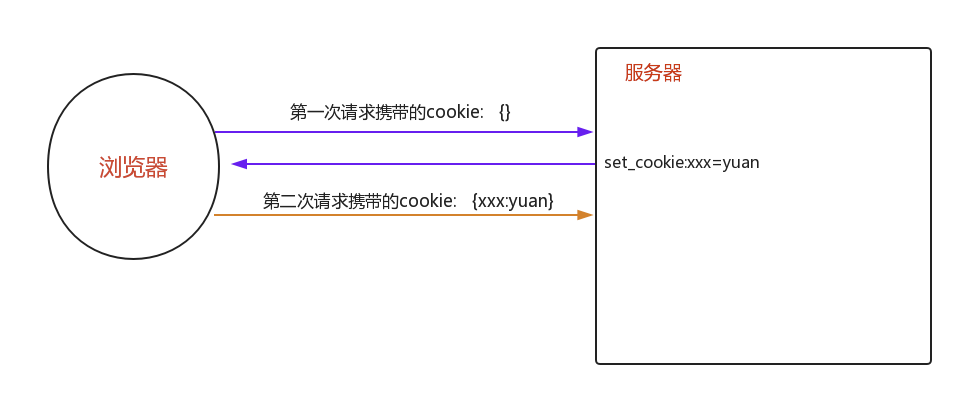
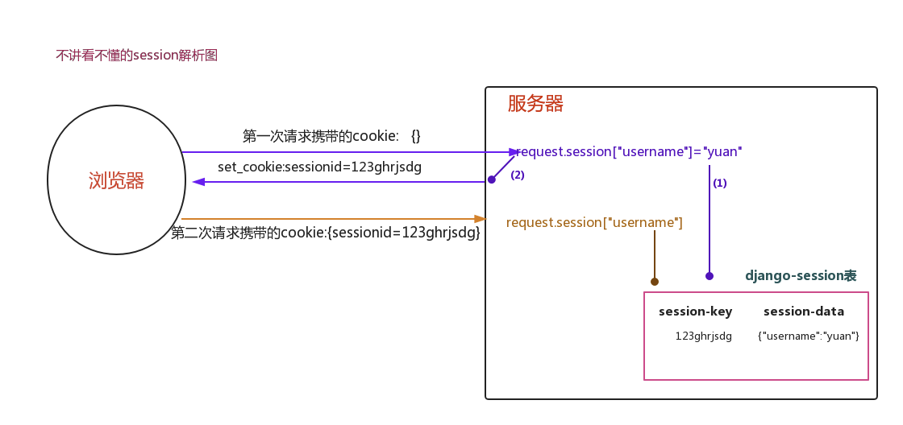

** Django组件-cookie与session**

# 1、会话跟踪技术

## 1) 什么是会话跟踪技术

我们需要先了解一下什么是会话！可以把会话理解为客户端与服务器之间的一次会晤，在一次会晤中可能会包含多次请求和响应。例如你给10086打个电话，你就是客户端，而10086服务人员就是服务器了。从双方接通电话那一刻起，会话就开始了，到某一方挂断电话表示会话结束。在通话过程中，你会向10086发出多个请求，那么这多个请求都在一个会话中。

在JavaWeb中，客户向某一服务器发出第一个请求开始，会话就开始了，直到客户关闭了浏览器会话结束。

在一个会话的多个请求中共享数据，这就是会话跟踪技术。例如在一个会话中的请求如下：

-   请求银行主页；

- 请求登录（请求参数是用户名和密码）；

- 请求转账（请求参数与转账相关的数据）；

- 请求信誉卡还款（请求参数与还款相关的数据）。

在这上会话中当前用户信息必须在这个会话中共享的，因为登录的是张三，那么在转账和还款时一定是相对张三的转账和还款！这就说明我们必须在一个会话过程中有共享数据的能力。

## 2)会话路径技术使用Cookie或session完成

我们知道HTTP协议是无状态协议，也就是说每个请求都是独立的！无法记录前一次请求的状态。但HTTP协议中可以使用Cookie来完成会话跟踪！在Web开发中，使用session来完成会话跟踪，session底层依赖Cookie技术。

# **2、Cookie概述**

## 1）什么叫Cookie

Cookie翻译成中文是小甜点，小饼干的意思。在HTTP中它表示服务器送给客户端浏览器的小甜点。其实Cookie是key-value结构，类似于一个python中的字典。随着服务器端的响应发送给客户端浏览器。然后客户端浏览器会把Cookie保存起来，当下一次再访问服务器时把Cookie再发送给服务器。 Cookie是由服务器创建，然后通过响应发送给客户端的一个键值对。客户端会保存Cookie，并会标注出Cookie的来源（哪个服务器的Cookie）。当客户端向服务器发出请求时会把所有这个服务器Cookie包含在请求中发送给服务器，这样服务器就可以识别客户端了！



## 2）Cookie规范

- Cookie大小上限为4KB；

- 一个服务器最多在客户端浏览器上保存20个Cookie；

- 一个浏览器最多保存300个Cookie；

上面的数据只是HTTP的Cookie规范，但在浏览器大战的今天，一些浏览器为了打败对手，为了展现自己的能力起见，可能对Cookie规范“扩展”了一些，例如每个Cookie的大小为8KB，最多可保存500个Cookie等！但也不会出现把你硬盘占满的可能！

注意，不同浏览器之间是不共享Cookie的。也就是说在你使用IE访问服务器时，服务器会把Cookie发给IE，然后由IE保存起来，当你在使用FireFox访问服务器时，不可能把IE保存的Cookie发送给服务器。

## 3）Cookie与HTTP头

Cookie是通过HTTP请求和响应头在客户端和服务器端传递的：

- Cookie：请求头，客户端发送给服务器端；

- 格式：Cookie: a=A; b=B; c=C。即多个Cookie用分号离开；  Set-Cookie：响应头，服务器端发送给客户端；

- 一个Cookie对象一个Set-Cookie： Set-Cookie: a=A Set-Cookie: b=B Set-Cookie: c=C

## 4）Cookie的覆盖

如果服务器端发送重复的Cookie那么会覆盖原有的Cookie，例如客户端的第一个请求服务器端发送的Cookie是：Set-Cookie: a=A；第二请求服务器端发送的是：Set-Cookie: a=AA，那么客户端只留下一个Cookie，即：a=AA。

## 5）django中的cookie语法

- 设置cookie：

```python
rep = HttpResponse(...) 或 rep ＝ render(request, ...) 或 rep ＝ redirect()
rep.set_cookie(key,value,...)
rep.set_signed_cookie(key,value,salt='加密盐',...)　
源码：
'''
class HttpResponseBase:
    def set_cookie(self, key,                 键
    　　　　　　　　　　　　 value='',            值
    　　　　　　　　　　　　 max_age=None,        超长时间 
cookie需要延续的时间（以秒为单位）
　　　　　　　　　　　　　　　　　　　　　　　　　　　　　　如果参数是\ None`` ，这个cookie会延续到浏览器关闭为止。
    　　　　　　　　　　　　 expires=None,        超长时间
   　　　　　　　　　　　　　　　　　　　　　　　　　　expires默认None ,cookie失效的实际日期/时间。 
　　　　　　　　　　　　　　　　　　　　　　　　　　　　
    　　　　　　　　　　　　 path='/',           Cookie生效的路径，
                                             浏览器只会把cookie回传给带有该路径的页面，这样可以避免将
                                             cookie传给站点中的其他的应用。
                                             / 表示根路径，特殊的：根路径的cookie可以被任何url的页面访问
    　　　　　　　　　　　　 
                         domain=None,         Cookie生效的域名
                                            
                                              你可用这个参数来构造一个跨站cookie。
                                              如， domain=".example.com"
                                              所构造的cookie对下面这些站点都是可读的：
                                              www.example.com 、 www2.example.com 
    　　　　　　　　　　　　　　　　　　　　　　　　　和an.other.sub.domain.example.com 。
                                              如果该参数设置为 None ，cookie只能由设置它的站点读取。
    　　　　　　　　　　　　 secure=False,        如果设置为 True ，浏览器将通过HTTPS来回传cookie。
    　　　　　　　　　　　　 httponly=False       只能http协议传输，无法被JavaScript获取
                                             （不是绝对，底层抓包可以获取到也可以被覆盖）
    　　　　　　　　　　): pass
'''
```

- 获取cookie：

```
request.COOKIES　　
```

- 删除cookie：

```
response.delete_cookie("cookie_key",path="/",domain=name)
```

练习

案例1:显示上次访问时间。

案例2:显示上次浏览过的商品。

# 3、session

Session是服务器端技术，利用这个技术，服务器在运行时可以 为每一个用户的浏览器创建一个其独享的session对象，由于 session为用户浏览器独享，所以用户在访问服务器的web资源时 ，可以把各自的数据放在各自的session中，当用户再去访问该服务器中的其它web资源时，其它web资源再从用户各自的session中 取出数据为用户服务。



## 1）django中session语法

```python
1、设置Sessions值
request.session['session_name'] ="admin"
2、获取Sessions值
session_name = request.session["session_name"]
3、删除Sessions值
del request.session["session_name"]
4、flush()
删除当前的会话数据并删除会话的Cookie。
这用于确保前面的会话数据不可以再次被用户的浏览器访问
5、get(key, default=None)
  
fav_color = request.session.get('fav_color', 'red')
  
6、pop(key)
  
fav_color = request.session.pop('fav_color')
  
7、keys()
  
8、items()
  
9、setdefault()
  
  
10 用户session的随机字符串
        request.session.session_key
   
        # 将所有Session失效日期小于当前日期的数据删除
        request.session.clear_expired()
   
        # 检查 用户session的随机字符串 在数据库中是否
        request.session.exists("session_key")
   
        # 删除当前用户的所有Session数据
        request.session.delete("session_key")
   
        request.session.set_expiry(value)
            * 如果value是个整数，session会在些秒数后失效。
            * 如果value是个datatime或timedelta，session就会在这个时间后失效。
            * 如果value是0,用户关闭浏览器session就会失效。
            * 如果value是None,session会依赖全局session失效策略。
```

- 
session配置

```python
Django默认支持Session，并且默认是将Session数据存储在数据库中，即：django_session 表中。
   
a. 配置 settings.py
   
    SESSION_ENGINE = 'django.contrib.sessions.backends.db'   # 引擎（默认）
       
    SESSION_COOKIE_NAME ＝ "sessionid"                       # Session的cookie保存在浏览器上时的key，即：sessionid＝随机字符串（默认）
    SESSION_COOKIE_PATH ＝ "/"                               # Session的cookie保存的路径（默认）
    SESSION_COOKIE_DOMAIN = None                             # Session的cookie保存的域名（默认）
    SESSION_COOKIE_SECURE = False                            # 是否Https传输cookie（默认）
    SESSION_COOKIE_HTTPONLY = True                           # 是否Session的cookie只支持http传输（默认）
    SESSION_COOKIE_AGE = 1209600                             # Session的cookie失效日期（2周）（默认）
    SESSION_EXPIRE_AT_BROWSER_CLOSE = False                  # 是否关闭浏览器使得Session过期（默认）
    SESSION_SAVE_EVERY_REQUEST = False                       # 是否每次请求都保存Session，默认修改之后才保存（默认）
```


练习
1 登录案例

```
需要的页面：
#login.html：登录页面，提供登录表单；
#index1.html：主页，显示当前用户名称，如果没有登录，显示您还没登录；
#index2.html：主页，显示当前用户名称，如果没有登录，显示您还没登录；
```

思考，如果第二个人再次再同一个浏览器上登录，django-session表会怎样？

2 验证码案例

验证码可以去识别发出请求的是人还是程序！当然，如果聪明的程序可以去分析验证码图片！但分析图片也不是一件容易的事，因为一般验证码图片都会带有干扰线，人都看不清，那么程序一定分析不出来。