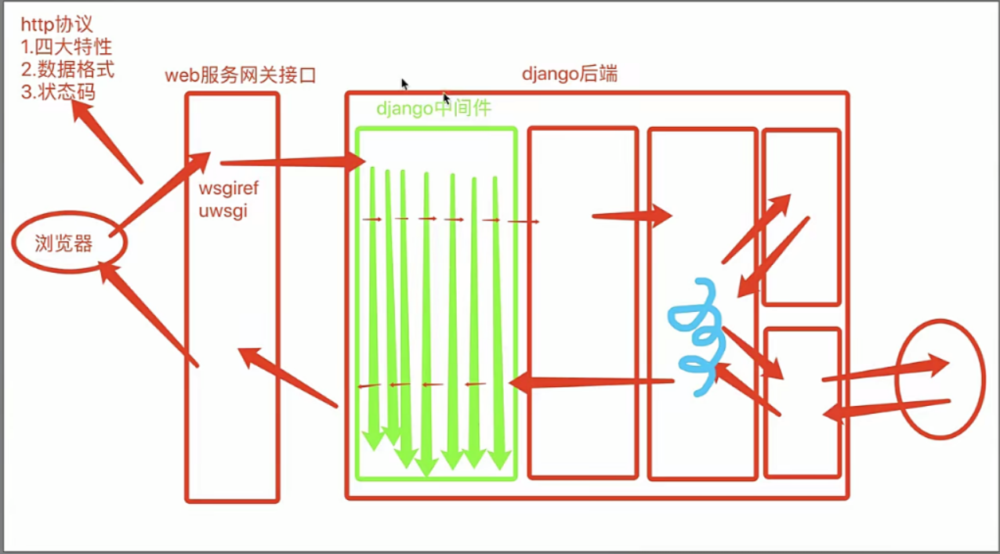

**Django 中间件**

# 1、django请求声明周期流程图



# 2、django中间件

```
"""
django中间件类似于django的保安	
1.请求来的时候需要先经过中间件才能到达urls.py继续匹配	
2.响应走的时候最后也需要经过中间件才能真正离开django后端django中间件能够做的事情 
只要是涉及到项目全局的功能，你一定要想到中间件	
    1.全局身份校验	
    2.全局访问频率校验	
    3.全局权限校验	
    ... 
django默认有七个中间件(每个中间件其实就类似于一块独立的功能)
django除了有自带的七个之外还支持用户自定义中间件并且暴露给用户五个可以自定义的方法
"""
# 如何自定义中间件
 1.在应用或者项目下创建一个任意名称的文件夹
  2.在该文件夹内创建任意名称的py文件
  3.在py文件内书写类 这个类需要继承所有中间件类都继承的MiddlewareMixin
  4.需要在配置文件中书写类的完整路径
# 需要掌握的两个
 1.process_request(self,request)
   1.请求来的时候会按照配置文件中注册的中间件从上往下依次经过每一个中间件里面的该方法，如果没有定义直接跳过
    2.该方法也可以自己返回HttpResponse对象，一旦返回则请求不再继续往后执行直接原路返回(可以借助于该方法实现很多限制校验功能)
  
  2.process_response(self,request,response)
   1.响应走的时候会按照配置文件中注册的中间件从下往上依次经过每一个中间件里面的该方法，如果没有定义直接跳过
    2.形参response就是返回给前端浏览器的内容，也就意味着该方法要么将response返回要么自己返回一个HttpResponse对象
    # 只要是形参中带有response的方法，那么该方法就必须返回response或者HttpResponse对象
    
  """ 
  注意 当process_request返回HttpResponse对象之后会直接走同级别的process_response而不会将所有的process_response都走一遍    
  但是在flask框架也有类似的中间件 但是它的特点只要返回响应就必须将所有类似于process_response功能方法全部走一遍 
   """
  
# 了解即可的三个
 1.process_view(self,view_name,*args,**kwargs)
 路由匹配成功之后执行视图函数之前
    
  2.process_exception(self,request,exception)
 当后端视图函数出现报错的时候
  
  3.process_template_response(self,request,response)
 返回的HttpResponse对象必须含有render属性
```