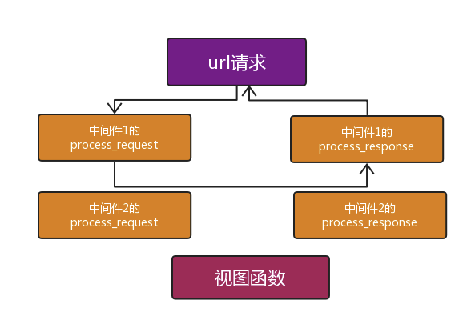
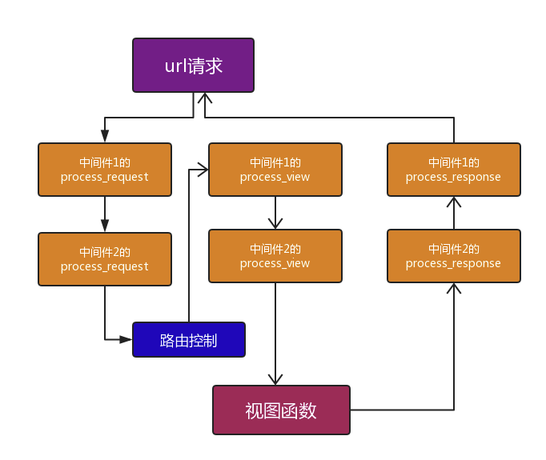

**Django组件-中间件**

**中间件**

# 1、中间件的概念

中间件顾名思义，是介于request与response处理之间的一道处理过程，相对比较轻量级，并且在全局上改变django的输入与输出。因为改变的是全局，所以需要谨慎实用，用不好会影响到性能。

Django的中间件的定义：

- Middleware is a framework of hooks into Django’s request/response processing. <br>It’s a light, low-level “plugin” system for globally altering Django’s input or output.

如果你想修改请求，例如被传送到view中的HttpRequest对象。 或者你想修改view返回的HttpResponse对象，这些都可以通过中间件来实现。

可能你还想在view执行之前做一些操作，这种情况就可以用 middleware来实现。

Django默认的Middleware：

```
MIDDLEWARE = [
'django.middleware.security.SecurityMiddleware',
'django.contrib.sessions.middleware.SessionMiddleware',
'django.middleware.common.CommonMiddleware',
'django.middleware.csrf.CsrfViewMiddleware',
'django.contrib.auth.middleware.AuthenticationMiddleware',
'django.contrib.messages.middleware.MessageMiddleware',
'django.middleware.clickjacking.XFrameOptionsMiddleware',
]
```

每一个中间件都有具体的功能。

# **2、自定义中间件**

中间件中一共有四个方法：

```
process_request
process_view
process_exception
process_response
```

## 1）process_request，process_response

当用户发起请求的时候会依次经过所有的的中间件，这个时候的请求时process_request,最后到达views的函数中，views函数处理后，在依次穿过中间件，这个时候是process_response,最后返回给请求者。


上述截图中的中间件都是django中的，我们也可以自己定义一个中间件，我们可以自己写一个类，但是必须继承MiddlewareMixin

需要导入

```
from django.utils.deprecation import MiddlewareMixin
```


### in views:

```
def index(request):
print("view函数...")
return HttpResponse("OK")
```

### in Mymiddlewares.py：

```
from django.utils.deprecation import MiddlewareMixin
from django.shortcuts import HttpResponse
class Md1(MiddlewareMixin):
def process_request(self,request):
    print("Md1请求")
def process_response(self,request,response):
    print("Md1返回")
    return response
class Md2(MiddlewareMixin):
def process_request(self,request):
    print("Md2请求")
    #return HttpResponse("Md2中断")
def process_response(self,request,response):
    print("Md2返回")
    return response
```

### 结果：

```
Md1请求
Md2请求
view函数...
Md2返回
Md1返回
```

注意：如果当请求到达请求2的时候直接不符合条件返回，即return HttpResponse("Md2中断")，程序将把请求直接发给中间件2返回，然后依次返回到请求者，结果如下：

返回Md2中断的页面，后台打印如下：

```
Md1请求
Md2请求
Md2返回
Md1返回
```

流程图如下：



## 2）process_view

```
process_view(self, request, callback, callback_args, callback_kwargs)
```

### Mymiddlewares.py修改如下

```
from django.utils.deprecation import MiddlewareMixin
from django.shortcuts import HttpResponse
class Md1(MiddlewareMixin):
def process_request(self,request):
    print("Md1请求")
    #return HttpResponse("Md1中断")
def process_response(self,request,response):
    print("Md1返回")
    return response
def process_view(self, request, callback, callback_args, callback_kwargs):
    print("Md1view")
class Md2(MiddlewareMixin):
def process_request(self,request):
    print("Md2请求")
    return HttpResponse("Md2中断")
def process_response(self,request,response):
    print("Md2返回")
    return response
def process_view(self, request, callback, callback_args, callback_kwargs):
    print("Md2view")
```

### 结果如下：

```
Md1请求
Md2请求
Md1view
Md2view
view函数...
Md2返回
Md1返回
```

下图进行分析上面的过程：



当最后一个中间的process_request到达路由关系映射之后，返回到中间件1的process_view，然后依次往下，到达views函数，最后通过process_response依次返回到达用户。

process_view可以用来调用视图函数：

```
class Md1(MiddlewareMixin):
def process_request(self,request):
    print("Md1请求")
    #return HttpResponse("Md1中断")
def process_response(self,request,response):
    print("Md1返回")
    return response
def process_view(self, request, callback, callback_args, callback_kwargs):
    # return HttpResponse("hello")
    response=callback(request,*callback_args,**callback_kwargs)
    return response
```

### 结果如下：

```
Md1请求
Md2请求
view函数...
Md2返回
Md1返回
```

注意：process_view如果有返回值，会越过其他的process_view以及视图函数，但是所有的process_response都还会执行。

## 3）process_exception

```
process_exception(self, request, exception)
```

示例修改如下：

```
class Md1(MiddlewareMixin):
def process_request(self,request):
    print("Md1请求")
    #return HttpResponse("Md1中断")
def process_response(self,request,response):
    print("Md1返回")
    return response
def process_view(self, request, callback, callback_args, callback_kwargs):
    # return HttpResponse("hello")
    # response=callback(request,*callback_args,**callback_kwargs)
    # return response
    print("md1 process_view...")
def process_exception(self):
    print("md1 process_exception...")
class Md2(MiddlewareMixin):
def process_request(self,request):
    print("Md2请求")
    # return HttpResponse("Md2中断")
def process_response(self,request,response):
    print("Md2返回")
    return response
def process_view(self, request, callback, callback_args, callback_kwargs):
    print("md2 process_view...")
def process_exception(self):
    print("md1 process_exception...")
复制代码
```

### 结果如下：

```
Md1请求
Md2请求
md1 process_view...
md2 process_view...
view函数...
Md2返回
Md1返回
```

### 流程图如下：


### 当views出现错误时：

#### 将md2的process_exception修改如下：

```
def process_exception(self,request,exception):
    print("md2 process_exception...")
    return HttpResponse("error")
```

#### 结果如下：

```
Md1请求
Md2请求
md1 process_view...
md2 process_view...
view函数...
md2 process_exception...
Md2返回
Md1返回
```

# 3、应用案例

## 1、做IP访问频率限制

某些IP访问服务器的频率过高，进行拦截，比如限制每分钟不能超过20次。

## 2、URL访问过滤

如果用户访问的是login视图（放过）

如果访问其他视图，需要检测是不是有session认证，已经有了放行，没有返回login，这样就省得在多个视图函数上写装饰器了！