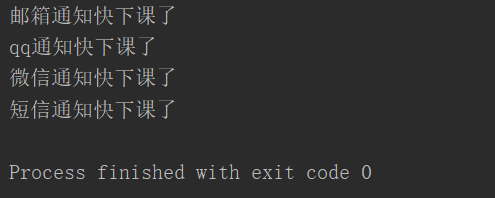

**参考django中间件功能设计扩展知识**

```
# 模块 importlib
 能够以字符串的形式帮助你导入模块，但是需要注意最小单位只能到模块名
# 功能的插拔式设计
 1.配置文件注册功能
  2.importlib模块
  3.字符串切割split
  4.反射
  5.面向对象及鸭子类型
# 一定要总结吸收该思想
```

**示例**

# 1、settings.py	

```
NOTIFY_LIST=[
    "notify.email.Email",
    "notify.qq.QQ",
    "notify.wechat.WeChat",
    "notify.msg.Msg",
]
```

# **2、notify包：**

- __init__.py

- email.py

- msg.py

- qq.py

- wechat.py

## __init__.py

```javascript
import settings
import importlib    #可以通过字符串加载某个模块
def send_all(content):
    for path_str in settings.NOTIFY_LIST:  #'notify.email.Email'
        module_path,class_name = path_str.rsplit('.',maxsplit=1)
        # module_path = 'notify.email'  class_name = 'Email'
        # 1 利用字符串导入模块
        module = importlib.import_module(module_path)  # from notify import email
        # 2 利用反射获取类名
        cls = getattr(module,class_name)  # Email、QQ、Wechat
        # 3 生成类的对象
        obj = cls()
        # 4 利用鸭子类型直接调用send方法
        obj.send(content)
```

## email.py

```
class Email(object):
    def __init__(self):
        pass    #前期的准备工作
    def send(self,content):
        print(f"邮箱通知{content}")
```

## msg.py

```
class Msg(object):
    def __init__(self):
        pass    #发送短信前期的准备工作
    def send(self,content):
        print(f"短信通知{content}")
```

## qq.py

```
class QQ(object):
    def __init__(self):
        pass    #前期的准备工作
    def send(self,content):
        print(f"qq通知{content}")
```

## wechat.py

```
class WeChat(object):
    def __init__(self):
        pass    #发送微信前期的准备工作
    def send(self,content):
        print(f"微信通知{content}")
```

# 3、start.py

```
import notify
notify.send_all("快下课了")
```

## 运行结果：

