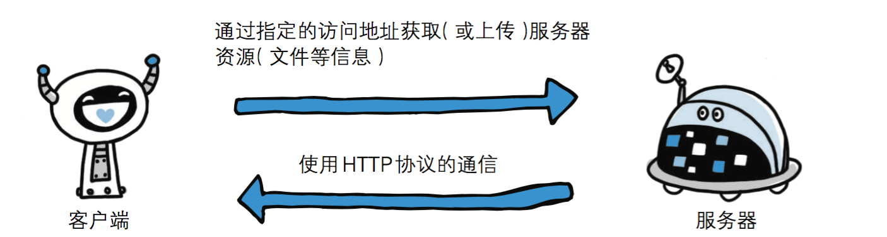
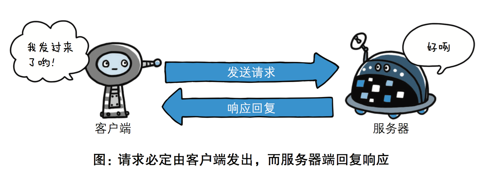
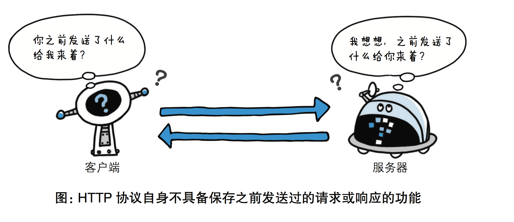
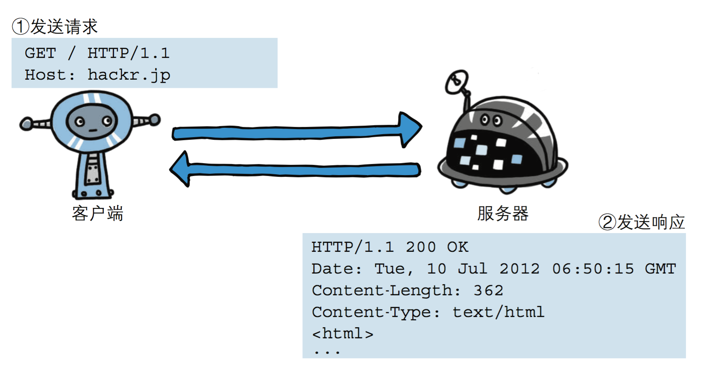
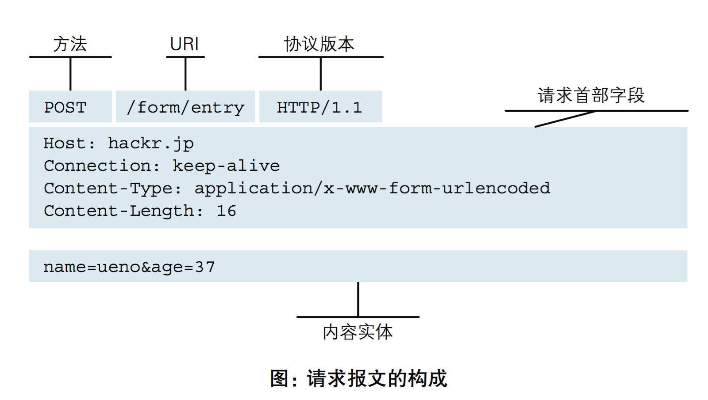
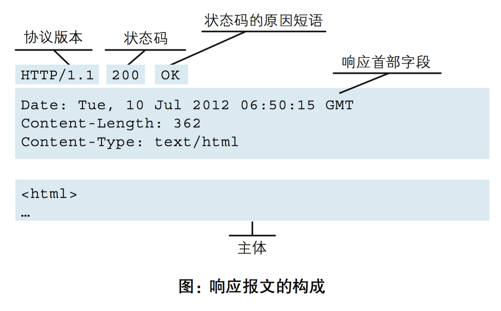
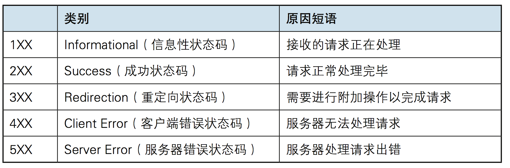

**HTTP协议**

# **1、http协议简介**

HTTP协议是Hyper Transfer Protocol（超文本传输协议）的缩写,是用于万维网（WWW:World Wide Web ）服务器与本地浏览器之间传输超文本的传送协议。

HTTP是一个属于应用层的面向对象的协议，由于其简捷、快速的方式，适用于分布式超媒体信息系统。它于1990年提出，经过几年的使用与发展，得到不断地完善和扩展。HTTP协议工作于客户端-服务端架构为上。浏览器作为HTTP客户端通过URL向HTTP服务端即WEB服务器发送所有请求。Web服务器根据接收到的请求后，向客户端发送响应信息。



# 2、http协议特性

## (1) 基于TCP/IP

http协议是基于TCP/IP协议之上的应用层协议。

## (2) 基于请求－响应模式

HTTP协议规定,请求从客户端发出,最后服务器端响应该请求并 返回。换句话说,肯定是先从客户端开始建立通信的,服务器端在没有 接收到请求之前不会发送响应



## (3) 无状态保存

HTTP是一种不保存状态,即无状态



使用HTTP协议,每当有新的请求发送时,就会有对应的新响应产 生。协议本身并不保留之前一切的请求或响应报文的信息。这是为了更快地处理大量事务,确保协议的可伸缩性,而特意把HTTP协议设计成 如此简单的。可是,随着Web的不断发展,因无状态而导致业务处理变得棘手 的情况增多了。比如,用户登录到一家购物网站,即使他跳转到该站的 其他页面后,也需要能继续保持登录状态。针对这个实例,网站为了能 够掌握是谁送出的请求,需要保存用户的状态。HTTP/1.1虽然是无状态协议,但为了实现期望的保持状态功能, 于是引入了Cookie技术。有了Cookie再用HTTP协议通信,就可以管 理状态了。有关Cookie的详细内容稍后讲解。

## 无连接

无连接的含义是限制每次连接只处理一个请求。服务器处理完客户的请求，并收到客户的应答后，即断开连接。采用这种方式可以节省传输时间。

# 3、http请求协议与响应协议

http协议包含由浏览器发送数据到服务器需要遵循的请求协议与服务器发送数据到浏览器需要遵循的请求协议。用于HTTP协议交互的信被为HTTP报文。请求端(客户端)的HTTP报文 做请求报文,响应端(服务器端)的 做响应报文。HTTP报文本身是由多行数据构成的字 文本。



## 1）请求协议

- 请求格式



### 请求方式: get与post请求

- GET提交的数据会放在URL之后，以?分割URL和传输数据，参数之间以&相连，如EditBook?name=test1&id=123456. POST方法

是把提交的数据放在HTTP包的请求体中.

- GET提交的数据大小有限制（因为浏览器对URL的长度有限制），而POST方法提交的数据没有限制.

- GET与POST请求在服务端获取请求数据方式不同。

## 2）响应协议

响应格式



响应状态码

状态码的职 是当客户端向服务器端发送请求时, 返回的请求 结果。借助状态码,用户可以知道服务器端是正常 理了请求,还是出 现了 。状态码如200 OK,以3位数字和原因 成。数字中的 一位指定了响应 别,后两位无分 。响应 别有以5种。



演示示例：

```
import socket


sock=socket.socket()
sock.bind(("127.0.0.1",8808))
sock.listen(5)

while 1:
    print("server waiting.....")
    conn,addr=sock.accept()
    data=conn.recv(1024)
    print("data",data)

    # 读取html文件
    with open("login.html","rb") as f:
        data=f.read()

    conn.send((b"HTTP/1.1 200 OK\r\n\r\n%s"%data))
    conn.close()
```

login.html

```
<!DOCTYPE html>
<html lang="en">
<head>
    <meta charset="UTF-8">
    <title>Title</title>
</head>
<body>


<form action="" method="post">
    用户名 <input type="text" name="user">
    密码 <input type="password" name="pwd">
    <input type="submit">
</form>

</body>
</html>
```