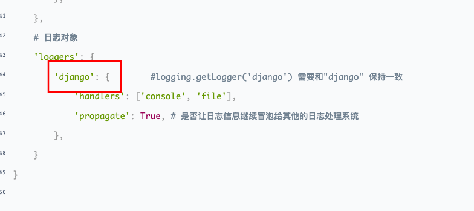

# settings.py

```python
# 真实项目上线后，日志文件打印级别不能过低，因为一次日志记录就是一次文件io操作
LOGGING = {
    'version': 1,
    'disable_existing_loggers': False,
    'formatters': {
        'verbose': {
            'format': '%(levelname)s %(asctime)s %(module)s %(lineno)d %(message)s'
        },
        'simple': {
            'format': '%(levelname)s %(module)s %(lineno)d %(message)s'
        },
    },
    'filters': {
        'require_debug_true': {
            '()': 'django.utils.log.RequireDebugTrue',
        },
    },
    'handlers': {
        'console': {
            # 实际开发建议使用WARNING
            'level': 'DEBUG',
            'filters': ['require_debug_true'],
            'class': 'logging.StreamHandler',
            'formatter': 'simple'
        },
        'file': {
            # 实际开发建议使用ERROR
            'level': 'INFO',
            'class': 'logging.handlers.RotatingFileHandler',
            # 日志位置,日志文件名,日志保存目录必须手动创建，注：这里的文件路径要注意BASE_DIR代表的是小luffyapi
            'filename': os.path.join(os.path.dirname(BASE_DIR), "logs", "luffy.log"),
            # 日志文件的最大值,这里我们设置300M
            'maxBytes': 300 * 1024 * 1024,
            # 日志文件的数量,设置最大日志数量为10
            'backupCount': 10,
            # 日志格式:详细格式
            'formatter': 'verbose',
            # 文件内容编码
            'encoding': 'utf-8'
        },
    },
    # 日志对象
    'loggers': {
        'django': {        #logging.getLogger('django') 需要和"django" 保持一致
            'handlers': ['console', 'file'],
            'propagate': True, # 是否让日志信息继续冒泡给其他的日志处理系统
        },
    }
}
```

# utils/logging.py

```python
import logging
logger = logging.getLogger('django')    # 这里django是自定义的，需要和配置中的相对应
# 以后使用，导入直接用
from luffyapi.utils.logger import log
log.info('xxxxxx')  # 不要写print
```

- 这里django是自定义的，需要和配置中的相对应

