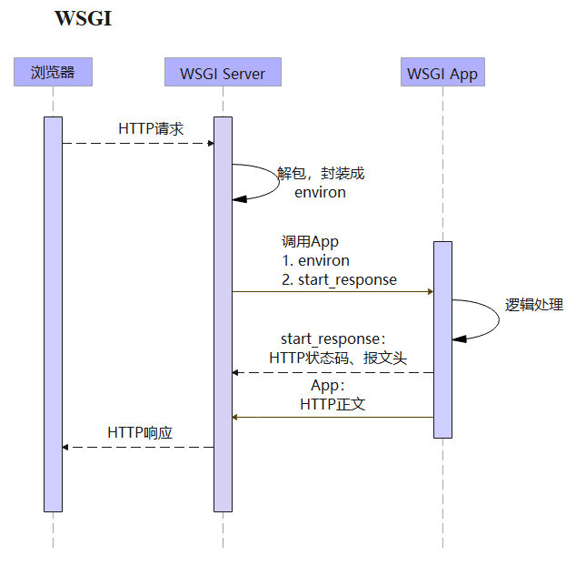

# 一、WSGI简介

WSGI（

# 二、WSGI基本原理

## 1. WSGI处理过程

1. **浏览器到WSGI Server：**浏览器发送的请求会先到WSGI Server。

1. **environ：**WSGI Server会将HTTP请求中的参数等信息封装到environ（一个字典）中。

1. **WSGI Server到WSGI App：**App就是我们自己编写的后台程序，每个URL会映射到对应的入口处理函数(或其他可调用对象），	WSGI Server调用后台App时，会将environ和WSGI Server中自己的一个start_response函数注入到后台App中。

1. **逻辑处理：**后台函数（或其他可调用对象）需要接收environ和start_response，进行逻辑处理后返回**一个可迭代对象**，可迭代对象中的元素为HTTP正文。

1. **WSGI App到WSGI Serve**r：后台函数处理完后，会先调用start_response函数将HTTP状态码、报文头等信息（响应头）返回给WSGI Server，然后再将函数的返回值作为HTTP正文（响应body）返回给WSGI Server。

1. **WSGI Server到浏览器**：WSGI Server将从App中得到的所有信息封装为一个response返回给浏览器。