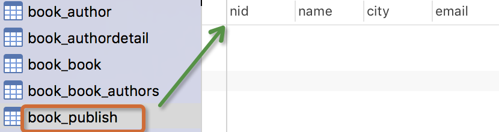

**Django 模型层(多表操作)**

# 1、创建模型

实例：我们来假定下面这些概念，字段和关系

作者模型：一个作者有姓名和年龄。

作者详细模型：把作者的详情放到详情表，包含生日，手机号，家庭住址等信息。作者详情模型和作者模型之间是一对一的关系（one-to-one）

出版商模型：出版商有名称，所在城市以及email。

书籍模型： 书籍有书名和出版日期，一本书可能会有多个作者，一个作者也可以写多本书，所以作者和书籍的关系就是多对多的关联关系(many-to-many);一本书只应该由一个出版商出版，所以出版商和书籍是一对多关联关系(one-to-many)。

模型建立如下：

```
from django.db import models
#Create your models here.
class Author(models.Model):
    nid = models.AutoField(primary_key=True)
    name=models.CharField( max_length=32)
    age=models.IntegerField()
    # 与AuthorDetail建立一对一的关系
    authorDetail=models.OneToOneField(to="AuthorDetail",on_delete=models.CASCADE)
class AuthorDetail(models.Model):
    nid = models.AutoField(primary_key=True)
    birthday=models.DateField()
    telephone=models.BigIntegerField()
    addr=models.CharField( max_length=64)
class Publish(models.Model):
    nid = models.AutoField(primary_key=True)
    name=models.CharField( max_length=32)
    city=models.CharField( max_length=32)
    email=models.EmailField()
class Book(models.Model):
    nid = models.AutoField(primary_key=True)
    title = models.CharField( max_length=32)
    publishDate=models.DateField()
    price=models.DecimalField(max_digits=5,decimal_places=2)
  
      # 与Publish建立一对多的关系,外键字段建立在多的一方
    publish=models.ForeignKey(to="Publish",to_field="nid",on_delete=models.CASCADE)
    # 与Author表建立多对多的关系,ManyToManyField可以建在两个模型中的任意一个，自动创建第三张表
    authors=models.ManyToManyField(to='Author')
```

- 生成表如下：

- 




注意事项：

- 表的名称myapp_modelName，是根据 模型中的元数据自动生成的，也可以覆写为别的名称　　

- id 字段是自动添加的

- 对于外键字段，Django 会在字段名上添加"_id" 来创建数据库中的列名

- 这个例子中的CREATE TABLE SQL 语句使用PostgreSQL 语法格式，要注意的是Django 会根据settings 中指定的数据库类型来使用相应的SQL 语句。

- 定义好模型之后，你需要告诉Django _使用_这些模型。你要做的就是修改配置文件中的INSTALL_APPSZ中设置，在其中添加models.py所在应用的名称。

- 外键字段 ForeignKey 有一个 null=True 的设置(它允许外键接受空值 NULL)，你可以赋给它空值 None 。

# **2、添加表纪录**

操作前先简单的录入一些数据：

- publish表：


- author表：


- authordetail表:


## 1）一对多

### 方式1:

```
publish_obj=Publish.objects.get(nid=1)
book_obj=Book.objects.create(title="python",publishDate="2012-12-12",price=100,publish=publish_obj)
```

### 方式2:

```
book_obj=Book.objects.create(title="python",publishDate="2012-12-12",price=100,publish_id=1)
核心：book_obj.publish与book_obj.publish_id是什么？
```

## 2）多对多

```
# 当前生成的书籍对象
book_obj=Book.objects.create(title="追风筝的人",price=200,publishDate="2012-11-12",publish_id=1)
# 为书籍绑定的做作者对象
yuan=Author.objects.filter(name="yuan").first() # 在Author表中主键为2的纪录
egon=Author.objects.filter(name="alex").first() # 在Author表中主键为1的纪录
# 绑定多对多关系,即向关系表book_authors中添加纪录
book_obj.authors.add(yuan,egon)    #  将某些特定的 model 对象添加到被关联对象集合中。   =======    book_obj.authors.add(*[])
book_obj.authors.remove(yuan,egon) 
book_obj.authors.clear()
```

数据库表纪录生成如下：

- book表


- book_authors表


**核心:book_obj.authors.all()是什么？**

多对多关系其它常用API：

```
book_obj.authors.remove()      # 将某个特定的对象从被关联对象集合中去除。    ======   book_obj.authors.remove(*[])
book_obj.authors.clear()       #清空被关联对象集合
book_obj.authors.set()         #先清空再设置　　
```

- more:

# **3、基于对象的跨表查询**

## 1）一对多查询（Publish 与 Book）

### 正向查询(按字段：publish)：

```
#查询主键为1的书籍的出版社所在的城市
book_obj=Book.objects.filter(pk=1).first()
book_obj.publish 是主键为1的书籍对象关联的出版社对象
print(book_obj.publish.city) 　
```

### 反向查询(按表名：book_set)：

```
publish=Publish.objects.get(name="苹果出版社")
#publish.book_set.all() : 与苹果出版社关联的所有书籍对象集合
book_list=publish.book_set.all()    
for book_obj in book_list:
       print(book_obj.title)
```

## 2）一对一查询(Author 与 AuthorDetail)

### 正向查询(按字段：authorDetail)：

```
egon=Author.objects.filter(name="egon").first()
print(egon.authorDetail.telephone)
```

### 反向查询(按表名：author)：

```
查询所有住址在北京的作者的姓名
authorDetail_list=AuthorDetail.objects.filter(addr="beijing")
for obj in authorDetail_list:
print(obj.author.name)
```

## 3）多对多查询 (Author 与 Book)

### 正向查询(按字段：authors)：

```
#金瓶眉所有作者的名字以及手机号
book_obj=Book.objects.filter(title="金瓶眉").first()
authors=book_obj.authors.all()        #与这本书关联的所有对象的集合，queryset
for author_obj in authors:
print(author_obj.name,author_obj.authorDetail.telephone)
```

### 反向查询(按表名：book_set)：

```
#查询egon出过的所有书籍的名字
author_obj=Author.objects.get(name="egon")
book_list=author_obj.book_set.all()        #与egon作者相关的所有书籍
for book_obj in book_list:
    print(book_obj.title)
```

**注意：**

你可以通过在 ForeignKey() 和ManyToManyField的定义中设置 related_name 的值来覆写 FOO_set 的名称。例如，如果 Article model 中做一下更改：

```
publish = ForeignKey(Book, related_name='bookList')
```

那么接下来就会如我们看到这般：

```
查询 人民出版社出版过的所有书籍
publish=Publish.objects.get(name="人民出版社")
book_list=publish.bookList.all()  # 与人民出版社关联的所有书籍对象集合
```

# **4、基于双下划线的跨表查询**

Django 还提供了一种直观而高效的方式在查询(lookups)中表示关联关系，它能自动确认 SQL JOIN 联系。要做跨关系查询，就使用两个下划线来链接模型(model)间关联字段的名称，直到最终链接到你想要的model 为止。

'''

**正向查询按字段,反向查询按表名小写用来告诉ORM引擎join哪张表**

'''

## 1）一对多查询

```
练习:  查询苹果出版社出版过的所有书籍的名字与价格(一对多)
# 正向查询 按字段:publish
queryResult=Book.objects.filter(publish__name="苹果出版社").values_list("title","price")
# 反向查询 按表名:book
queryResult=Publish.objects.filter(name="苹果出版社").values_list("book__title","book__price")
```

## 2）多对多查询　　

```
练习: 查询alex出过的所有书籍的名字(多对多)
# 正向查询 按字段:authors:
queryResult=Book.objects.filter(authors__name="alex").values_list("title")
# 反向查询 按表名:book
queryResult=Author.objects.filter(name="alex").values_list("book__title","book__price")
```

## 3）一对一查询

```
# 查询alex的手机号
# 正向查询
ret=Author.objects.filter(name="alex").values("authordetail__telephone")
# 反向查询
ret=AuthorDetail.objects.filter(author__name="alex").values("telephone")
```

## 4）进阶练习(连续跨表)

### 练习: 查询人民出版社出版过的所有书籍的名字以及作者的姓名

#### 正向查询

```
queryResult=Book.object.filter(publish__name="人民出版社").values_list("title","authors__name")
```

#### 反向查询

```
queryResult=Publish.objects.filter(name="人民出版社").values_list("book__title","book__authors__name")
```

### 练习: 手机号以151开头的作者出版过的所有书籍名称以及出版社名称

#### 方式1:

```
queryResult=Book.objects.filter(authors__authorDetail__telephone__regex="151").values_list("title","publish__name")
```

#### 方式2:

```
ret=Author.objects.filter(authordetail__telephone__startswith="151").values("book__title","book__publish__name")
```

## 5）related_name

反向查询时，如果定义了related_name ，则用related_name替换表名，例如：

```
publish = ForeignKey(Blog, related_name='bookList')
```

### 练习: 查询人民出版社出版过的所有书籍的名字与价格(一对多)

#### 反向查询 不再按表名:book,而是related_name:bookList

```
queryResult=Publish.objects.filter(name="人民出版社").values_list("bookList__title","bookList__price")
```

# 5、聚合查询与分组查询

## 1）聚合

- aggregate(*args, **kwargs)

```
计算所有图书的平均价格
>>> from django.db.models import Avg
>>> Book.objects.all().aggregate(Avg('price'))
{'price__avg': 34.35}
```

aggregate()是QuerySet 的一个终止子句，意思是说，它返回一个包含一些键值对的字典。键的名称是聚合值的标识符，值是计算出来的聚合值。键的名称是按照字段和聚合函数的名称自动生成出来的。如果你想要为聚合值指定一个名称，可以向聚合子句提供它。

```

Book.objects.aggregate(average_price=Avg('price'))
{'average_price': 34.35}
```

如果你希望生成不止一个聚合，你可以向aggregate()子句中添加另一个参数。所以，如果你也想知道所有图书价格的最大值和最小值，可以这样查询：

```
from django.db.models import Avg, Max, Min
Book.objects.aggregate(Avg('price'), Max('price'), Min('price'))
{'price__avg': 34.35, 'price__max': Decimal('81.20'), 'price__min': Decimal('12.99')}

```

## 2)分组

```
###################################－－单表分组查询－－#######################################################


查询每一个部门名称以及对应的员工数
emp:
id  name age   salary    dep
1   alex  12   2000     销售部
2   egon  22   3000     人事部
3   wen   22   5000     人事部
sql语句:
select dep,Count(*) from emp group by dep;
ORM:
emp.objects.values("dep").annotate(c=Count("id")
###################################－－多表分组查询－－###########################
多表分组查询：
查询每一个部门名称以及对应的员工数
emp:
id  name age   salary   dep_id
1   alex  12   2000       1
2   egon  22   3000       2
3   wen   22   5000       2
dep
id   name
1    销售部
2    人事部
emp－dep:
id  name age   salary   dep_id   id   name
1   alex  12   2000       1      1    销售部
2   egon  22   3000       2      2    人事部
3   wen   22   5000       2      2    人事部
sql语句:
select dep.name,Count(*) from emp left join dep on emp.dep_id=dep.id group by dep.id
ORM:
dep.objetcs.values("id").annotate(c=Count("emp")).values("name","c")
```

```
class Emp(models.Model):
    name=models.CharField(max_length=32)
    age=models.IntegerField()
    salary=models.DecimalField(max_digits=8,decimal_places=2)
    dep=models.CharField(max_length=32)
    province=models.CharField(max_length=32)
```

annotate()为调用的QuerySet中每一个对象都生成一个独立的统计值（统计方法用聚合函数）。

总结 ：跨表分组查询本质就是将关联表join成一张表，再按单表的思路进行分组查询。

## 3)查询练习

### (1) 练习：统计每一个出版社的最便宜的书

```
publishList=Publish.objects.annotate(MinPrice=Min("book__price"))
for publish_obj in publishList:
print(publish_obj.name,publish_obj.MinPrice)
```

annotate的返回值是querySet，如果不想遍历对象，可以用上valuelist：

```
queryResult= Publish.objects.annotate(MinPrice=Min("book__price")).values_list("name","MinPrice")
print(queryResult)
```

```
'''
SELECT "app01_publish"."name", MIN("app01_book"."price")  AS "MinPrice" FROM "app01_publish" 
LEFT  JOIN "app01_book" ON ("app01_publish"."nid" = "app01_book"."publish_id") 
GROUP BY "app01_publish"."nid", "app01_publish"."name", "app01_publish"."city", "app01_publish"."email" 
'''
```

### (2) 练习：统计每一本书的作者个数

```
ret=Book.objects.annotate(authorsNum=Count('authors__name'))
```

### (3) 统计每一本以py开头的书籍的作者个数：

```
queryResult=Book.objects.filter(title__startswith="Py").annotate(num_authors=Count('authors'))
```

### (4) 统计不止一个作者的图书：

```
queryResult=Book.objects.annotate(num_authors=Count('authors')).filter(num_authors__gt=1)
```

### (5) 根据一本图书作者数量的多少对查询集 QuerySet进行排序:

```
Book.objects.annotate(num_authors=Count('authors')).order_by('num_authors')
```

### (6) 查询各个作者出的书的总价格:

```
按author表的所有字段 group by
queryResult=Author.objects.annotate(SumPrice=Sum("book__price")).values_list("name","SumPrice")
print(queryResult)
```

# **6、F查询与Q查询**

## 1）F查询

在上面所有的例子中，我们构造的过滤器都只是将字段值与某个常量做比较。如果我们要对两个字段的值做比较，那该怎么做呢？

Django 提供 F() 来做这样的比较。F() 的实例可以在查询中引用字段，来比较同一个 model 实例中两个不同字段的值。

```
查询评论数大于收藏数的书籍
from django.db.models import F
Book.objects.filter(commnetNum__lt=F('keepNum'))
```

Django 支持 F() 对象之间以及 F() 对象和常数之间的加减乘除和取模的操作。

```
查询评论数大于收藏数2倍的书籍
Book.objects.filter(commnetNum__lt=F('keepNum')*2)
```

修改操作也可以使用F函数,比如将每一本书的价格提高30元：

```
Book.objects.all().update(price=F("price")+30)　
```

## 2）Q查询

filter() 等方法中的关键字参数查询都是一起进行“AND” 的。 如果你需要执行更复杂的查询（例如OR 语句），你可以使用Q 对象。

```
from django.db.models import Q
Q(title__startswith='Py')
```

Q 对象可以使用& 和| 操作符组合起来。当一个操作符在两个Q 对象上使用时，它产生一个新的Q 对象。

```
bookList=Book.objects.filter(Q(authors__name="yuan")|Q(authors__name="egon"))
```

等同于下面的SQL WHERE 子句：

```
WHERE name ="yuan" OR name ="egon"
```

你可以组合& 和|  操作符以及使用括号进行分组来编写任意复杂的Q 对象。同时，Q 对象可以使用~ 操作符取反，这允许组合正常的查询和取反(NOT) 查询：

```
bookList=Book.objects.filter(Q(authors__name="yuan") & ~Q(publishDate__year=2017)).values_list("title")
```

查询函数可以混合使用Q 对象和关键字参数。所有提供给查询函数的参数（关键字参数或Q 对象）都将"AND”在一起。但是，如果出现Q 对象，它必须位于所有关键字参数的前面。例如：

```
bookList=Book.objects.filter(Q(publishDate__year=2016) | Q(publishDate__year=2017),
title__icontains="python"
)
```

# 实践参考： 路飞免费课模型

```python
from django.db import models
class BaseModel(models.Model):
    create_time = models.DateTimeField(auto_now_add=True, verbose_name='创建时间')
    update_time = models.DateTimeField(auto_now=True, verbose_name='更新时间')
    is_delete = models.BooleanField(default=False, verbose_name='是否删除')
    is_show = models.BooleanField(default=True, verbose_name='是否显示')
    display_order = models.IntegerField(verbose_name='轮播顺序')
    class Meta:
        abstract = True
class CourseCategory(BaseModel):
    """分类
    python,linux，网络安全
    跟课程一对多
    """
    name = models.CharField(max_length=64, unique=True, verbose_name="分类名称")
    class Meta:
        db_table = "luffy_course_category"
        verbose_name = "分类"
        verbose_name_plural = verbose_name
    def __str__(self):
        return "%s" % self.name
class Course(BaseModel):
    """课程"""
    course_type = (
        (0, '付费'),
        (1, 'VIP专享'),
        (2, '学位课程')
    )
    level_choices = (
        (0, '初级'),
        (1, '中级'),
        (2, '高级'),
    )
    status_choices = (
        (0, '上线'),
        (1, '下线'),
        (2, '预上线'),
    )
    name = models.CharField(max_length=128, verbose_name="课程名称")
    course_img = models.ImageField(upload_to="courses", max_length=255, verbose_name="封面图片", blank=True, null=True)
    course_type = models.SmallIntegerField(choices=course_type, default=0, verbose_name="付费类型")
    # 使用这个字段的原因
    brief = models.TextField(max_length=2048, verbose_name="详情介绍", null=True, blank=True)
    level = models.SmallIntegerField(choices=level_choices, default=0, verbose_name="难度等级")
    pub_date = models.DateField(verbose_name="发布日期", auto_now_add=True)
    period = models.IntegerField(verbose_name="建议学习周期(day)", default=7)
    attachment_path = models.FileField(upload_to="attachment", max_length=128, verbose_name="课件路径", blank=True,
                                       null=True)
    status = models.SmallIntegerField(choices=status_choices, default=0, verbose_name="课程状态")
    course_category = models.ForeignKey("CourseCategory", on_delete=models.SET_NULL, db_constraint=False, null=True,
                                        blank=True,
                                        verbose_name="课程分类")
    students = models.IntegerField(verbose_name="学习人数", default=0)
    sections = models.IntegerField(verbose_name="总课时数量", default=0)
    pub_sections = models.IntegerField(verbose_name="课时更新数量", default=0)
    price = models.DecimalField(max_digits=6, decimal_places=2, verbose_name="课程原价", default=0)
    teacher = models.ForeignKey("Teacher", on_delete=models.DO_NOTHING, null=True, blank=True, verbose_name="授课老师")
    class Meta:
        db_table = "luffy_course"
        verbose_name = "课程"
        verbose_name_plural = "课程"
    def __str__(self):
        return "%s" % self.name
class Teacher(BaseModel):
    """导师
    跟课程一对多
    """
    role_choices = (
        (0, '讲师'),
        (1, '导师'),
        (2, '班主任'),
    )
    name = models.CharField(max_length=32, verbose_name="导师名")
    role = models.SmallIntegerField(choices=role_choices, default=0, verbose_name="导师身份")
    title = models.CharField(max_length=64, verbose_name="职位、职称")
    signature = models.CharField(max_length=255, verbose_name="导师签名", help_text="导师签名", blank=True, null=True)
    image = models.ImageField(upload_to="teacher", null=True, verbose_name="导师封面")
    brief = models.TextField(max_length=1024, verbose_name="导师描述")
    class Meta:
        db_table = "luffy_teacher"
        verbose_name = "导师"
        verbose_name_plural = verbose_name
    def __str__(self):
        return "%s" % self.name
class CourseChapter(BaseModel):
    """章节
    跟课程是多对一的关系
    """
    course = models.ForeignKey("Course", related_name='coursechapters', on_delete=models.CASCADE,
                               verbose_name="课程名称")
    chapter = models.SmallIntegerField(verbose_name="第几章", default=1)
    name = models.CharField(max_length=128, verbose_name="章节标题")
    summary = models.TextField(verbose_name="章节介绍", blank=True, null=True)
    pub_date = models.DateField(verbose_name="发布日期", auto_now_add=True)
    class Meta:
        db_table = "luffy_course_chapter"
        verbose_name = "章节"
        verbose_name_plural = verbose_name
    def __str__(self):
        return "%s:(第%s章)%s" % (self.course, self.chapter, self.name)
class CourseSection(BaseModel):
    """课时"""
    section_type_choices = (
        (0, '文档'),
        (1, '练习'),
        (2, '视频')
    )
    chapter = models.ForeignKey("CourseChapter", related_name='coursesections', on_delete=models.CASCADE,
                                verbose_name="课程章节")
    name = models.CharField(max_length=128, verbose_name="课时标题")
    orders = models.PositiveSmallIntegerField(verbose_name="课时排序")
    section_type = models.SmallIntegerField(default=2, choices=section_type_choices, verbose_name="课时种类")
    section_link = models.CharField(max_length=255, blank=True, null=True, verbose_name="课时链接",
                                    help_text="若是video，填vid,若是文档，填link")
    duration = models.CharField(verbose_name="视频时长", blank=True, null=True, max_length=32)  # 仅在前端展示使用
    pub_date = models.DateTimeField(verbose_name="发布时间", auto_now_add=True)
    free_trail = models.BooleanField(verbose_name="是否可试看", default=False)
    class Meta:
        db_table = "luffy_course_Section"
        verbose_name = "课时"
        verbose_name_plural = verbose_name
    def __str__(self):
        return "%s-%s" % (self.chapter, self.name)
```