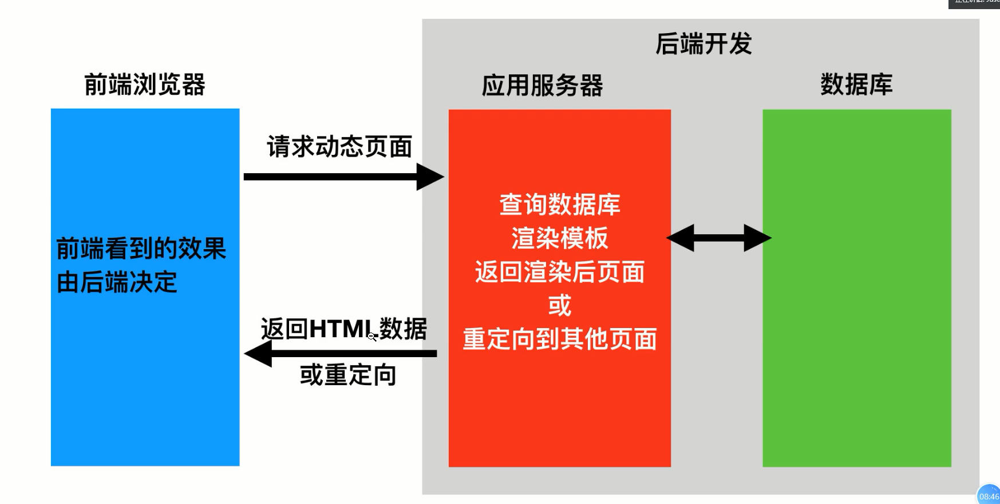
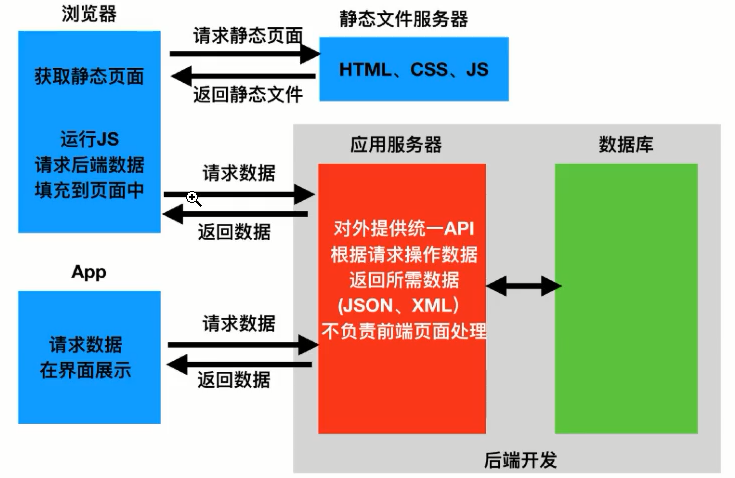

# 一、web应用模式

在开发web应用中，有两种应用模式

## 1.1 前后端不分离

## 1.2 前后端分离

# 二 、API接口

为了在团队内部研形成洪识、防止个人习惯差异引起的混乱，我们需要找到一种大家都觉得很好的接口实现规范，而且这种规范能够让后端写的接口，用途一目了然，减少双方之间的合作成本。

通过网络，规定了前后台信息交互规则的url链接，也就是前后台信息交互的媒介

Neb API接口和一般的url链接还是有区别的，Neb AP接口简单概括有下面四大特点