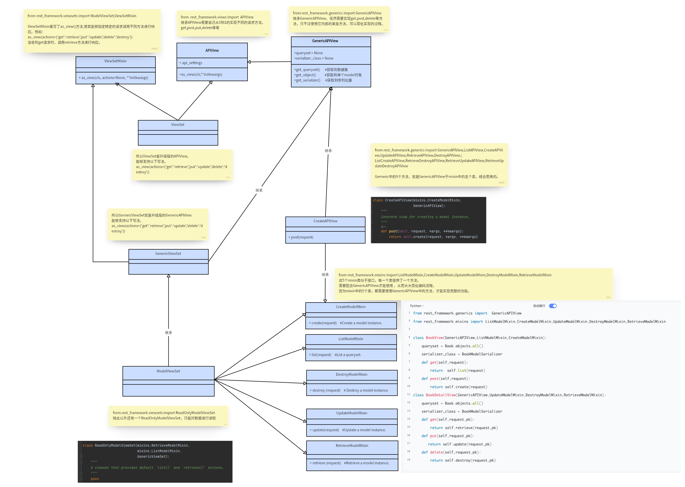

**两个视图基类：**

- APIView,

- GenericAPIView

# URL类图



# 1、基于APIView写接口

```python
#### views.py
from rest_framework.generics import GenericAPIView
from app01.models import Book
from app01.ser import BookSerializer
# 基于APIView写的
class BookView(APIView):
    def get(self,request):
        book_list=Book.objects.all()
        book_ser=BookSerializer(book_list,many=True)
        return Response(book_ser.data)
    def post(self,request):
        book_ser = BookSerializer(data=request.data)
        if book_ser.is_valid():
            book_ser.save()
            return Response(book_ser.data)
        else:
            return Response({'status':101,'msg':'校验失败'})
class BookDetailView(APIView):
    def get(self, request,pk):
        book = Book.objects.all().filter(pk=pk).first()
        book_ser = BookSerializer(book)
        return Response(book_ser.data)
    def put(self, request,pk):
        book = Book.objects.all().filter(pk=pk).first()
        book_ser = BookSerializer(instance=book,data=request.data)
        if book_ser.is_valid():
            book_ser.save()
            return Response(book_ser.data)
        else:
            return Response({'status': 101, 'msg': '校验失败'})
    def delete(self,request,pk):
        ret=Book.objects.filter(pk=pk).delete()
        return Response({'status': 100, 'msg': '删除成功'})
    
#models.py
class Book(models.Model):
    name=models.CharField(max_length=32)
    price=models.DecimalField(max_digits=5,decimal_places=2)
    publish=models.CharField(max_length=32)
#ser.py
class BookSerializer(serializers.ModelSerializer):
    class Meta:
        model=Book
        fields='__all__'
# urls.py
re_path('books/$', views.BookView.as_view()),
re_path('books/(?P<pk>\d+)', views.BookDetailView.as_view()),
```

# 2、基于GenericAPIView写的接口

```
# views.py
class Book2View(GenericAPIView):
    #queryset要传queryset对象，查询了所有的图书
    # serializer_class使用哪个序列化类来序列化这堆数据
    queryset=Book.objects
    # queryset=Book.objects.all()
    serializer_class = BookSerializer
    def get(self,request):
        book_list=self.get_queryset()
        book_ser=self.get_serializer(book_list,many=True)
        return Response(book_ser.data)
    def post(self,request):
        book_ser = self.get_serializer(data=request.data)
        if book_ser.is_valid():
            book_ser.save()
            return Response(book_ser.data)
        else:
            return Response({'status':101,'msg':'校验失败'})
class Book2DetailView(GenericAPIView):
    queryset = Book.objects
    serializer_class = BookSerializer
    def get(self, request,pk):
        book = self.get_object()
        book_ser = self.get_serializer(book)
        return Response(book_ser.data)
    def put(self, request,pk):
        book = self.get_object()
        book_ser = self.get_serializer(instance=book,data=request.data)
        if book_ser.is_valid():
            book_ser.save()
            return Response(book_ser.data)
        else:
            return Response({'status': 101, 'msg': '校验失败'})
    def delete(self,request,pk):
        ret=self.get_object().delete()
        return Response({'status': 100, 'msg': '删除成功'})
    
 #url.py
    # 使用GenericAPIView重写的
    path('books2/', views.Book2View.as_view()),
    re_path('books2/(?P<pk>\d+)', views.Book2DetailView.as_view()),
```

# 3、基于GenericAPIView和5个视图扩展类写的接口

```python
from rest_framework.mixins import  ListModelMixin,CreateModelMixin,UpdateModelMixin,DestroyModelMixin,RetrieveModelMixin
#
# views.py
class Book3View(GenericAPIView,ListModelMixin,CreateModelMixin):
    queryset=Book.objects
    serializer_class = BookSerializer
    def get(self,request):
        return self.list(request)
    def post(self,request):
        return self.create(request)
class Book3DetailView(GenericAPIView,RetrieveModelMixin,DestroyModelMixin,UpdateModelMixin):
    queryset = Book.objects
    serializer_class = BookSerializer
    def get(self, request,pk):
        return self.retrieve(request,pk)
    def put(self, request,pk):
        return self.update(request,pk)
    def delete(self,request,pk):
        return self.destroy(request,pk)
# urls.py
    # 使用GenericAPIView+5 个视图扩展类 重写的
    path('books3/', views.Book3View.as_view()),
    re_path('books3/(?P<pk>\d+)', views.Book3DetailView.as_view()),
#GenericAPIView 的9个视图子类(继承了5个扩展类接口)
from rest_framework.generics import \GenericAPIView,ListAPIView,CreateAPIView,UpdateAPIView,RetrieveAPIView,DestroyAPIView,\
ListCreateAPIView,RetrieveDestroyAPIView,RetrieveUpdateAPIView,RetrieveUpdateDestroyAPIView
ListAPIView    #获取所有，get
CreateAPIView  #新增一个,post
UpdateAPIView  #更新一个,put
RetrieveAPIView  #获取一个,get
DestroyAPIView  #删除一个，delete
ListCreateAPIView    #获取所有，新增一个，get，post
RetrieveUpdateAPIView   #获取一个，更新一个
RetrieveDestroyAPIView   #获取一个，删除一个
RetrieveUpdateDestroyAPIView #获取一个，更新，删除一个
# 所以一般只需要写两个类，
#一个继承：ListCreateAPIView类，
#另一个继承：RetrieveUpdateDestroyAPIView类，就可以获得所有的方法。
但是一个类不能同时继承 ListCreateAPIView	和RetrieveUpdateDestroyAPIView 这两个类，因为这样就会出现两个get方法。
导致出错。
```

# 4、使用ModelViewSet编写5个接口

```python
# views.py
from rest_framework.viewsets import ModelViewSet
class Book5View(ModelViewSet):  #5个接口都有，但是路由有点问题
    queryset = Book.objects
    serializer_class = BookSerializer
    
# urls.py
# 使用ModelViewSet编写5个接口
    path('books5/', views.Book5View.as_view(actions={'get':'list','post':'create'})), #当路径匹配，又是get请求，会执行Book5View的list方法
 re_path('books5/(P<pk>\d+)',views.Book5View.as_view(actions{'get':'retrieve','put':'update','delete':'destroy'})),
```

# 5、源码分析ViewSetMixin

```
# 重写了as_view
# 核心代码（所以路由中只要配置了对应关系，比如{'get':'list'}）,当get请求来，就会执行list方法
for method, action in actions.items():
    #method：get
    # action：list
    handler = getattr(self, action)
    #执行完上一句，handler就变成了list的内存地址
    setattr(self, method, handler)
    #执行完上一句 对象.get=list
    #for循环执行完毕 对象.get:对着list   对象.post：对着create
```

# 6、继承ViewSetMixin的视图类

```python
# views.py
from rest_framework.viewsets import ViewSetMixin
class Book6View(ViewSetMixin,APIView): #一定要放在APIVIew前
    def get_all_book(self,request):
        print("xxxx")
        book_list = Book.objects.all()
        book_ser = BookSerializer(book_list, many=True)
        return Response(book_ser.data)
    
# urls.py
    #继承ViewSetMixin的视图类，路由可以改写成这样
    path('books6/', views.Book6View.as_view(actions={'get': 'get_all_book'})),
```