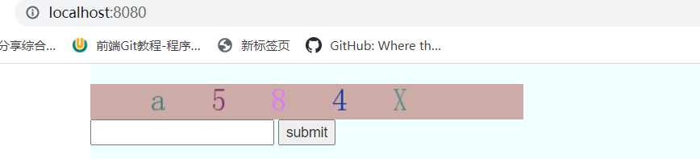

使用这个模块可以直接获取一个验证码图片对象。

并且可以验证验证码是否正确。

配合前端JS，点击图片，即可刷新验证码

# 1、myCaptcha.py

```
# _*_ coding : utf-8 _*_
# @Time : 2022/5/10 22:21
# @Author : HackWu
# @File : myCaptcha
# @Project : BBS
from django.shortcuts import HttpResponse
from PIL import Image,ImageDraw,ImageFont
from app01.myModel import mySettings
'''
    Image:生成图片
    ImageDraw:能够在图片上乱涂乱画
    ImageFont；用来控制字体样式
    
'''
from io import BytesIO,StringIO
'''
   内存管理器模块
   BytesIO: 临时帮你存储数据，返回的时候，数据是二进制格式
   StringIO:临时帮你存储数据，返回使的时候，数据是字符串
    
'''
import random
def get_random():
    return random.randint(0,255),random.randint(0,255),random.randint(0,255)    #返回的多个值，会以元组的形式返回
'''
myCaptch模块，是用于创建一个验证码图片的，并且可以验证用户输入的验证码是否正确
    - get_Captcha(request) :可以获取一个验证码对象
    - check_captcha(request,captcha)   可以验证用户输入的验证码captcha是否正确
'''
def get_captcha(request):   #获取验证码
    '''
    验证码的相关设置需要在mySettings.py中的
        -set_patcha字典中进行设置
    '''
    #推到步骤3：文件存储反锁IO操作效率低 借助于内存管理器模块
    # img_obj=Image.new("RGB",(430,35),get_random())
    # io_obj=BytesIO()        #生成一个内存管理器对象，你可以看成是文件句柄
    # img_obj.save(io_obj,"png")
    # return HttpResponse(io_obj.getvalue())  #从内存管理器中读取二进制的图片数据，返回给前端
    set_captcha=mySettings.set_captcha
    '''
     "ignore_case":True,         #是否忽略大小写,True表示忽略
    "use_system_image":True,    #是否使用系统图片，True为是，如果为False，需要给定自己的图片路径
    "image_url":"null",         #图片路径，如果use_system_image=False时，必须填写
    "image_format":"png",        #图片格式
    "image_size":(430,35),      #图片大小，如果是自己的图片，图片的大小，必须和这个保持一致
    "font_size":30,             #字体大小
    "font_url":"null",          #字体的路径，是一个tff文件
    
    '''
    use_system_image=set_captcha.get("use_system_image")
    image_url=set_captcha.get("image_url")
    image_format=set_captcha.get("image_format")
    image_size=set_captcha.get("image_size")
    font_size=set_captcha.get("font_size")
    font_url=set_captcha.get("font_url")
    img_obj=None    #图片对象
    if use_system_image == "True":
        img_obj=Image.new("RGB",image_size,get_random())
    else:
        img_obj=Image.open(image_url)  #如果使用自己的图片，如图的大小需要调整成和标签中的大小一致。
    #推到步骤4： 写图片验证码
    img_draw=ImageDraw.Draw(img_obj)    #产生一个画笔对象
    img_font=ImageFont.truetype(font_url,font_size)  #字体样式 大小
    #随机验证码 五位数的随机验证码 数字 小写字母 大写字母
    code=""
    for i in range(5):
        random_upper=chr(random.randint(65,90))  #chr(),将数字转换为对应的字母，65-90都是大写字母
        random_lower=chr(random.randint(97,122)) #97-122都是小写字母
        rand_int=str(random.randint(0,9))   #随机的数字
        #从上面三个随机选一个
        tmp=random.choice([rand_int,random_upper,random_lower]) #从列表中随机选一个
        #将产生的随机字符串写到字符串上
        '''
            为什么一个个写？
                因为一个个写，可以控制每个字体的间隙，而生成好之后再写的话，
                间隙没法控制。
        '''
        img_draw.text((i*60+60,0),tmp,get_random(),img_font)  #分别是，字体坐标，什么字，字体的颜色，字体的样式
        #拼接随机字符串
        code+=tmp
    print(code)
    #随件的验证码在登录的视图函数里面需要用到，要比对，所以要找地方存起来，其他视图函数也能拿到
    request.session["code"]=code
    io_obj=BytesIO()
    img_obj.save(io_obj,image_format)
    io_obj=io_obj.getvalue()
    return io_obj
def check_captcha(request,code):
    '''
    判断验证码是否正确，如果正确返回True,错误返回False
    :param request: 请求对象
    :param code:    用户输入的验证码
    :return:
    '''
    ignore=mySettings.set_captcha.get("ignore_case")
    if ignore == "True":  #Ture 表示忽律大小写
        if request.session.get("code").upper() == code.upper():   #忽律大小写
            return True
        else:
            return False
    else:
        if request.session.get("code") == code:   #忽律大小写
            return True
        else:
            return False
```

# 2、mySettings.py

```
#验证码图片设置
set_captcha={
    "ignore_case":"True",                   #是否忽略大小写,True表示忽略
    "use_system_image":"True",              #是否使用系统图片，True为是，如果为False，需要给定自己的图片路径
    "image_url":"static/img/qq.png",        #图片路径，如果use_system_image=False时，必须填写
    "image_format":"png",                   #图片格式
    "image_size":(430,35),                  #图片大小，如果是自己的图片，图片的大小，必须和这个保持一致
    "font_size":30,                         #字体大小
    "font_url":"static/font/simsun.ttf",    #字体的路径，是一个tff文件
}
```

# 3、使用方法

```
def fun(request):
    image_captcha=myCaptcha.get_captcha(request)    #获得一个验证码对象
    code="1234"                #这个表示从前端页面后去到的验证码信息
    tag=myCaptcha.check_captcha(request,code)        #比较验证码是否正确
    #验证code这个字符串是否匹配刚才产生的验证码，如果匹配返回True，否则返回False
    #这里很明显返回False，所以tag=False
```

# 4、实例

## urls.y

```python
#图片验证码相关操作
re_path(r"^get_code/",views.get_code,name="get_code"),
```

## views.py

```
from app01.myModel import  myCaptcha
def get_code(request):        #后去验证码
    io_obj=myCaptcha.get_captcha(request)     #获得一个验证码图片对象
    return HttpResponse(io_obj)
def fun(request):            #判断前端传入的验证码是否正确
    code=request.POST.get("img")
    print(code)
    tag=myCaptcha.check_captcha(request,code)    #用于检测验证码是否正确
    if tag:
        return HttpResponse("OK")        #如果正确，返回“OK”
    return render(request,"index.html",locals())
```

## test.html

```
<!DOCTYPE html>
<html lang="en">
<head>
    <meta charset="UTF-8">
    <title>Title</title>
    <link href="https://cdn.bootcss.com/twitter-bootstrap/3.4.1/css/bootstrap.min.css" rel="stylesheet">
    <script src="https://cdn.bootcss.com/jquery/3.3.1/jquery.min.js"></script>
    <script src="https://cdn.bootcss.com/twitter-bootstrap/3.4.1/js/bootstrap.min.js"></script>
</head>
<body>
 <form action="/fun/" method="post">
    
     <br>
    <input type="text" name="img">
    <input type="submit" value="submit">
</form>
<script>
    $("#img").click(function () {        //点击就可以自动刷新验证码
        let old_url=$(this).attr("src")+"?";//获取这个src的属性值,并加上一个问号
        $(this).attr("src",old_url);        //更改src的地址，以此达到刷新的目的
    })
</script>
</body>
</html>
```

## 效果展示

