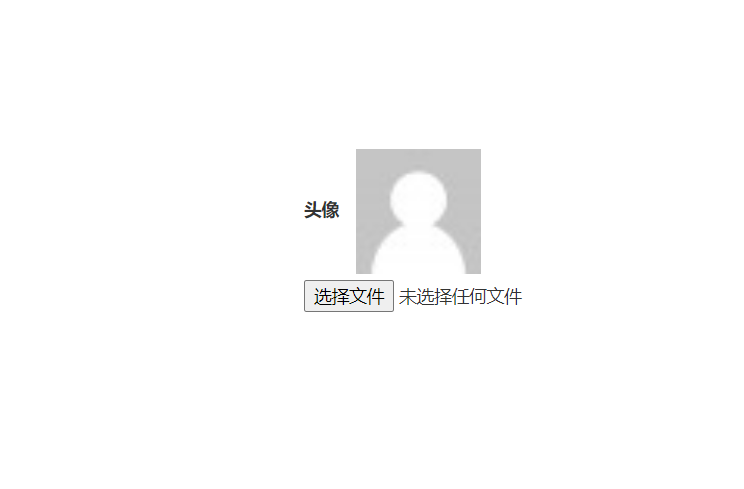
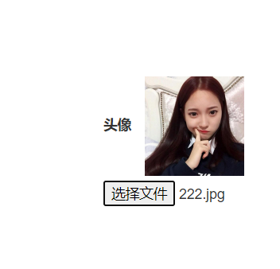

# test.html

```
<!DOCTYPE html>
<html lang="en">
<head>
    <meta charset="UTF-8">
    <title>Title</title>
    <link href="https://cdn.bootcss.com/twitter-bootstrap/3.4.1/css/bootstrap.min.css" rel="stylesheet">
    <script src="https://cdn.bootcss.com/jquery/3.3.1/jquery.min.js"></script>
    <script src="https://cdn.bootcss.com/twitter-bootstrap/3.4.1/js/bootstrap.min.js"></script>
    <style>
    <!--这是本页面临时样式，使用时不需要加-->
        form{
            width: 200px;
            height: 200px;
            margin-top: 200px;
            margin-left: auto;
            margin-right: auto;
        }
    </style>
</head>
<body>
<!--***********************************主要内容*****************************-->
    <form>
        <label for="image_id">头像
            
            
        </label>
        <input type="file" id="image_id">
    </form>
<script>
    $("#image_id").change(function () {
        //文件阅读器对象
        //1、先生成一个文件阅读器对象
        let myFileReaderObj=new FileReader();
        //2、获取用户上传的头像文件
        let fileObj=$(this)[0].files[0];
        //3、将文件对象交给阅读器对象读取
        myFileReaderObj.readAsDataURL(fileObj);//这是异步操作并且是IO操作
        //4、利用文件阅读器，将文件展示到前端页面  修改img 的src属性
        //等待文件阅读器读取完毕之后，在执行
        myFileReaderObj.onload=function(){
            $("#my_image").attr("src",myFileReaderObj.result)  //改变img标签属性src的值，值为一串二进制信息，也可以用于显示图片。
        }
    });    
</script>
</body>
</html>
```

- 未上传图片时



- 上传图片之后

